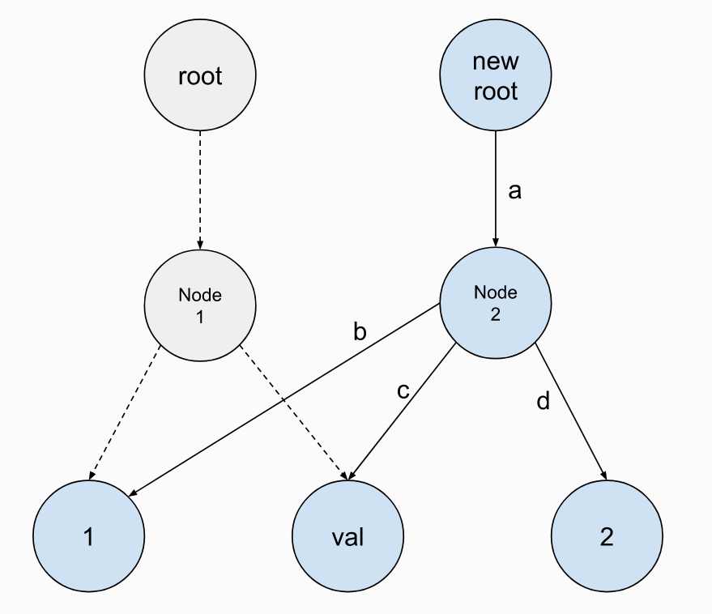
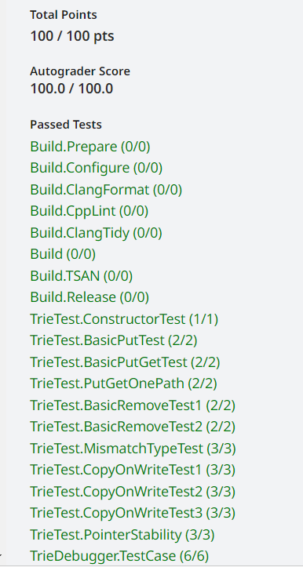

**CMU15445（Spring 2023）PROJECT \#0 - C++ PRIMER**

**1.BackGround**

（1）环境配置：见源码README或官网。

（2）语法：

**智能指针**

智能指针是RAII(Resource Acquisition Is Initialization，资源获取即初始化)机制对普通指针进行的一层封装。这样使得智能指针的行为动作像一个指针，本质上却是一个对象，这样可以方便管理一个对象的生命周期。

| C++ objtype \*p = new objtype(); p -\> func(); delete p; |
|----------------------------------------------------------|

如果忘记删除，或者删除的情况没有考虑清楚，容易造成悬挂指针(dangling pointer)或者说野指针(wild pointer)。智能指针可以方便我们控制指针对象的生命周期。在智能指针中，一个对象什么情况下被析构或被删除，是由指针本身决定的，并不需要用户进行手动管理。在c++中，智能指针一共定义了4种：auto_ptr、unique_ptr、shared_ptr 和 weak_ptr。其中，auto_ptr 在 C++11已被摒弃，在C++17中已经移除不可用。

**dynamic_cast**

dynamic_cast\<new_type\>(old_variable)：多态类之间的类型转换使用该方法进行类型转换。其中new_type 的类型：指向某个class类型的指针、某个class类型的引用、void指针；

使用条件：该class类型具有虚函数；

重点是该方法的返回值：

-   基类转子类，返回nullptr（对于指针）或者std::bad_cast（对于引用）;
-   子类转基类，返回基类指针（对于指针）或者基类指针（对于引用）；
-   子类之间转换，返回nullptr（对于指针）或者std::bad_cast（对于引用）；

**string_view**

std::string_view允许我们像std::string一样处理字符序列，而不需要为这些字符序列分配内存。 也就是说，std::string_view对象只是引用外部字符序列，而不拥有它们。使用std::string_view开销小且速度快，通过值传递std::string_view总是能保证很小的开销。 然而，使用std::string_view也存在一些潜在的危险，因为与裸指针类似，在使用std::string_view时，程序员需要确保所引用的字符序列仍然有效。

**optional**

类模板 std::optional 管理一个可选的容纳值，既可以存在也可以不存在的值。比如下面这个例子：

| C++ class Info {public:Info(int age, const string& name) : age_(age), name_(name) {}  int age_;  string name_; }; optional\<Info\> GetInfoObj(bool condition) {  if (condition) {  return make_optional\<Info\>(20, "xiaoming");  } else {return nullopt;} } int main() {  auto obj1 = GetInfoObj(true);  if (obj1) {cout \<\< "age:" \<\< obj1-\>age\_ \<\< ", name:" \<\< obj1-\>name\_ \<\< endl;}  auto obj2 = GetInfoObj(false);  return 0; } |
|----------------------------------------------------------------------------------------------------------------------------------------------------------------------------------------------------------------------------------------------------------------------------------------------------------------------------------------------------------------------------------------------------------------------------------------------------|

**2.Task**

**Task \#1 - Copy-On-Write Trie**

COW Trie的优势就是可以提升并发性能以及降低使并发编程更简易。对COW Trie的更改会得到一棵新Trie，这使得读操作可以在旧Trie树上进行而不会被阻塞。我们首先要完成 Get、Put、Remove操作。

**Get()操作：**我们沿着字符串找到最后的值节点。然后使用dynamic_cast转换。需要注意如何判断节点为空以及节点是否是value_node的情况。在转换时，我们需要使用智能指针的 get( ) 方法取得裸指针，然后再进行转换。

**Put()操作：**我们在插入节点时，并非是在原Trie上插入节点，而是在搜索要插入节点的路径上不断 Clone( )，对其children_进行操作。对于没有涉及到的节点，我们要指向原本的节点，这样我们就需要自下而上构建这棵树。具体流程如下：

1.  建立stack等需要的数据结构。
2.  遍历key，直到结束或者树中没有其中的字符。在此期间将经过的节点记录到stack。
3.  建立新节点。
4.  从新节点开始，利用stack自下而上重建树。

**Remove()操作：**

扫一遍key，如果发现key不在Trie里或者并不是value_node，直接返回root。在此过程利用stack记录扫描过的节点。将尾部节点的is_value_node_修改为false。根据该节点的children是否为空构造新树的末尾节点。然后用最后遍历到的那个结点的children去构造一个TrieNode并修改栈顶，然后依此出栈并erase掉children为利用stack重新建树。注意不只要删除规定节点，在遍历过程中，如果规定节点的父节点只有这一子节点并且自己不是一个value_node，则需要递归向上把父节点也清理掉。

由于测试用例的问题，其实只删除规定节点是能够通过Spring2023的测试的，但无法通过Fall2023的测试。

**Task \#2 - Concurrent Key-Value Store**

COW使得Trie的并发编程更简单，实验模板里只使用了两个互斥量，而不需要每个node维护互斥量。

Get操作给了提示，其实Put、Remove也差不多。写Put的时候要用move传value。

| C++ Pseudo-code: (1) Take the root lock, get the root, and release the root lock. Don't lookup the value in the  trie while holding the root lock. (2) Lookup the value in the trie. (3) If the value is found, return a ValueGuard object that holds a reference to the value and the  root. Otherwise, return std::nullopt. |
|-------------------------------------------------------------------------------------------------------------------------------------------------------------------------------------------------------------------------------------------------------------------------------------------------------------------------------|

**Task \#3 - Debugging**

在trie_debug_test.cpp里debug。不同环境生成的随机数可能不同。我这里是7,2,30。

**Task \#4 - SQL String Functions**

写一个upper和lower函数，然后在plan_func_call注册，比较简单。

**3.Result**

最后在gradescope上提交通过。

