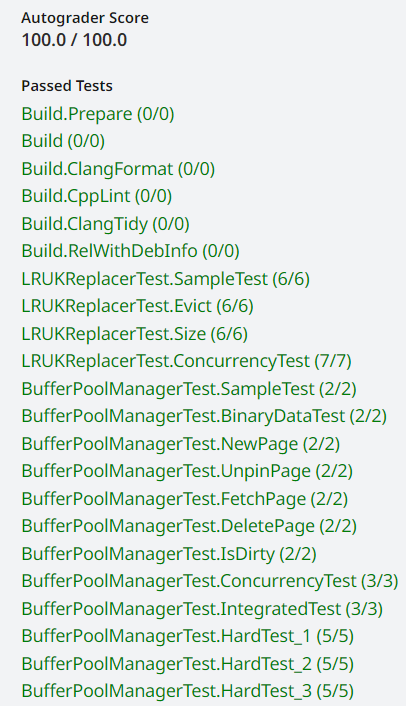

**CMU15445（Spring 2023）PROJECT \#1 - Buffer Pool**

**Resources**

-   https://15445.courses.cs.cmu.edu/spring2023/ 2023spring课程官网
-   https://github.com/cmu-db/bustub 源码Github地址
-   https://www.gradescope.com/ 自动测评网站 GradeScope，Course ID: 500628
-   https://dl.acm.org/doi/epdf/10.1145/170036.170081 LRU-K论文
-   https://leetcode.cn/problems/lru-cache/ LeetCode LRU实现，可以做一做

**Overview**

本项目分为3个部分：

1.  实现LRU-K算法
2.  实现缓冲池管理
3.  实现RAII思想的PageGuard

task1主要是实现src/buffer/lru_k_replacer.cpp中LRU-K替换策略。

RecordAccess：访问指定记录。变更LRU-K策略中的两个cache_list  
Evict： 踢出 evictable 且符合上面条件的 frame。不足k次的队列是FIFO进行踢出，返回踢出的frame_id。  
SetEvictable： 设置 frame 是否可被踢出。  
Remove： 删除选中的 frame。  
Size：返回curr_size_的值。

task2实现Buffer Pool Manager，用来从硬盘中获取实际数据，管理缓冲区数据。

NewPage： 生成一个新的 page 对象，将生成的 page_id通过参数传出，利用LRU-K对缓冲区进行换进换出。  
FetchPage：获取一个 page 对象，如果Bufferpool里存在，则从bufferpool里读取，如果没有需要从硬盘中获取，同时需要分配bufferpool的frame（是否需要将页面换出）。  
UnpinPage：减少 pin 计数。如果计数为 0 ，SetEvictable=true。  
FlushPage：把 page 内容写回到磁盘上。  
FlushAllPages：将所有page进行FlushPage。  
DeletePage： 删除一个evictable的page。

task3实现PageGuard把Page封装起来，自动加锁释放锁就很方便，这是RAII思想。主要有构造函数，析构函数，Drop，复制的实现。并且在bufferpool中实现

| C++  auto NewPageGuarded(page_id_t \*page_id) -\> BasicPageGuard;  auto FetchPageBasic(page_id_t page_id) -\> BasicPageGuard;  auto FetchPageRead(page_id_t page_id) -\> ReadPageGuard;  auto FetchPageWrite(page_id_t page_id) -\> WritePageGuard; |
|-----------------------------------------------------------------------------------------------------------------------------------------------------------------------------------------------------------------------------------------------------|

.h文件中基本会给出一些实现的提示，同时需要注意数据结构的构造和使用。

**Solution**

**Task \#1 - LRU-K Replacement Policy**

LRU算法全称是最近最少使用算法（Least Recently Use）。当缓存使用的空间达到上限后，就需要从已有的数据中淘汰一部分以维持缓存的可用性，而淘汰数据的选择就是通过LRU算法完成的。LRU算法的基本思想是基于局部性原理的时间局部性：如果一个信息项正在被访问，那么在近期它很可能还会被再次访问。所以顾名思义，LRU算法会选出最近最少使用的数据进行淘汰。

LRU将访问数据的顺序或时间和数据本身维护在一个容器当中。当访问一个数据时：若该数据不在容器当中，则设置该数据的优先级为最高并放入容器中。若该数据在容器当中，则更新该数据的优先级至最高。

请查看https://leetcode.cn/problems/lru-cache/ LeetCode给出的题目，我这里完成了双向链表+哈希表实现LRU算法。使得Get和Put操作的时间复杂度都为O(1)。

| C++ class LRUCache { private:  struct Node{  Node \*next,\*pre;  int val=0;  int key=-1;  Node(int key,int val):val(val),key(key),next(NULL),pre(NULL){}  };  int capacity;  Node\* head,\*tail;  unordered_map\<int,Node\*\> mymap; public:  LRUCache(int capacity) {  this-\>capacity=capacity;  head=new Node(-1,-1);  tail=new Node(-1,-1);  head-\>next=tail;  tail-\>pre=head;  }    void puttofirst(Node\* temp){  if(temp-\>pre&&temp-\>next){  Node\* pr=temp-\>pre;  pr-\>next=temp-\>next;  temp-\>next-\>pre=pr;  }  //temp去最前面  Node \*ppr=head-\>next;  head-\>next=temp;  temp-\>pre=head;  temp-\>next=ppr;  ppr-\>pre=temp;  }    int get(int key) {  if(mymap.count(key)){  //temp断开  Node\* temp=mymap[key];  puttofirst(temp);  return temp-\>val;  }  else  return -1;  }    void put(int key, int value) {  if(mymap.count(key)){  mymap[key]-\>val=value;  puttofirst(mymap[key]);  }  else{  Node\* nnode=new Node(key,value);  if(mymap.size()==capacity){  //删除链尾元素  Node\* p=tail-\>pre;  int keynum=p-\>key;  mymap.erase(keynum);  tail-\>pre=p-\>pre;  p-\>pre-\>next=tail;  //插到最前面  mymap[key]=nnode;  puttofirst(mymap[key]);  }  else{  mymap[key]=nnode;  puttofirst(mymap[key]);  }  }  } }; |
|---------------------------------------------------------------------------------------------------------------------------------------------------------------------------------------------------------------------------------------------------------------------------------------------------------------------------------------------------------------------------------------------------------------------------------------------------------------------------------------------------------------------------------------------------------------------------------------------------------------------------------------------------------------------------------------------------------------------------------------------------------------------------------------------------------------------------------------------------------------------------------------------------------------------------------------------------------------------------------------------------------------------------------------------------------------------------------------------------------------------------------------------------------------------------------------------------------------------------------------------------|

LRU-K算法是对LRU算法的改进，将原先进入缓存队列的评判标准从访问一次改为访问K次。LRU-K算法有两个队列，一个是缓存队列cache_list，一个是数据访问历史队列history_list。当访问一个数据时，首先先在访问历史队列中累加访问次数，当历史访问记录超过K次后，才将数据缓存至缓存队列，从而避免缓存队列被污染。在实现替换时，先检测有没有frame的访问次数是小于k的history_list，如果有就根据FIFO进行踢出。cache_list的踢出方法则和LRU算法一致。

我这里定义的数据结构比较简单，主要还是围绕两个队列，以及通过unordered_map快速访问到队列的位置（上述LRU实现是通过双向链表访问，操作更快）。

| C++  size_t curr_size_{0};  size_t replacer_size_;  size_t k_;  std::mutex latch_;   std::unordered_map\<frame_id_t, size_t\> access_count_;  std::list\<frame_id_t\> history_list_;  std::unordered_map\<frame_id_t, std::list\<frame_id_t\>::iterator\> history_map_;  std::list\<frame_id_t\> lruk_cache_list_;  std::unordered_map\<frame_id_t, std::list\<frame_id_t\>::iterator\> lruk_cache_map_;  std::unordered_map\<frame_id_t, bool\> is_evictable_; |
|-----------------------------------------------------------------------------------------------------------------------------------------------------------------------------------------------------------------------------------------------------------------------------------------------------------------------------------------------------------------------------------------------------------------------------------------------------------------|

下面说一些思路。对于线程安全，我使用的是std::scoped_lock latch(latch_)，直接锁住就行。对于Evict，首先需要判断curr_size_，然后先从history_list中查看有无可以evict的frame，再从cache_list中查看。对于RecordAccess，要更新access_count_[frame_id]，然后根据access_count_[frame_id]大于等于还是小于k，进行不同的操作。比如当等于k的时候，就要从history_list放到cache_list中了。Remove的时候要注意history_list_是FIFIO的，和cache_list不一样。

**Task \#2 - Buffer Pool Manager**

buffer pool manager为数据库提供更抽象的接口。bpm帮助数据库完成创建、访问、删除page等操作。需要注意bpm的几个重要的数据结构。

-   pages_: buffer pool 中缓存 pages 的指针数组。是Frame的缓冲池，pages_[i]是第i个frame对应的Page。其实就是一个frame到page的映射。
-   disk_manager: 即硬盘管理类，用于更新脏页，读取page等。
-   page_table_: 页表，用于映射页到页框
-   replacer_: 之前写的LRU-K策略
-   free_list_: 空闲链表，维护可用空间。每当delete page的时候，该page对应的frame就会加到其中。每当要申请用一个frame的时候，也优先从这个list取。
-   latch_: 锁。

在完成代码的时候，根据buffer_pool_manager.h给出每个函数的提示完成，注意每个数据结构对应的关系，以及实现某些操作时需要修改哪些数据结构，他们的先后顺序如何。对于线程安全，使用的是std::scoped_lock latch(latch_)。

比如这里给出NewPage的算法流程

1.  std::scoped_lock latch(latch_);
2.  判断是否所有page pincount都大于0，如果是，则无法分配。
3.  AllocatePage();
4.  取得frame，如果free_list不为空，则从free_list中提取。否则，replacer_-\>Evict(&frame_id)。如果被evict的页是脏页，则需要将内容写到磁盘。
5.  更新page_table和pages数组。
6.  replacer_更新访问。

对于Fetchpage，bmp需要先在内训中找到这个page，如果找到，说明它对应的frame还在缓存池中，直接返回。如果找不到，说明这个page的数据已经写回了磁盘，同时需要分配bufferpool的frame（是否需要将页面换出）。这个frame还是像NewPgImp一样从free_list和replacer中找。

**Task \#3 - Read/Write Page Guards**

实现PageGuard把Page封装起来，自动加锁释放锁就很方便，这是RAII思想。主要有构造函数，析构函数，Drop，复制的实现。实现的代码量很小，但非常需要注意理解每一个变量设置的含义。比如在Drop的时候UnpinPage，还有WritePageGuard和ReadPageGuard初始构造和析构时，对page读写锁的latch和unlatch。

**Result**

在该lab中，主要实现LRU-K算法，缓冲池管理，RAII思想的PageGuard。个人认为，循序渐进，首先理解需要实现的东西的原理，注意数据结构的设计以及之间的关系，编码时注意项目头文件给出实现函数的提示，有助于较快和准确的实现代码。
