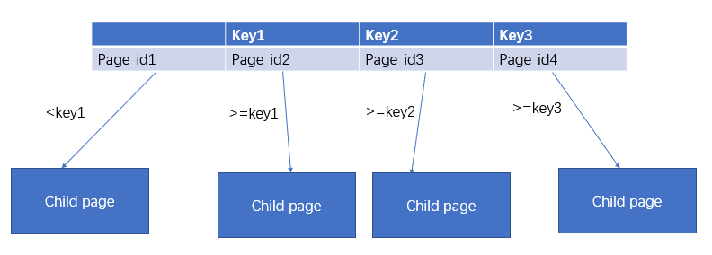
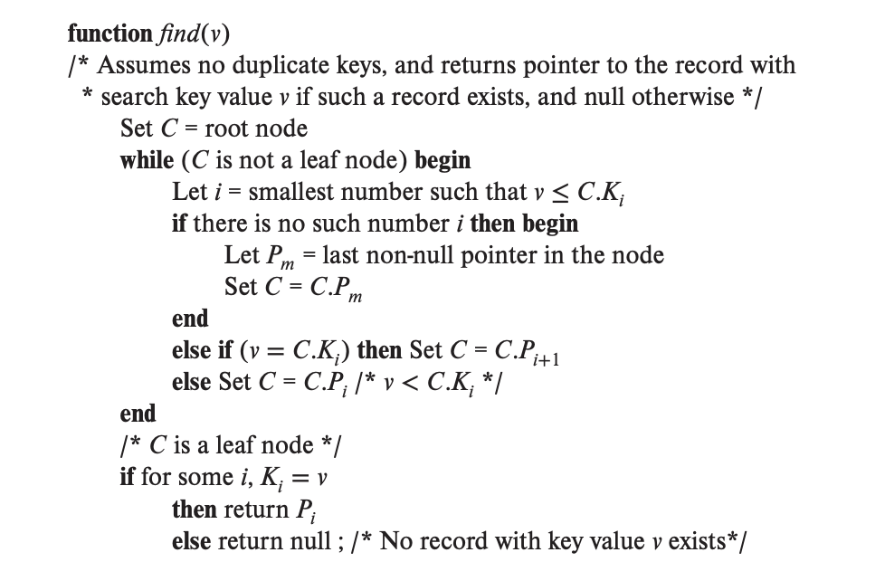
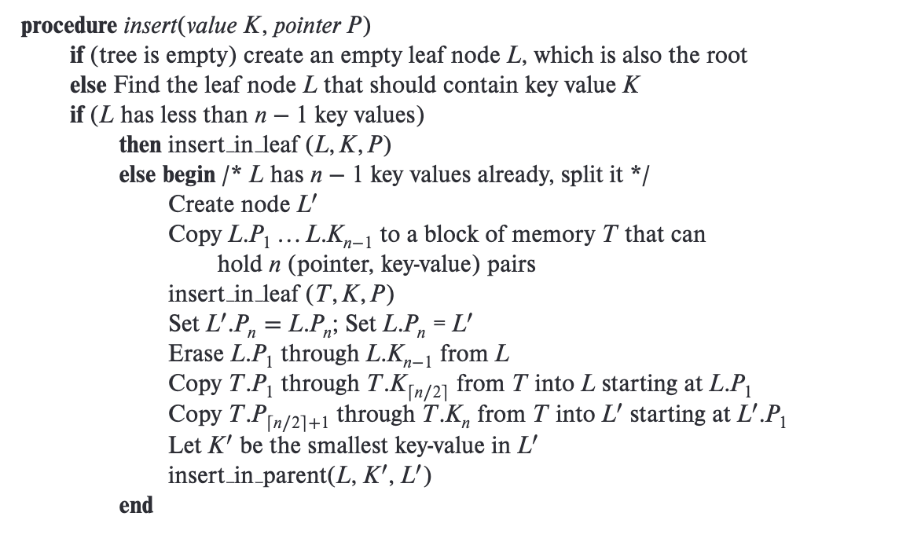
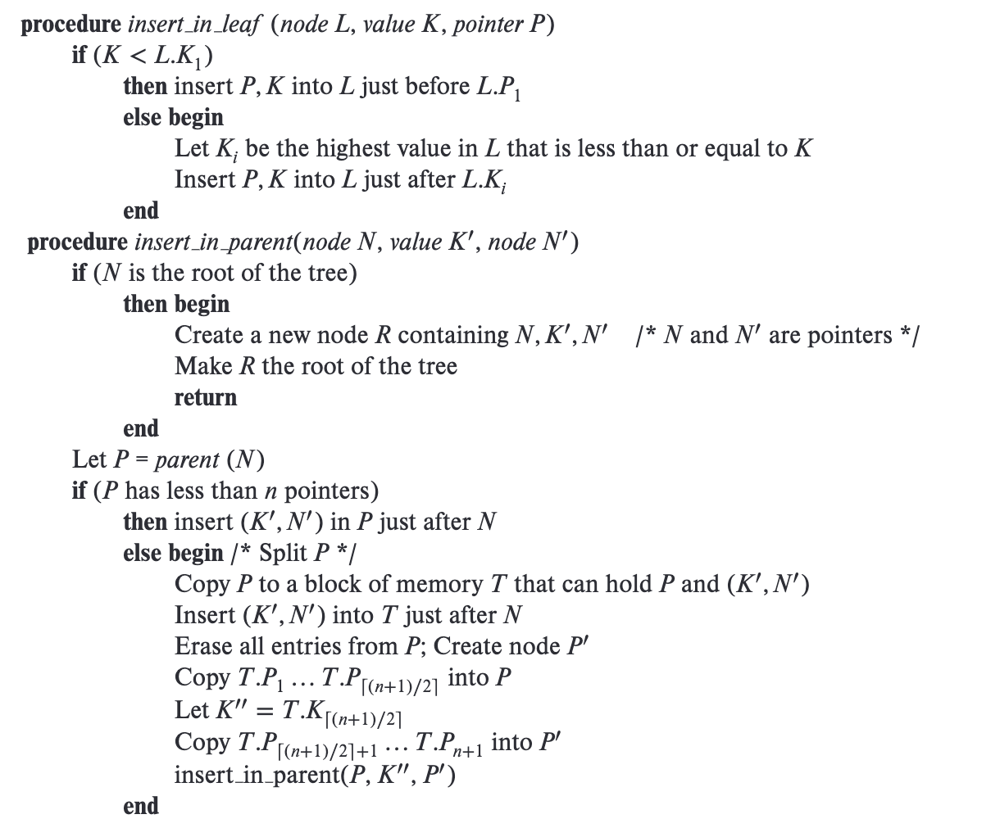
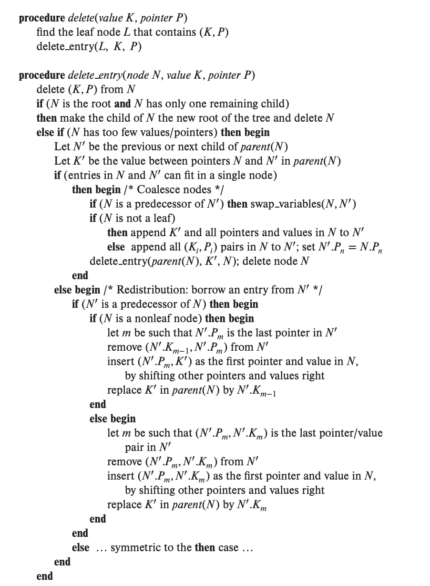
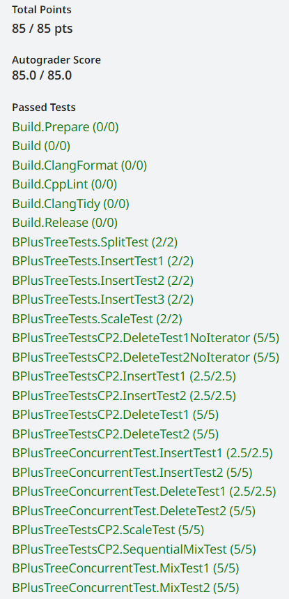

**CMU15445（Spring 2023）Project \#2 - B+Tree**

**Resources**

-   https://15445.courses.cs.cmu.edu/spring2023/ 2023spring课程官网
-   https://github.com/cmu-db/bustub 源码Github地址
-   https://www.gradescope.com/ 自动测评网站 GradeScope，Course ID: 500628

除了书上，网络上也有很多B+树的原理以及一些B+树实现代码可以参考。

**Overview**

Project 2 需要为 Bustub 实现 B+ 树索引。拆分为两个部分：

-   Checkpoint1:
-   Task \#1 - B+Tree Pages
-   实现三个页面类的一些函数，GetMinSize这个函数需要注意。
-   Task \#2a - B+Tree Insertion and Search for Single Values
-   实现查找算法与删除算法。ckp1是单线程的，可以使用BasicPageGuard，但是为了以后方便可以提前使用ReadPageGuard 和 WritePageGuard，并且注意并发策略。
-   Checkpoint2: 多线程实现
-   Task \#2b - B+Tree Deletions
-   删除过程的细节处理，borrow、merge等。
-   Task \#3 - An Iterator for Leaf Scans
-   迭代器的设计思路，这个其实ckp1就可以完成了，ckp1的测试也需要用到迭代器。
-   Task \#4 - Concurrent Index
-   使用ReadPageGuard 和 WritePageGuard，可以用课上的螃蟹算法，或者自己写OCC什么的，各个部分遇到的各种问题，debug也很痛苦...

**Solution**

**Task \#1 - B+Tree Pages**

总共需要补全三种页类型，B+Tree Page，B+Tree Internal Page，B+Tree Leaf Page。Task1 的实现非常简单，都是一些普通的 Get 和 Set，Init等函数。对于 B+Tree Internal Page和 B+Tree Leaf Page ，它们都有成员 MappingType array_[0] ，它是一个可变长的数组。长度为0的数组的主要用途是为了满足需要变长度的结构体。在一个结构体的最后, 申明一个长度为0的数组, 就可以使得这个结构体是可变长的. 对于编译器来说, 此时长度为0的数组并不占用空间, 因为数组名本身不占空间, 它只是一个偏移量, 数组名这个符号本身代表了一个不可修改的地址常量。然后需要注意B+Tree Internal Page的 ValueType 是 page_id_t， 即它指向下一个页面。B+Tree Leaf Page，它的 ValueType我们就不需要关注了。

b_plus_tree_page 是另外两个 page 的父类，即 B+树中 tree page 的抽象。internal page 中，KV 对的 K 是能够比较大小的索引，V 是 page id，用来指向下一层的节点。Project 中要求，第一个 Key 为空。

leaf page 多了一个成员变量 next_page_id，指向下一个 leaf page。leaf page 的 KV 对是一一对应的，是指向数据，internal page的kv则是用于辅助找到数据的。

**Task \#2a - B+Tree Insertion and Search for Single Values**

**B+Tree查找算法**

在查找或是插入删除时，我们都要从head_page开始，这里我们需要用到ReadPageGuard和WritePageGuard，不过ckp1不考虑并发可以用BasicPageGuard。在查找时，我们利用FetchPageRead获得root_page，并开始向下查找。节点分为 internal page 和 leaf page，每个 page 上的 key 有序排列。当拿到一个 key 需要查找对应的 value 时，首先需要经由 internal page 递归地向下查找，最终找到 key 所在的 leaf page。

| C++  ReadPageGuard readpageguard = bpm_-\>FetchPageRead(header_page_id_);  auto root_page = readpageguard.As\<BPlusTreeHeaderPage\>();  page_id_t page_id = root_page-\>root_page_id_;  if (page_id == INVALID_PAGE_ID) {  return false;  }  ReadPageGuard readpg = bpm_-\>FetchPageRead(page_id);  readpageguard.Drop(); |
|---------------------------------------------------------------------------------------------------------------------------------------------------------------------------------------------------------------------------------------------------------------------------------------------------------------------------|

**B+Tree插入算法**

B+树的插入是首先确定需要插入的叶节点，如果插入导致分裂，向上递归处理。Insert算法中需要实现Split和Merge功能。

首先根据 key 找到需要插入的 leaf page，将 key 插入 leaf page。可以二分搜索找到合适的位置插入。在插入后，需要检查当前 leaf page size 是否等于 max size。若相等，则要进行一次 leaf page 分裂操作，这是一个递归向上的过程：

1.  New page，并将原 page 的一半转移到new page 中，注意分清要放到左或右。
2.  更新原 page 和新 page 的 next page id。
3.  获取 parent page，并更新parent page的key。
4.  检查 parent page size是否等于max size，并递归向上执行。

注意parent page 是internal page了，不需要更新 next page id。

**Task \#2b - B+Tree Deletions**

**B+Tree删除算法**

B+树 Delete 过程也是先向下递归查询到 leaf page并删除，如果小于min size 后先尝试向sibling借，否则则和sibling合并，并向上递归地检查是否满足 minsize。Delete算法主要要实现Borrow和Merge函数。

首先找到leaf page并删除 leaf page 中 KV 对。当前leaf page size 若大于等于 min size则return true。如果小于的话，首先尝试从两侧的兄弟节点中borrow，若都不能，则选择一侧节点与其合并。borrow就是把左侧节点最后一个 KV 对转移至当前节点第一个 KV 对或者把右侧节点的 KV 对转移至当前节点最后一个 KV 对。需要注意borrow后更新子节点父节点指针。Merge是将一个节点的所有 KV 对转移至另一节点。若合并的是leaf page，要更新 next page id，并且都需要更新合并后 page 的子节点的父节点指针。parent删除对应的key，检查 size 是否小于 min size，并递归向上执行这个过程。

同样的insert和delete都是要用到WritePageGuard的。使用方法是：

| C++ auto page_guard = bpm_-\>FetchPageWrite(page_id); auto page = guard.As\<BPlusTreeHeaderPage\>(); auto page = reinterpret_cast\<const BPlusTreePage \*\>(guard.GetData()); |
|-------------------------------------------------------------------------------------------------------------------------------------------------------------------------------|

**Task \#3 - An Iterator for Leaf Scans**

实现一个遍历 leaf page 的迭代器。这里其实在ckp1的时候就可以实现了。

我用到的数据结构主要是

| C++  BufferPoolManager \*bpm_;  ReadPageGuard guard_;  ReadPageGuard head_;  int index_;  page_id_t page_id_; |
|---------------------------------------------------------------------------------------------------------------|

Begin()就是一直向internel_page-\>ValueAt(0)遍历直到到达叶子节点。Begin(const KeyType \&key) 类似于查找，找到key所在的页，更新index。End()就是构造一个空的INDEXITERATOR_TYPE就行。

**Task \#4 - Concurrent Index**

用到latch crabbing原则：

1.  Search 操作下降过程中自上而下对结点加读锁。获得子结点的锁后，可立即释放父结点的锁。
2.  Insert/delete 操作下降过程中自上而下对结点加写锁。获得子结点的锁后，判断子结点是否 safe，如果是，可立即释放所有祖先结点的写锁。

总的来说，这部分在于对latch crabbing的处理。如果你把insert和delete细节上处理的很不错，这部分debug起来会轻松很多。

**Result**

在project2主要实现了B+树，难度也是比project1大不少，debug耗时陡增。B+树的插入是首先确定需要插入的叶节点，如果插入导致分裂，向上递归处理。B+树 Delete 过程也是先向下递归查询到 leaf page并删除，如果小于min size 后先尝试向sibling借，否则则和sibling合并，并向上递归地检查是否满足 minsize。实现这些过程也需要注意很多细节。然后是task4需要理解到latch crabbing原则，我在这部分没有去用OCC或者其他算法进行优化。

