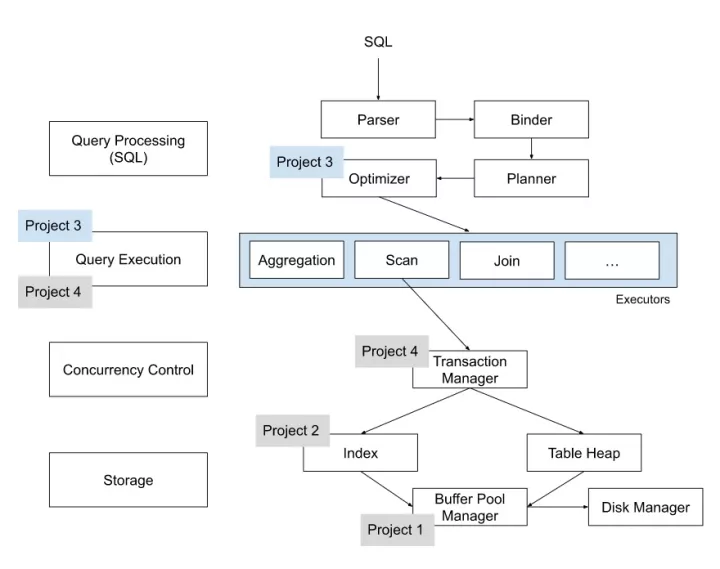
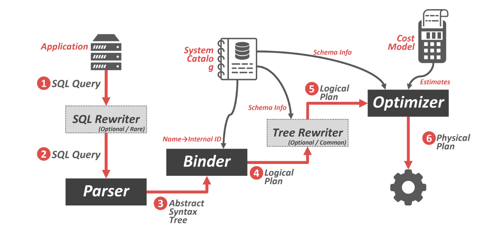
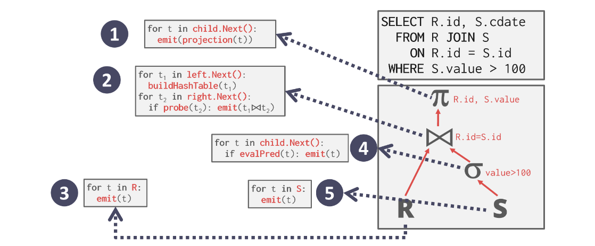
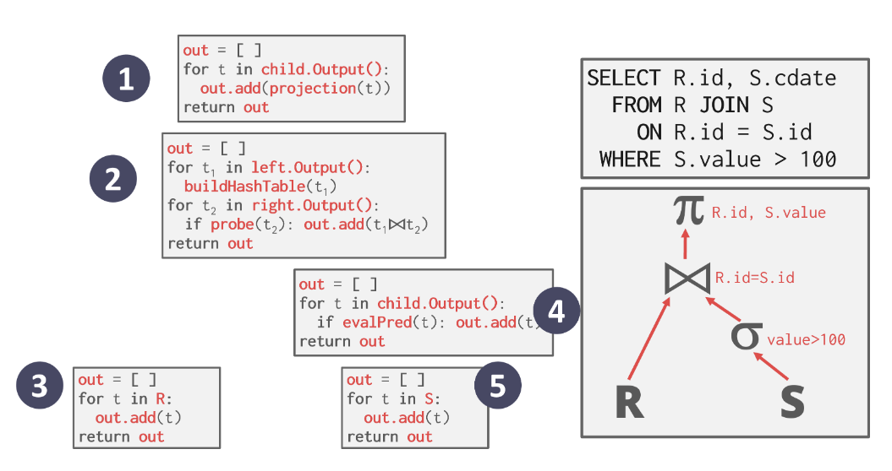
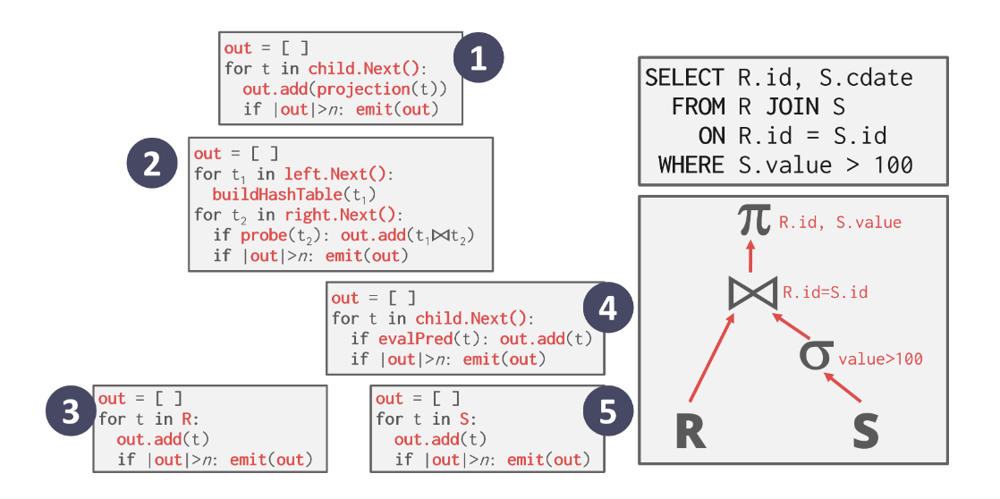
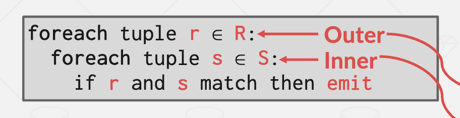
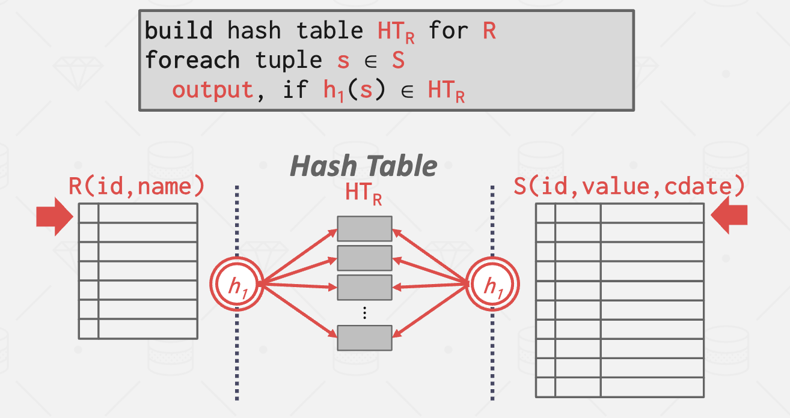
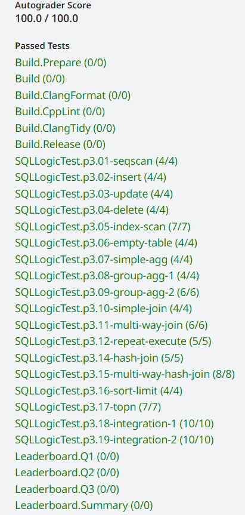

**CMU15445（Spring 2023）PROJECT \#3 - Query Execution**

**Resources**

-   https://15445.courses.cs.cmu.edu/spring2023/ 2023spring课程官网
-   https://github.com/cmu-db/bustub 源码Github地址
-   https://www.gradescope.com/ 自动测评网站 GradeScope，Course ID: 500628

**Overview**

该图清晰地介绍了 Bustub 的整体架构。在 Project 3 中，我们需要实现一系列 Executors，以及为 Optimizer 添加新功能。project3主要要求我们实现如下任务：

-   Task1：Access Method Executors. 包含 SeqScan、Insert、Delete、Update、IndexScan算子。
-   Task2：Aggregation and Join Executors. 包含 Aggregation、NestedLoopJoin、NestedHashJoin以及将loopjoin如何optimize为hashjoin。
-   Task3：Sort + Limit Executors and Top-N Optimization. 实现Sort、Limit、TopN 三个算子，以及将 Sort + Limit 优化为 TopN。
-   Leaderboard Task：三条sql语句，需要完成Hash Join、Filter Push Down、Column Pruning 等优化。

上图主要包含如下几个模块：

-   Parser：将SQL query转变为抽象语法树（AST）。Bustub 中采用了 libpg_query 库将 sql 语句 parse 为 AST。
-   Binder：将查询语句与数据库元数据进行绑定，验证查询的正确性和有效性
-   Planner：为查询生成逻辑计划，描述查询操作的顺序和方式
-   Optimizer：对逻辑计划进行优化转换和选择最优的执行计划，以提高查询性能。Optimizer 主要有两种实现方式：（1）Rule-based：是根据已经定义好的一系列规则，对 PlanNode 进行一系列的修改、聚合等操作。（2）Cost-based：需要读取数据，利用统计学模型来预测不同形式但结果等价的查询计划的 cost，最后选出 cost 最小的查询计划作。Bustub 的 Optimizer 采用Rule-based。

一条写SQL 语句首先会经过 PARSER 生成 AST 抽象语法树，再由 BINDER 将 AST 上的每个节点与一个数据库实体绑定，随后 PLANNER 生成一个初步的查询计划，OPTIMIZER 对初步的查询计划进行优化，使其成本更低，最后这个计划被送入一堆 Executors 中进行执行，需要生成真正执行查询计划的一系列算子。生成算子需要遍历查询计划树，将树上的 PlanNode 替换成对应的 Executor。课程中主要讲了三类模型：

1.  Iterator Model，或 Pipeline Model，或火山模型。每个算子都有 Init() 和 Next() 两个方法。Init() 对算子进行初始化工作。Next() 则是向下层算子请求下一条数据。返回false表示算子跑完了。

1.  Materialization Model，每个operater会一次性处理完所有input并通过数组方式向上一次性返回。每个query plan operator都实现一个output函数：此函数的返回结果是operator将发出的所有tuple。当operator完成执行后，DBMS永远不需要返回到它来检索更多数据。对于OLTP的数据库比较适合（大量简单的write操作，单点查询）。

1.  Vectorization Model，一次调用返回一批数据。批处理，利于 SIMD 加速。适合 OLAP 数据库。

算子的执行方向也有两种，分别是Top-to-Bottom，从root节点算子开始，不断地 pull 下层算子的数据，以及Bottom-to-Top，从叶子节点算子向上层算子 push 自己的数据。BusTub 采用了 Top-to-Bottom 的火山模型。

在该project中，我们主要需要掌握的数据结构有、Catalog、Index、Schema（描述了一个tuple内存储的数据格式）、Column（名字、类型、长度等信息）、Tuple（存储了一行数据。它包含Data和RID）、Value、RID这些基本的数据结构，还有AbstractPlanNode、AbstractExecutor以及我们每次实现一个算子时它的子类。与project2 b+树的难点不同，该project主要是对整体代码的分析，以及leaderboard tasks中optimizer的实现。

**Solution**

**Task \#1 - Access Method Executors**

实现SeqScan、Insert、Delete、Update、IndexScan算子。对于SeqScan，直接用TableIterator，注意区分前置++和后置++。初始化时，通过Catalog获取数据。Next函数中++table_iter_，直到end。

| C++ void SeqScanExecutor::Init() {  auto table_info = exec_ctx_-\>GetCatalog()-\>GetTable(plan_-\>table_name_);  table_iter\_ = std::make_unique\<TableIterator\>(table_info-\>table_-\>MakeIterator()); } |
|------------------------------------------------------------------------------------------------------------------------------------------------------------------------------------------------------------|

Insert 时，直接将 tuple 追加至 table 尾部。Next返回的tuple是一个整数，指示插入了多少行。除了插入tuple，还要通过 exec_ctx_-\>GetCatalog()-\>GetTableIndexes(table_info_-\>name_);调用所有的索引，然后进行索引的插入。

Delete 时，并不是直接删除，而是将 tuple 标记为删除状态，也就是逻辑删除。delete node和insert node相似，都是通过child_node获取tuple，然后构造一个只有整数的tuple，指示操作的行数。Delete 时，记得也要更新与 table 相关的所有 index。

对于Update算子，逻辑是先删除，后插入。先更新is_deleted_标记，随后插入新的数据。新的数据在UpdatePlanNode 中的target_expressions_。可以通过 Evaluate（）可以 拿到 Tuple 的一个属性的值。

| C++ tuplemeta.is_deleted\_ = true; table_info_-\>table_-\>UpdateTupleMeta(tuplemeta, \*rid); |
|----------------------------------------------------------------------------------------------|

index_scan是通过dynamic_cast\<BPlusTreeIndexForTwoIntegerColumn \*\>(index_info_-\>index_.get())转换，然后将它转换为iter进行迭代。

**Task \#2 - Aggregation & Join Executors**

aggregation的成员有：

| C++  /\*\* The aggregation plan node \*/  const AggregationPlanNode \*plan_;  /\*\* The child executor that produces tuples over which the aggregation is computed \*/  std::unique_ptr\<AbstractExecutor\> child_;  /\*\* Simple aggregation hash table \*/  SimpleAggregationHashTable aht_;  /\*\* Simple aggregation hash table iterator \*/  SimpleAggregationHashTable::Iterator aht_iterator_; |
|-------------------------------------------------------------------------------------------------------------------------------------------------------------------------------------------------------------------------------------------------------------------------------------------------------------------------------------------------------------------------------------------------------|

首先先看代码中提供的SimpleAggregationHashTable。在InsertCombine（）中调用了CombineAggregateValues（）。举个例子，CountAggregate实现如下，其它的实现方法其实是类似的。

| C++ case AggregationType::CountAggregate:  if (!input.aggregates_.at(i).IsNull()) {  if (result-\>aggregates_.at(i).IsNull()) {  result-\>aggregates_.at(i) = ValueFactory::GetIntegerValue(1);  } else {  result-\>aggregates_.at(i) = result-\>aggregates_.at(i).Add(ValueFactory::GetIntegerValue(1));  }  }  break; |
|-------------------------------------------------------------------------------------------------------------------------------------------------------------------------------------------------------------------------------------------------------------------------------------------------------------------------|

在实现AggregationExecutor::Init()时，需要InsertCombine，但是需要注意空表情况：如果哈希表为空且没有group by，那么应当初始化一行初始值。

| C++ ht_.insert({{std::vector\<Value\>{}}, GenerateInitialAggregateValue()}); |
|------------------------------------------------------------------------------|

Next中需要我们返回“The next tuple produced by the aggregation”，因此需要初始化std::vector\<Value\> values，先加入所有aht_iterator_.Key()，再加入aht_iterator_.Val()，然后构造tuple返回。

难度较大的是接下来的nested_loop_join和hash_join。NestedLoopJoin的逻辑：对于外层表中的每一个tuple，都要和内层表的每一个tuple进行匹配。performChecks中会检查NestedLoopJoin满足不是Pipeline Breaker的条件，要求 NestedLoopJoin 左子节点每次调用 Next() 方法后，右子节点都需要再 Init() 一次

-   这里要求同时支持left join和inner join：
1.  内连接（inner join）只输出两个表中匹配的行。
2.  左连接（left join）是在inner join的基础上，还会包含左表中的所有行，即使在右表中没有匹配的行。如果左表的某一行在右表中找不到匹配的行，则右表的结果将为空值（NULL）。左连接的结果集包含了左表的所有行以及与之匹配的右表的行。

右表是需要反复使用的，我们在Init阶段就将其存储在std::vector\<Tuple\> right_tuples_{}，我们以right_id_存储当前访问到的right_tuples_的位置。Next执行的思路如下：

-   对于第一次Next，首先要取出外层的left_tuple，然后和内层做比较。
-   如果该left_tuple与right_tuples都比较过，说明left到了next left_tuple，需要执行right_executor_-\>Init()。
-   遍历right_id_后的位置，如果相等就更新right_id_，返回结果。如果该次没有可以join的right_tuple，那么取出下一个left_tuple，继续进行比较。
-   对于“right is empty, but the join_type is leftjoin”这种情况，right_executor_这边需要构造空value。
-   如果right_tuples已经被遍历完了，需要取出下一个left_tuple，否则使用上一次的left_tuple进行操作。
-   如果已经两层遍历完，返回false。

Hash join的基本做法如上图所示，需要在 Init 阶段就建立哈希表并完成探测。先把右表做hash，我使用hash_t作为key。随后遍历左表，计算左表tuple的key，从right_join_ht中查找是否有相等的key，并且两个不同的value集合可能有相同的Hash_t，所以在连接的时候还得判断两个value集合是否相等。

| C++  std::unordered_map\<hash_t, std::vector\<Tuple\>\> right_join_ht{};  std::unordered_map\<hash_t, std::vector\<std::vector\<Value\>\>\> right_join_value_ht{};  while (right_executor_-\>Next(&tuple, \&rid)) {  std::vector\<Value\> values{};  auto key = hash_t{};  for (const auto \&right_expr : plan_-\>RightJoinKeyExpressions()) {  auto val = right_expr-\>Evaluate(&tuple, right_executor_-\>GetOutputSchema());  values.push_back(val);  key = HashUtil::CombineHashes(key, HashUtil::HashValue(&val));  }  right_join_ht[key].emplace_back(tuple);  right_join_value_ht[key].emplace_back(values);  } |
|-----------------------------------------------------------------------------------------------------------------------------------------------------------------------------------------------------------------------------------------------------------------------------------------------------------------------------------------------------------------------------------------------------------------------------------------------------------------------------------------------------------------------------------------------------------------------------------------------------------------------|

**Task \#3 - Sort + Limit Executors and Top-N Optimization**

Task 3 中要实现 Sort、Limit 和 TopN，以及将 Limit + Sort 在 Optimizer 中优化为 TopN，都比较简单。sort就是创建一个Tuple的vector，然后在Init（）中将所有tuple读取出来放进该vector，然后对该vector排序。limit和seq_scan一样，内部维护一个计数器，记录已经 emit 了多少 tuple。当下层算子为空或 count计数 达到规定上限后，不再返回新的 tuple。 Top-N就是采用std::priority_queue 自定义一个比较函数（这个函数跟sort一样的），然后在 Init() 中遍历下层算子所有 tuple insert到std::priority_queue中，维持std::priority_queue中元素个数\<=N，在Next() 里一个一个输出。Top-N Optimization就是把当(optimized_plan-\>GetType() == PlanType::Limit && optimized_plan-\>GetChildren()[0]-\>GetType() == PlanType::Sort)，就把这两个plan转换为一个topnplan。

**Optional Leaderboard Tasks**

Leaderboard tasks分三个部分：

-   Query 1: Where's the Index?
-   Query 2: Too Many Joins!
-   Query 3: The Mad Data Scientist

参考了两位大佬的做法（https://zhuanlan.zhihu.com/p/649735065），（https://zhuanlan.zhihu.com/p/587566135）。

q1就是完成对于（SELECT \* FROM t1 WHERE x \>= 90 AND y = 10）这类语句，如果存在索引，则选择索引进行数据访问。

q2是把所有 Filter 放在了 plan tree 的顶端，做法就是Filter Push-down，将 Filter 尽可能地下推至数据源处。

对于q3，实,只用 SELECT v, d1, d2，其余的数据都是多余的，无需计算，因此需要实现 Column Pruning 优化。

**Result**

在该project中，主要学习到了查询执行以及查询优化，实现了一系列算子，对整个查询执行过程有了更深刻的理解。但Leaderboard Tasks还值得进一步继续优化，查询优化确实实现起来难度更大，我也希望对这方面能有更深入的学习。

