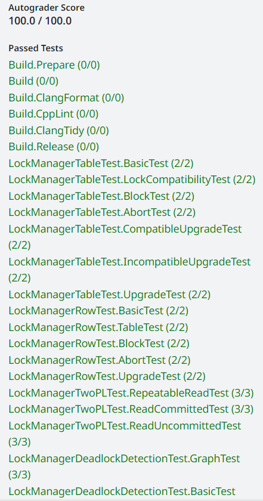

**CMU15445（Spring 2023）PROJECT \#4 - Concurrency Control**

**Resources**

-   https://15445.courses.cs.cmu.edu/spring2023/ 2023spring课程官网
-   https://github.com/cmu-db/bustub 源码Github地址
-   https://www.gradescope.com/ 自动测评网站 GradeScope，Course ID: 500628

**Overview**

分为三个部分：

-   Lock Manager：锁管理器，利用 2PL 实现并发控制。lock manager将处理来自事务的锁请求，向事务授予锁，并根据事务的隔离级别检查是否适当释放了锁。lock manager需要支持table lock和tuple lock，和以下五种模式：intention-shared、intention-exclusive、shared-intention-exclusive、shared、exclusive。
-   Deadlock Detection：死锁检测，运行在一个 background 线程，每间隔一定时间检测当前是否出现死锁，并挑选youngest的事务将其 abort 以解开死锁。可以采用DFS或者拓扑排序等方法进行检测。
-   Concurrent Query Execution：修改SeqScan、Insert 和 Delete 算子，并修改Transaction_Manager，能够实现并发的查询，并且完成Commit和Abort方法。

我们主要需要注意的是，2PL事务的四个状态。

| C++ enum class TransactionState { GROWING, SHRINKING, COMMITTED, ABORTED }; |
|-----------------------------------------------------------------------------|

三个隔离级别:读未提交(脏读问题)、读提交（不可重复读问题）、可重复读（存在幻读问题，增加了记录）

| C++ enum class IsolationLevel { READ_UNCOMMITTED, REPEATABLE_READ, READ_COMMITTED }; |
|--------------------------------------------------------------------------------------|

事务终止原因：

| C++ enum class AbortReason {  LOCK_ON_SHRINKING,  UNLOCK_ON_SHRINKING,  UPGRADE_CONFLICT,  DEADLOCK,  LOCKSHARED_ON_READ_UNCOMMITTED }; |
|-----------------------------------------------------------------------------------------------------------------------------------------|

还有Transaction类中的变量及函数，还有TableWriteRecord、IndexWriteRecord。还需要阅读Transaction Manager中的代码。

| C++  /\*\* The current transaction state. \*/  TransactionState state_{TransactionState::GROWING};  /\*\* The isolation level of the transaction. \*/  IsolationLevel isolation_level_;  /\*\* The thread ID, used in single-threaded transactions. \*/  std::thread::id thread_id_;  /\*\* The ID of this transaction. \*/  txn_id_t txn_id_;   /\*\* The undo set of table tuples. \*/  std::shared_ptr\<std::deque\<TableWriteRecord\>\> table_write_set_;  /\*\* The undo set of indexes. \*/  std::shared_ptr\<std::deque\<IndexWriteRecord\>\> index_write_set_;  /\*\* The LSN of the last record written by the transaction. \*/  lsn_t prev_lsn_;   std::mutex latch_;   /\*\* Concurrent index: the pages that were latched during index operation. \*/  std::shared_ptr\<std::deque\<Page \*\>\> page_set_;  /\*\* Concurrent index: the page IDs that were deleted during index operation.\*/  std::shared_ptr\<std::unordered_set\<page_id_t\>\> deleted_page_set_;   /\*\* LockManager: the set of table locks held by this transaction. \*/  std::shared_ptr\<std::unordered_set\<table_oid_t\>\> s_table_lock_set_;  std::shared_ptr\<std::unordered_set\<table_oid_t\>\> x_table_lock_set_;  std::shared_ptr\<std::unordered_set\<table_oid_t\>\> is_table_lock_set_;  std::shared_ptr\<std::unordered_set\<table_oid_t\>\> ix_table_lock_set_;  std::shared_ptr\<std::unordered_set\<table_oid_t\>\> six_table_lock_set_;   /\*\* LockManager: the set of row locks held by this transaction. \*/  std::shared_ptr\<std::unordered_map\<table_oid_t, std::unordered_set\<RID\>\>\> s_row_lock_set_;  std::shared_ptr\<std::unordered_map\<table_oid_t, std::unordered_set\<RID\>\>\> x_row_lock_set_; |
|-------------------------------------------------------------------------------------------------------------------------------------------------------------------------------------------------------------------------------------------------------------------------------------------------------------------------------------------------------------------------------------------------------------------------------------------------------------------------------------------------------------------------------------------------------------------------------------------------------------------------------------------------------------------------------------------------------------------------------------------------------------------------------------------------------------------------------------------------------------------------------------------------------------------------------------------------------------------------------------------------------------------------------------------------------------------------------------------------------------------------------------------------------------------------------------------------------------------------------------------------------------------------------------------------------------------------------------------------------------------------------------------------------------------------------------------------------------------------------------------------------------------------------------------------------------------------------------------------------------------------------------------------------------------------------------------------------------------------|

然后记得把LockRequestQueue request_queue_的这个位置改成智能指针，否则很难保证不会出现内存泄露问题。

| C++  class LockRequestQueue {  public:  /\*\* List of lock requests for the same resource (table or row) \*/  // std::list\<LockRequest \*\> request_queue_;  std::list\<std::shared_ptr\<LockRequest\>\> request_queue_;  /\*\* For notifying blocked transactions on this rid \*/  std::condition_variable cv_;  /\*\* txn_id of an upgrading transaction (if any) \*/  txn_id_t upgrading\_ = INVALID_TXN_ID;  /\*\* coordination \*/  std::mutex latch_;  }; |
|------------------------------------------------------------------------------------------------------------------------------------------------------------------------------------------------------------------------------------------------------------------------------------------------------------------------------------------------------------------------------------------------------------------------------------------------------------------|

project4涉及到的细节较多，需要仔细学习课程concurreny control这部分。

**Solution**

**Task \#1 - Lock Manager**

**Lock Table/Row**

（1）检查加锁是否合法：CheckTransactionLevel(txn, lock_mode)。根据代码中的NOTE, 了解不同隔离级别下的加锁规则。

| C++ void LockManager::CheckTransactionLevel(Transaction \*txn, LockMode lock_mode) {  switch (txn-\>GetIsolationLevel()) {  case IsolationLevel::READ_UNCOMMITTED:  if (lock_mode == LockMode::SHARED \|\| lock_mode == LockMode::INTENTION_SHARED \|\|  lock_mode == LockMode::SHARED_INTENTION_EXCLUSIVE) {  txn-\>SetState(TransactionState::ABORTED);  throw TransactionAbortException(txn-\>GetTransactionId(), AbortReason::LOCK_SHARED_ON_READ_UNCOMMITTED);  }  if (txn-\>GetState() != TransactionState::GROWING) {  txn-\>SetState(TransactionState::ABORTED);  throw TransactionAbortException(txn-\>GetTransactionId(), AbortReason::LOCK_ON_SHRINKING);  }  break;  case IsolationLevel::REPEATABLE_READ:  if (txn-\>GetState() == TransactionState::SHRINKING) {  txn-\>SetState(TransactionState::ABORTED);  throw TransactionAbortException(txn-\>GetTransactionId(), AbortReason::LOCK_ON_SHRINKING);  }  break;  case IsolationLevel::READ_COMMITTED:  if (txn-\>GetState() == TransactionState::SHRINKING) {  if (lock_mode != LockMode::SHARED && lock_mode != LockMode::INTENTION_SHARED) {  txn-\>SetState(TransactionState::ABORTED);  throw TransactionAbortException(txn-\>GetTransactionId(), AbortReason::LOCK_ON_SHRINKING);  }  }  break;  default:  (void)txn;  } } |
|---------------------------------------------------------------------------------------------------------------------------------------------------------------------------------------------------------------------------------------------------------------------------------------------------------------------------------------------------------------------------------------------------------------------------------------------------------------------------------------------------------------------------------------------------------------------------------------------------------------------------------------------------------------------------------------------------------------------------------------------------------------------------------------------------------------------------------------------------------------------------------------------------------------------------------------------------------------------------------------------------------------------------------------------------------------------------------------------------------------------------------------------------------------------------------------------------------------------------------------------------------------------------------------------------|

（2）获得LockRequestQueue，如果该表没有请求队列，就造一个。

（3）然后遍历请求队列：如果已存在该事务，已经获得对应锁，返回true。如果未获得锁，判断已经有其他事务在等待升级，如果有则中止事务。

| C++ if (lock_request_queue-\>upgrading\_ != INVALID_TXN_ID) {  txn-\>SetState(TransactionState::ABORTED);  lock_request_queue-\>latch_.unlock();  throw TransactionAbortException(txn-\>GetTransactionId(), AbortReason::UPGRADE_CONFLICT); } |
|-----------------------------------------------------------------------------------------------------------------------------------------------------------------------------------------------------------------------------------------------|

检查是否可以升级，注意代码中的note

| C++ While upgrading, only the following transitions should be allowed: IS -\> [S, X, IX, SIX] S -\> [X, SIX] IX -\> [X, SIX] SIX -\> [X] |
|------------------------------------------------------------------------------------------------------------------------------------------|

随后删除原有的锁授权，并且需要修改事务中的对应的set。然后标记队列中的升级操作正在进行中。如果当前请求是升级请求，则将其插入到第一个没有granted的请求前，以确保升级请求被优先处理。如果是新的锁请求，将其追加到请求队列的末尾。

（4）不是update操作，创建锁并加到队尾。

（5）使用一个conditional variable在lock request queue等待，直到拿到锁或者被abort（如果发生了死锁，task2中实现的死锁检测时有可能将该请求abort）。当锁请求成功获得时，将锁请求标记为已授予（granted\_ 设置为 true），然后释放锁请求队列的互斥锁。

lockrow和locktable操作几乎一样。前边需要加几个逻辑：是否是S或X锁？TableIntension锁是否满足要求？

| C++  CheckLockRowLockMode(txn, lock_mode);  CheckLockRowTableIntension(txn, lock_mode, oid);  CheckTransactionLevel(txn, lock_mode); |
|--------------------------------------------------------------------------------------------------------------------------------------|

**UnLock Table/Row**

（1）获得LockRequestQueue

（2）对于Unlock Table，需要判断是否存在行锁，有着Abort。

（3）遍历请求队列，找到 unlock 对应的 granted 请求。若不存在对应的请求，抛 ATTEMPTED_UNLOCK_BUT_NO_LOCK_HELD 异常。

（4）找到对应的请求后，根据事务的隔离级别和锁类型修改其状态。

| C++  switch (txn-\>GetIsolationLevel()) {  case IsolationLevel::READ_UNCOMMITTED:  if (lock_request-\>lock_mode\_ == LockMode::EXCLUSIVE) {  txn-\>SetState(TransactionState::SHRINKING);  }  if (lock_request-\>lock_mode\_ == LockMode::SHARED) {  txn-\>SetState(TransactionState::ABORTED);  throw new Exception("add shared lock before the read is committed");  }  break;  case IsolationLevel::REPEATABLE_READ:  if (lock_request-\>lock_mode\_ == LockMode::EXCLUSIVE \|\| lock_request-\>lock_mode\_ == LockMode::SHARED) {  txn-\>SetState(TransactionState::SHRINKING);  }  break;  case IsolationLevel::READ_COMMITTED:  if (lock_request-\>lock_mode\_ == LockMode::EXCLUSIVE) {  txn-\>SetState(TransactionState::SHRINKING);  }  break;  } |
|------------------------------------------------------------------------------------------------------------------------------------------------------------------------------------------------------------------------------------------------------------------------------------------------------------------------------------------------------------------------------------------------------------------------------------------------------------------------------------------------------------------------------------------------------------------------------------------------------------------------------------------------------------------------------------------------------------------------------------------------------------|

对于unlock row，不用执行第（2）步。然后如果force为true，则不用执行第（4）步。

**Task \#2 - Deadlock Detection**

检测环来检查是否有死锁。运行在一个 background 线程，每间隔一定时间检测当前是否出现死锁，并挑选youngest的事务将其 abort 以解开死锁。可以采用DFS或者拓扑排序等方法进行检测。我用的是拓扑排序方法。在发现环后，我们可以得到环上的所有节点。此时我们挑选 youngest 的事务将其终止。

可能图中不止一个环。对这里的youngest要这样理解，youngest 事务是指从图中最小的节点开始检测，检测到的第一个环的 tid 最大的事务。比如有一个图中有0,1,2,3,4。0和1构成一个环。2、3和4构成一个环。这个图有两个，youngest是第一个环（0,1构成的环）中的txn1。

**Task \#3 - Concurrent Query Executioncommit**

需要对于SeqScan Executor/Insert Executor/Delete Executor进行修改，以支持并发的query执行。

对于Insert Executor，需要判断有没有对表加IX锁，然后在insert数据的时候记得写事务的undo记录，wtype是INSERT

| C++ exec_ctx_-\>GetTransaction()-\>AppendTableWriteRecord(tbl_write_record); exec_ctx_-\>GetTransaction()-\>AppendIndexWriteRecord(idx_write_record); |
|-------------------------------------------------------------------------------------------------------------------------------------------------------|

对于Delete Executor，在SeqScan Executor中已经按照exec_ctx_-\>IsDelete()处理加锁逻辑，不用加锁。然后在delete数据的时候记得写事务的undo记录，wtype是DELETE。

对于SeqScan Executor，如果exec_ctx_-\>IsDelete()为true，对于table就需要获取intention exclusive lock, tuple需要获取exclusive lock。对于读如果不是READ_UNCOMMITTED就要加IS锁。在Next 函数中思路基本类似，根据 IsDelete 决定加 S or X lock。最后如果 IsDelete() 为 false 并且 隔离级别为 READ_COMMITTED ，还可以释放所有的 S lock。

在Transaction Manager中，对于Abort需要实现回滚修改的逻辑，对于TableWriteRecord，需要使用UpdateTupleMeta对tuple进行插入/删除的逆操作，对于IndexWriteRecord也是逆操作，是WType::INSERT就DeleteEntry，是WType::DELETE就InsertEntry。

**Result**

这是这门课最后一个实验。Project4 主要关于并发控制，我们完成了lock manager，deadlock detection以及并发读的功能。实验做完感觉数据库算基本入门了，后续还要再梳理一下课程内容。数据库领域还有很多东西等着我去学习，继续加油吧！

