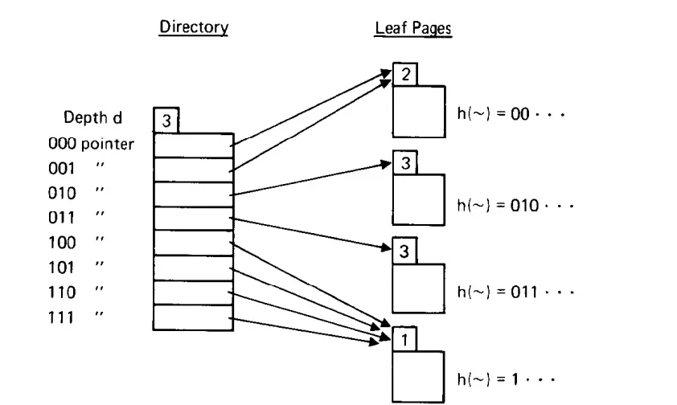
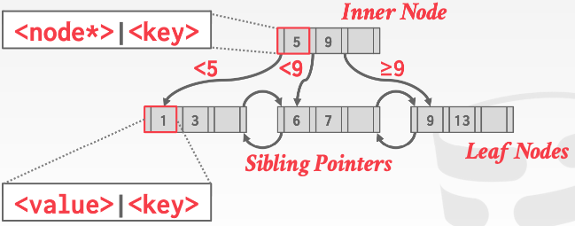
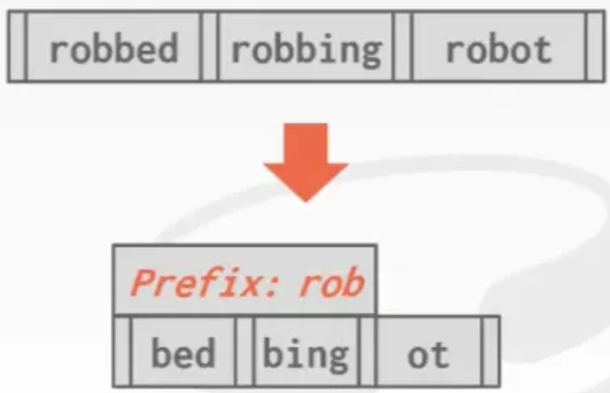
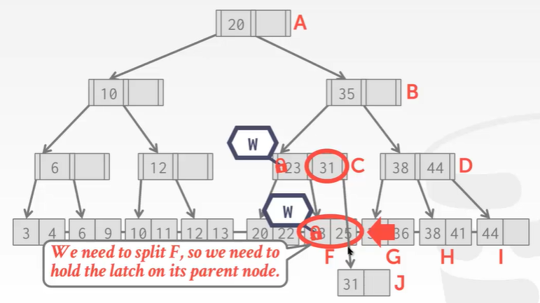
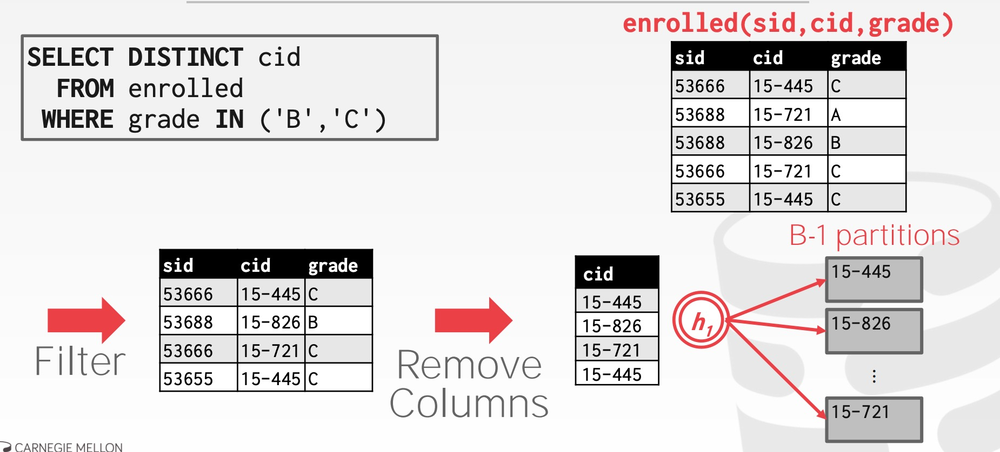
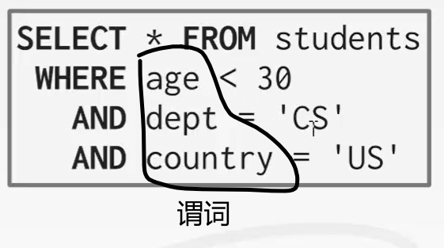
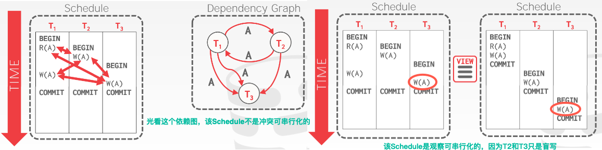
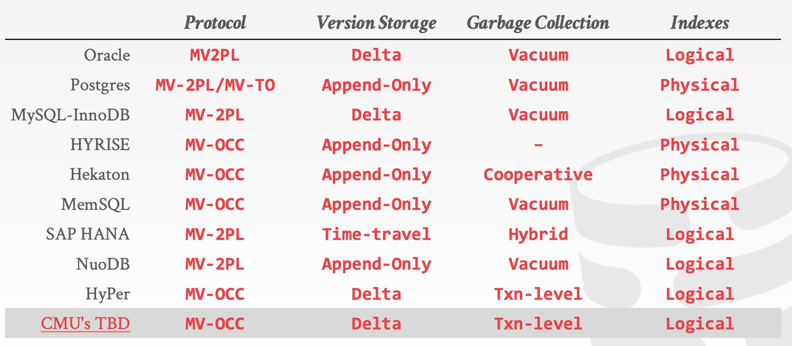
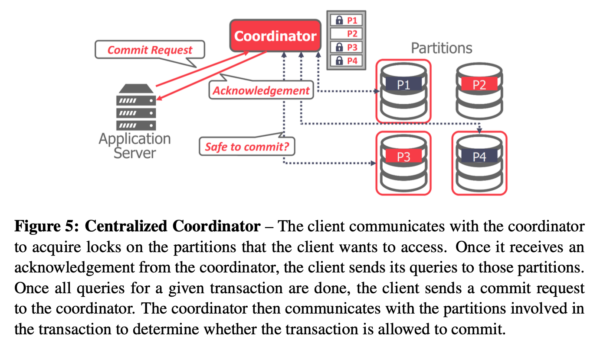
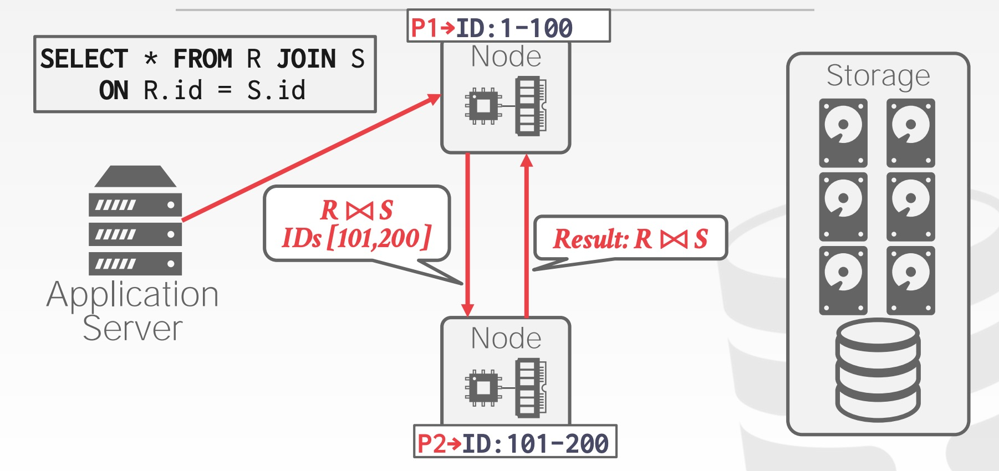

**CMU15445（Spring2023）Course Notes**

**Lecture \#01: Relational Model & Relational Algebra**

**1 数据库**

数据库 DB：一个有组织的相互关联的数据的集合，它对现实世界的某些方面进行建模。

数据库管理系统 DBMS：管理数据库的专业软件。由一个相互关联的数据的集合和一组用以定义、创建、查询、更新及管理这些数据的程序组成。

**2 关系模型**

**Relation & Tuple**

每个 Relation 都是一个无序集合（unordered set），集合中的元素称为 tuple，每个 tuple 由一组属性构成，这些属性在逻辑上通常有内在联系。

**Primary Keys**

primary key 在一个 Relation 中唯一确定一个 tuple，如果你不指定，有些 DBMSs 会自动帮你生成 primary key。

**Foreign Keys**

foreign key 唯一确定另一个 relation 中的一个 tuple

Ted Codd 在1970年提出了关系模型。这个关系模型有三个关键点:

-   将所有的表存储在数据库中以建立关系。（以关系存储数据库）
-   通过高级语言访问数据。
-   逻辑层与物理层分开。

数据模型（model）：描述数据库中数据的概念集合（如何组织数据）。关系模型是数据模型的一个例子。

-   Relational：大多数DBMS为关系型数据库
-   Key/Value、Graph、Document、Column-family：NoSQL数据库（列簇数据库如RocksDB）
-   Array/Matrix：Machine Learning会使用
-   Hierarchical：层次模型
-   Network：网状模型

模式（schema）：使用给定数据模型时，对特定数据集合的描述。

关系数据模型包含三要素：

1.  关系结构：关系的定义及其内容。这是关系具有的属性和这些属性可以包含的值。
2.  数据完整性约束：确保数据库内容满足约束条件。
3.  操作：如何访问和修改数据库的内容。

**3 数据操纵语言 DML**

DML：表达数据库的查询和更新，使用户可访问/操纵那些按某种适当的数据模型组织起来的数据。

1.  有以下访问类型
-   检索数据库信息
-   插入、删除、修改信息
1.  有两种基本的数据操纵语言
-   过程化 DML(如 Relational Algebra)：要求用户指定需要什么数据及如何获取这些数据
-   声明化 DML(非过程化 DML，如 Relational Calculus)：只需用户指定需什么数据，无需指明如何获得
-   查询：对信息进行检索的语句。DML中涉及信息检索的部分称为查询语言
-   （实践中常把“查询语言”和“数据操纵语言”作为同义词，但这在技术上并不正确）

DDL 是对数据结构进行修改的语言，如加索引、建表等。

**4 关系代数**

Relational Algebra：定义了一些基本方法来从关系中获取或操作元组。每种操作输入的是一个或多个关系，输出的是一个新的关系。

**Lecture \#02: Modern SQL**

**1 关系语言**

Edgar Codd 在20世纪70年代早期发表了有关关系模型的重要论文。他最初只定义了——DBMS 如何在关系模型上执行查询的数学符号（关系代数的七种基本运算符：选择、投影、自然连接、笛卡尔积、交、并、差）。用户只需要使用声明性语言(如SQL)指定他们想要的结果。DBMS负责确定产生该答案的最有效的计划。

关系代数基于集合(无序，无重复)。SQL基于包(无序，允许重复)。

**2 SQL 的历史**

-   ”SEQUAL" from IBM's System R prototype
-   Structured English Query Language
-   Adopted by Oracle in the 1970s
-   IBM releases DB2 in 1983
-   ANSI Standard in 1986. ISO in 1987
-   Structured Query Language

当前 SQL 的标准是 SQL 2016，而目前大部分 DBMSs 至少支持 SQL-92 标准，具体的系统对比信息可以到[这里](http://troels.arvin.dk/db/rdbms/)查询。

SQL：结构化查询语言。IBM最初将其命名为“SEQUEL”。由不同种类的命令组成：

1.  数据操作语言（DML）：数据操作，选择 select、插入 insert、更新 update、删除 delete。
2.  数据定义语言（DDL）：数据定义，如新建表，增加索引等。
3.  数据控制语言（DCL）：安全性授权、访问控制。
4.  其他：如何定义视图，如何定义完整性约束、参照约束，事务。

如 create：

| SQL CREATE TABLE student (  sid INT PRIMARY KEY,  name VARCHAR(16),  login VARCHAR(32) UNIQUE,  age SMALLINT,  gpa FLOAT ); |
|-----------------------------------------------------------------------------------------------------------------------------|

**3 SQL操作**

**聚合函数**

聚合函数将一组元组作为输入，然后生成单个标量值作为输出。只能在SELECT输出列表中使用。

SQL-92标准中定义了**AVG()**、**MIN()**、**MAX()**、**SUM()** 以及 **COUNT()** 函数。

1.  **AVG(col)** —— 返回col列的平均值
2.  **MIN(col)** —— 返回col列的最小值
3.  **MAX(col)** —— 返回col列的最大值
4.  **SUM(col)** —— 返回col列所有值的和
5.  **COUNT(col)** —— 返回 col 列值的数目

以下三个sql等价

| SQL SELECT COUNT(\*) FROM student WHERE login LIKE '%@cs'; SELECT COUNT(login) FROM student WHERE login LIKE '%@cs'; SELECT COUNT(1) FROM student WHERE login LIKE '%@cs'; |
|----------------------------------------------------------------------------------------------------------------------------------------------------------------------------|

加入 **DISTINCT** 关键字，可去除重复值。

**group by** 子句中给出的一个/多个属性构造分组，属性上取值都相同的元组被分为一组。**having** 子句可设置分组的限定条件。**select** 子句和 **having**子句中，只能有被聚集的属性和出现在 **group by** 子句中的属性。不使用 **group by** 则将整个结果视作一个分组。

Aggregate之外的其他列的输出未定义（e.cid 下面未定义）, Non-aggregated value必须出现在一个group by子句中。输出每门课的cid及学生的平均gpa：

**字符串操作**

不同数据库对于字符大小写敏感、字符串引号的规定：

SQL 中由很多操作字符串的函数：

-   upper(s) 将字符串 s 转换为大写；lower(s) 将字符串 s 转换为小写
-   trim(s) 去除字符串 s 后面的空格
-   substring(s,first,last) 选取s的子串

使用 like 操作符实现字符串的模式匹配，使用 escape 关键词定义转义字符；使用 not like 比较运算符搜寻不匹配项。

-   百分号（%）：匹配任意子串
-   下划线（_）：匹配任意一个字符

标准SQL使用 \|\| 拼接字符串。

-   大多数DBMS也遵循这一点。Postgres和Oracle是所有DBMS中遵循SQL标准最好的，SQL server、DB2其次，SQLite还行，MySQL最差。
-   在SQL Server 下要用 + ；在MySQL下不能用 + 、不能用 \|\| ，只能通过concat()函数。MySQL中若在两个字符串间不放任何东西，它们也会连接在一起（这点其他数据库系统都不行）。

**日期/时间操作**

-   DATE()函数：将字符串转换为日期类型。
-   EXTRACT() 函数：提取日期/时间数据的单独部分，比如年YEAR、月MONTH、日DAY、小时HOUR、分钟MINUTE、秒SECOND等
-   UNIX_TIMESTAMP() 函数：将日期转换为 UNIX 中的时间戳（即从1970.01.01开始计算的秒）
-   ROUND(字段,位数) 函数：将数值字段四舍五入为指定的小数位数。
-   DATEDIFF() 函数：**MySQL 中** 用于计算两个日期之间的间隔天数。
-   julianday() 函数：**SQLite中** 将日期转换为公历时间（即从公元前4713.01.01到现在的天数）。
-   CAST(表达式 AS 数据类型) 函数：将某种数据类型的表达式显式转换为另一种数据类型。参数是个表达式，它包括用AS关键字分隔的源值和目标数据类型。

获取今天是这一年的第几天

| SQL -- 适用 MySQL SELECT ROUND((UNIX_TIMESTAMP(DATE('2021-08-19'))-UNIX_TIMESTAMP(DATE('2021-01-01')))/(60\*60\*24),0) AS days; -- 先转化为秒，再转换为天数  SELECT DATEDIFF(DATE('2021-08-19'),DATE('2021-01-01')) AS days; |
|------------------------------------------------------------------------------------------------------------------------------------------------------------------------------------------------------------------------------|

**输出重定向 Output Redirection**

与将查询结果返回给客户端不同，可让DBMS将结果存储到另一个表中。则可在后续查询中访问该数据。

**新表：**将查询的输出存储到一个新的（永久的）表中。SQL标准中，INTO 关键字在执行过程中会创建一张表。

**现有表：**将查询的输出存储到数据库中已经存在的表中。输出数据列的属性、类型必须与现有表的属性、类型相匹配，列名称不必匹配。

**输出控制 Output Control**

**ORDER BY \<column\*\> [ASC\|DESC]** ：按一列或多列值对输出元组进行排序。（默认升序 ASC）

**LIMIT \<count\> [offset]** ：默认情况下，DBMS将返回查询产生的所有元组。可使用LIMIT子句来限制结果元组的数量。**LIMIT** 表示要取的tuple数目，**offset** 表示要跳过的tuple数目。

**嵌套查询**

在其他查询中调用查询，以在单个查询中执行更复杂的逻辑。外部查询的作用域包含在内部查询中（即**内部查询可引用外部查询的属性，但外部不能引用内部**）构建嵌套查询的办法：先从外部查询开始构建，考虑实际需要哪些属性，然后考虑如何过滤得到结果。

嵌套查询涉及操作符：

-   ALL：必须满足子查询中所有行的表达式。
-   ANY：子查询中至少有一行必须满足表达式。
-   IN：等价于= ANY()。
-   EXISTS：至少返回一行。

**window 函数**

Window 函数：跨元组执行“移动”计算。类似于聚合函数，对一个tuple子集进行函数计算，将它们聚合为一个结果，可以增量方式或移动方式进行此操作。但它仍然返回原始元组，后跟用 window 函数计算出的值。 如果采用聚合函数，则只能看到被聚集的属性和出现在 group by 子句中的属性，无法看到原来完整的tuple。

**先执行整个查询，再使用window函数对这些结果进行处理，然后将之放入查询结果中**。

窗口函数的语法结构如下：

| Plaintext \<窗口函数\>(\<表达式\>) OVER ([PARTITION BY \<列1\>, \<列2\>, ...]  [ORDER BY \<排序列\> [ASC \| DESC]]  [\<窗口帧定义\>]) |
|---------------------------------------------------------------------------------------------------------------------------------------|

窗口函数的核心部分是窗口帧定义，它确定哪些行应该被包含在计算中。窗口帧定义有以下几种常见的形式：

-   不带窗口帧定义：计算整个分区内的所有行。
-   ROWS BETWEEN AND ：指定一个范围，例如从当前行向前或向后的N行。
-   RANGE BETWEEN AND ：根据值的大小指定一个范围，而不是特定的行数。

常见的窗口函数包括：

-   ROW_NUMBER()：为每行分配一个唯一的整数行号。
-   RANK()：计算每行的排名，相同值的行具有相同的排名，跳过相应的排名。
-   DENSE_RANK()：计算每行的密集排名，相同值的行具有相同的排名，不跳过相应的排名。
-   SUM()、AVG()、MIN()、MAX()：计算指定列或表达式的聚合值。

example：

1.  计算每个销售员的销售总额和平均销售额：

| SQL SELECT salesperson, sales_amount,  SUM(sales_amount) OVER (PARTITION BY salesperson) AS total_sales,  AVG(sales_amount) OVER (PARTITION BY salesperson) AS avg_sales FROM sales_table; |
|--------------------------------------------------------------------------------------------------------------------------------------------------------------------------------------------|

1.  计算每个月的累计销售额：

| SQL SELECT month, sales_amount,  SUM(sales_amount) OVER (ORDER BY month) AS cumulative_sales FROM sales_table; |
|----------------------------------------------------------------------------------------------------------------|

**Select 1**

SELECT 1 是一种常见的用法，它的含义是选择一个常量值 1 作为查询结果的一列。通常情况下，使用 SELECT 1 的目的是为了检查查询是否返回了至少一行结果，而不关心具体的列或数据。这种用法常用于条件判断或简单的存在性检查。

**CTE**

在 SQL 中，CTE（Common Table Expression）是一种临时命名的查询结果集，它类似于子查询，但具有更清晰和可重用的语法。CTE 可以在一个查询中定义并被后续的查询引用。

**WITH**子句将内部查询的输出绑定到具有该名称的临时结果。

也可以用RECURSIVE 关键字来定义递归的 CTE。

| SQL WITH RECURSIVE cte_name (column1, column2, ...) AS (  -- Anchor member (初始查询)  SELECT initial_column1, initial_column2, ...  FROM initial_table  WHERE initial_condition   UNION ALL   -- Recursive member (递归查询)  SELECT recursive_column1, recursive_column2, ...  FROM recursive_table  JOIN cte_name ON join_condition  WHERE recursive_condition ) SELECT \* FROM cte_name; |
|----------------------------------------------------------------------------------------------------------------------------------------------------------------------------------------------------------------------------------------------------------------------------------------------------------------------------------------------------------------------------------------------|

**Lecture \#03: Database Storage (Part I)**

**1 存储**

传统的 DBMS 架构都属于 **disk-oriented architecture**，即假设数据主要存储在非易失的磁盘（non-volatile disk）上。于是 DBMS 中一般都有磁盘管理模块（disk manager），它主要负责数据在非易失与易失（volatile）的存储器之间的移动。

这里需要理解两点：

-   为什么需要将数据在不同的存储器之间移动？
-   为什么要自己来做数据移动的管理，而非利用 OS 自带的磁盘管理模块？

（CPU寄存器、CPU缓存、内存、固态硬盘、硬盘、网络存储）

磁盘管理模块的存在就是为了同时获得易失性存储器的性能和非易失性存储器的容量，让 DBMS 的数据看起来像在内存中一样。

**易失性存储设备：**

-   易失性：断电后数据就会丢失。
-   支持快速**随机访问**与**字节寻址**。则程序可以跳转到任何字节地址并得到那里的数据。
-   出于我们的目的，我们总是将这个存储类称为内存。

**非易失性存储设备：**

-   非易失性：存储设备无需连续的电源来保持它所存储的比特。
-   更适合**顺序访问**（同时读取多个数据块）。
-   **块/页寻址**。这意味着为了读取特定偏移量的值，程序首先必须将 4KB 页加载到存储程序想要读取的值的内存中。
-   称为磁盘。我们不会对固态存储(SSD)和旋转硬盘(HDD)进行(主要)区分。

**2 面向磁盘的DBMS概览**

面向磁盘的数据库管理系统：

1.  DBMS假设数据库的首要存储位置在**非易失的磁盘**上
2.  DBMS的组件管理数据在非易失性存储和易失性存储之间的移动

数据库全部位于磁盘上，数据库文件中的数据被组织为页，第一个页是目录页。为了对数据进行操作，DBMS需要将数据存入内存。它通过一个缓冲池来管理磁盘和内存之间的来回移动。DBMS也有一个执行引擎来执行查询。执行引擎将向缓冲池请求一个特定的页面，缓冲池将负责将该页面放到内存中，并向执行引擎提供一个指向内存中的页面的指针。缓冲池管理器将确保在执行引擎对该内存进行操作时页面在那里。之所以要构建面向磁盘的数据库管理系统，是因为我们希望能支持比一台机器上可用的内存量更大的数据库。

**3 DBMS VS OS**

DBMS的一个高级设计**目标**：给应用程序一种错觉——我们能提供足够的内存将整个数据库存入内存中。

由于磁盘的读/写开销很大，而我们不希望从磁盘存取数据时出现大的停顿，从而降低其他所有东西的速度。因此，我们希望DBMS在等待从磁盘获取数据时能够处理其他查询。（有一系列技巧，如允许在同一时间运行不同的线程或者不同的查询、缓存数据、提前计算某些数据等）

这个高级的设计目标就像虚拟内存，其中有一个很大的地址空间和一个让操作系统从磁盘导入页面的地方。

实现虚拟内存的一种方法：**使用mmap** 内存映射文件 **将文件的内容映射到进程的地址空间，进程在地址空间上读取，操作系统负责在磁盘和内存之间来回移动页面。**然而，如果mmap遇到page fault，那么这个进程将会被阻塞（操作系统要将page从磁盘load到内存）。

如果我们的数据库只需要读取数据的话，使用mmap实际上是可行的，但是问题在于我们并不仅仅需要读。如果有写操作，那么操作系统是不知道哪些page需要在其他page执行前从内存刷到磁盘上的，这将会与日志与并发控制的实现有关。

我们也可以通过一些指令来指导操作系统进行page的替换：

-   **madvise**：告诉操作系统何时你计划阅读某些页面。
-   **mlock**：告诉操作系统不要将内存范围交换到磁盘。
-   **msync**：告诉操作系统将内存范围刷新到磁盘。

出于正确性和性能的考虑，我们**不建议在DBMS中使用mmap**。

尽管使用mmap系统将具有操作系统可以提供的功能，但让DBMS实现这些过程本身可以提供更好的控制和性能（以正确的顺序将脏页刷到磁盘，更好的预取、buffer 替换、进程/线程调度策略）。

实际上并没有多少使用操作系统mmap的数据库系统，下列数据库使用了操作系统的mmap：

上述的数据库使用mmap，但仍然需要做一些额外的事情来防止操作系统做出错误的事情。

下列是部分使用mmap的数据库系统，有些会提供特定的设定才会启用mmap，在默认情况下不会使用mmap。

实际上很多系统都是不使用mmap的，他们会使用一些buffer池之类的技术：

主流数据库MySQL、DB2、Oracle、SQL server等都没有使用mmap。

**4 数据库存储**

关于 **数据库存储**，我们必须关心的问题主要有两个：

1.  如何使用磁盘上的文件表示数据库
2.  如何管理内存以及在硬盘间来回移动数据

最基本的形式中，DBMS将数据库以文件的形式存储在磁盘上。有些可能使用文件层次结构，有些可能使用单个文件。操作系统不知道这些文件的内容。只有DBMS知道如何破译它们的内容，因为内容是以特定于某种DBMS的方式编码的。数据库文件通常存放在操作系统提供的**文件系统** 中，我们基于操作系统的文件系统所提供的基本读写API来对文件进行读写。

DBMS的 存储管理器 负责维护磁盘上的数据库文件。它将文件组织为page的集合。它还可以跟踪page上的所有读取/写入操作，以及页面中还有多少空闲空间。有些系统会要求page是自包含的，这意味着阅读每个page所需的所有信息都存在page本身，这使得page出错时能尽可能容灾恢复。

**5 page**

1.  Page是一个固定大小的数据块，一个page能够保存任何东西，可以保存数据库里面的tuple，也可以保存元数据、索引、日志。
2.  现在有些数据库要求page是self-contained的，也就是说该表的内容的元数据存储在一个page中，该表内容的tuple存储在另一个page中，如果数据库schema布局的那个page灭失就不能解释这个表内容的元数据了（表的列意义、列属性、列类型等）。所以现在某些数据库系统例如Oracle就需要元数据的page和内容数据的page一同保存在同一个page中。
3.  另外大多数系统不会在page中混合使用不同类型的数据。
4.  每个page都会被赋予一个唯一的内容标识符，数据库系统会生成page ID。考虑到有时候会将数据库系统的page移动至另一个磁盘、压缩磁盘等操作，所以系统还有一个indirection层，记录了page ID和位置信息，这样indirection就会告诉我们page ID对应在什么位置，以保证我们移动磁盘时候page ID不会发生改变。

**大多数DBMS使用固定大小的page**，以避免支持可变大小page所需的工程开销。例如，对于可变大小的页面，删除一个页面可能会在文件中创建一个漏洞，DBMS无法轻松地用新页面填补这个漏洞。

在DBMS中，page有三个概念:

1.  硬件页面（4KB）：你从实际存储设备本身获得的page相关的API或page访问级别。
2.  操作系统页面（4KB）：通过它可从存储设备中取出数据放入内存。
3.  数据库页面（512B -16 KB)。

硬件页面是我们最关心的，存储设备只能保证硬件页面大小的原子写入操作。如果硬件页是4kb，那么当系统尝试将4kb写入磁盘时，要么将写入全部4kb，要么不写入。这意味着 **如果我们的数据库页比硬件页大，DBMS将不得不采取额外的措施来确保数据安全地写入**，因为当系统崩溃时，程序可以在将数据库页写入磁盘的过程中只完成了一部分（硬件只能保证4KB大小的数据没有问题）。这会对日志与并发产生一定的影响。

不同 DBMS 管理 pages 的方式不同，主要分为以下几种：

-   堆文件组织
-   连续/分类文件组织
-   hash文件组织

**6 heap file**

数据库中的heap文件是一个无序的page集合，可以随机地把tuple数据存在文件里。

-   它是最简单，最基础的组织类型。它适用于数据块。**在堆文件组织中，记录将插入文件的末尾。**插入记录时，不需要对记录进行排序和排序。
-   当数据块已满时，新记录将存储在其他某个块中。这个新数据块不必是下一个数据块，但是它可以选择内存中的任何数据块来存储新记录。堆文件也称为无序文件。
-   在文件中，每个记录都有唯一的ID，并且文件中的每个页面都具有相同的大小。DBMS负责存储和管理新记录。
-   heap file 指的是一个无序的 pages 集合，pages 管理模块需要记录哪些 pages 已经被使用，而哪些 pages 尚未被使用。那么具体如何来记录和管理呢？主要有以下两种方法 Linked List 和 Page Directory。

堆文件组织的优点

-   这是用于批量插入的非常好的文件组织方法。如果一次需要将大量数据加载到数据库中，则此方法最适合。
-   对于小型数据库，记录的获取和检索比顺序记录要快。

堆文件组织的缺点

-   对于大型数据库，此方法效率不高，因为它需要花费时间来搜索或修改记录。
-   对于大型数据库，此方法效率低下。

两种表示heap文件的方法：

1.  **Linked List 链表：**堆文件的header中，链表有两个指针，分别指向空闲页列表和数据页列表。但是，如果DBMS正在寻找一个特定的页面，它必须对数据页面列表进行顺序扫描，直到找到它正在寻找的页面。

1.  **page directory 页面目录：**DBMS维护的特殊页面，跟踪数据页面的位置（维护了page ID 和page所处位置的映射）以及每个页面上的空闲空间数量。数据库必须保证目录页面和数据页面的同步。

**7 page内部结构**

每个 page 都包含一个 **header**，记录关于 page 的一些 metadata：

-   page 大小、校验和、DBMS的版本、事务的可见性（一些数据查询和修改的权限等）、压缩信息。
-   一些系统要求页面是自包含的（例如oracle）。

我们需要根据 header 的信息来解析page中存储的数据。

page 中布局数据的一种方法是类似数组的方式去存储 tuple，header 维护一个数组的信息。然后每次添加新 tuple 时，就将该 tuple 添加到末尾。但是，当它删除 tuple 或 tuple 具有可变长度属性时，就会出现问题。

在page 中存储数据有两种主要方法：slotted-pages、log-structured。

**slotted-pages**：page 将 slot 映射到 offset（偏移量）。

-   当今DBMS中最常用的方法。
-   头部header跟踪 使用的slot的数量、最后使用的slot的起始位置的偏移量、slot数组，**slot数组跟踪每个元组的起始位置（将一个特定的slot映射到page上的某个偏移量上）**。这样一个 tuple 就可由一个page id和slot id来唯一定位。
-   要添加一个元组，从前往后对 slot 数组进行填充，而元组的数据从后往前填充。当 slot 数组和元组数据相遇时，该页被认为已满（中间可能存在空隙，但这些空间太小以至于无法存东西）。
-   关键在于间接层避免了物理存储位置更新信息传播到系统的其他上层部分。根据page ID 就能在page 目录中找到此page保存的位置，而根据slot就能找到tuple的相对位置。更新物理存储无需更新其他任何东西。

**log-structured**：DBMS只存储日志记录，而不存储tuples。

-   将数据库如何修改（插入、更新、删除）的记录存储到文件中。方便回滚，因为用了日志数据结构后回滚只需要删除某些log即可完成。
-   为了读取记录，DBMS从后往前扫描日志文件并“重新创建”元组。
-   写快，读慢。
-   在仅追加存储上工作得很好，因为DBMS不能返回并更新数据。
-   为了提高读取速度，DBMS可以有索引，允许它跳转到日志中的特定位置。它还可以定期压缩日志（如果它有一个元组，然后对它进行更新，它可以压缩它，只插入更新后的元组）。压缩的问题使DBMS最终会导致写的放大（它一遍又一遍地重写相同的数据）。

**8 tuple内部结构**

元组本质上是一个字节序列（字节数组）。将这些字节解释为属性类型和值是DBMS的工作。

**Tuple Header**：包含关于Tuple的元数据。

-   DBMS的并发控制协议的可见性信息（即关于哪个事务创建/修改该元组的信息）。
-   NULL值的位映射。（NULL实际也是元数据）
-   注意，DBMS不需要在这里存储关于数据库模式的元数据。

**元组数据**：属性的实际数据。

-   属性通常按照创建表时指定的顺序进行存储。
-   大多数DBMS不允许元组超过page的大小。

**独特的标识符**:

-   数据库中的每个元组都被分配一个唯一的标识符。
-   最常见的：page ID +（偏移量或slot）。
-   应用程序不能依赖这些 ID 来表示任何东西。

**非正规化元组数据：**如果两个表是相关的，DBMS可以“预连接”它们，因此这两个表最终在同一个page上。这使得读取速度更快，因为DBMS只需要加载一个page而不是两个独立的page，但是这使得更新更加昂贵，因为DBMS需要为每个元组提供更多的空间。

**Lecture \#04: Database Storage (Part II)**

**1 Log-Structured Storage**

log-structured 这种方式page中不存储数据，而是存储记录，如下图所示：

其中，修改通过二进制表示

这种叫做日志文件系统。

问：为什么要这么做？去记录每次的日志信息。

答：这样做回滚起来很方便。这样操作会更快，因为顺序读取和访问的速度要比随机访问快得多。

缺点：在查询场景下，就需要遍历 page 信息来生成数据才能返回查询结果。为了加快查询效率，通常会对操作日志

在记录 id 上建立索引，如下图所示：

另外，定期压缩日志也是不可或缺的

**2 Data Representation**

Tuple本质上就是 byte 数组。DBMS的任务就是将那些bytes翻译成有意义的属性值。数据表示模式 sehema 是DBMS存储值的字节的方式。DBMS的 catalogs 中包含着数据表的 schema 和元组的 layout（类似数据表的说明书）。

元组中可以存储 **五种主要类型**：整数、可变精度数、定点精度数、可变长度值和日期/时间。

| IEEE-754是一种行业标准，它是一种用来表示数字和CPU的规范 |
|---------------------------------------------------------|

1.  **整型：**
-   大多数 DBMS 使用 IEEE-754 标准指定的“本地”C/C++类型存储整数。值的长度固定。
-   示例：INTEGER、BIGINT、SMALLINT、TINYINT
1.  **可变精度类型：**
-   使用 IEEE-754 标准指定的“本地”C/ C++类型的不精确、可变精度的数字类型。值的长度固定。
-   可变精度数比任意精度数（固定精度数的精度是任意的，即它的范围无法确定）**计算更快，因为CPU可以直接对它们执行指令。但存在舍入误差。**
-   示例：FLOAT、REAL/DOUBLE
1.  **固定精度类型：**
2.  **可变长度类型：**
-   任意长度的字节数组。
-   有一个 header 跟踪字符串的长度（若是一个非常大的值，后面还跟一个checksum），使它容易跳转到下一个值。后面跟字节序列。
-   大多数 DBMS 不允许 tuple 超过单个 page 的大小，所以他们在 **overflow page** 上写入值，让 tuple 包含对该 page 的指针。（这就像是另一个record id，通过page number和slot id来告诉我们该去哪里找到我们需要的那个数据）

    

-   除了将数据直接保存在数据库中，还有另一种方案——**外部存储**（Exturnal File），基本思路是：不将该属性的数据保存在tuple内部，而是往里面保存一个指针或者是一个文件路径，它们指向能找到该数据的本地磁盘，或者网络存储，亦或是某些外部存储设备。
-   将这些大值存储在外部文件 **External File** 中，然后 tuple 将包含指向该文件的指针。
-   示例：VARCHAR、VARBINARY、TEXT、BLOB
1.  **日期和时间类型：**
-   通常，这些表示为自 unix 时代（1970年1月1日）以来的微秒/毫秒/秒数。
-   示例：TIME、DATE、TIMESTAMP

**系统目录 System Catalogs：**

DBMS将数据库的元数据存储在内部的 catalog 中，包括表名、索引、视图、用户权限等信息。

大多数DBMS将它们的目录存储在它们自己的表所使用的格式中。通过STANDARD INFORMATION_SCHEMAAPI将目录暴露出来。

**3 OLTP & OLAP**

数据库的应用场景大体可以用两个维度来描述：操作复杂度和读写分布，如下图所示：

坐标轴左下角是 OLTP（On-line Transaction Processing），OLTP 场景包含简单的读写语句，且每个语句都只操作数据库中的一小部分数据。

在坐标轴右上角是 OLAP（On-line Analytical Processing），OLAP 主要处理复杂的，需要检索大量数据并聚合的操作。

*通常 OLAP 操作的就是 OLTP 应用搜集的数据*

**Lecture \#05: Storage Models & Compression**

**1 工作负载 workload**

目前根据不同的应用场景和数据读写特征，大致将数据库划分为两种。不同workload 的数据库的存储方式也存在很大差异。

OLTP：联机事务处理。**从外界拿到数据后放入数据库系统；查询多为读取/更新一小部分数据，不断重复相同操作。**

-   快速、短时间运行的操作
-   查询在同一时间对单个实体进行操作
-   写比读多
-   重复操作
-   通常是人们首先构建的应用程序
-   示例：Amazon的用户调用。他们可以添加购物车，购买商品，但这些行为只会影响他们的账户。 BigTable、Cassandra、MongoDB、Radis以及其他数据库系统。（Cassandra、MongoDB、Radis是NoSQL数据库系统）

OLAP：联机分析处理。**分析通过OLTP获取的大量数据，从中推断出新信息。**（被称为数据科学，从已有数据中推断出新数据）

-   长时间运行，更复杂的查询
-   读取数据库的大部分内容
-   探索查询
-   从OLTP端收集的数据中获取新数据

HTAP：混合事务分析处理。将OLTP与OLAP相结合。

可见 OLTP 擅长简单的查询，但会做大量写入操作；OLAP 会做大量读取操作，但更复杂。HTAP 是二者的结合，既要获取数据又要对数据进行分析。

**2 存储模型 storge model**

**n元存储模型（NSM）**

DBMS连续存储单个元组的所有属性，因此NSM也被称为行存储。

适合 **OLTP** 工作负载，因为在 OLTP 工作负载中，事务往往只操作单个实体并插入大量工作负载。它是理想的，因为它只需要一次获取就可以获得单个元组的所有属性。

1.  优点
-   快速插入、更新和删除。
-   适用于需要整个元组的查询，以及只需要获取几条数据的点查询。
1.  缺点
-   不适合扫描表的大部分或属性的子集。因为它获取了处理查询不需要的数据，从而污染了缓冲池。
1.  组织NSM数据库的两种方式：
-   堆组织表：元组存储在称为堆的块中，堆并不一定定义顺序。
-   索引组织表：元组存储在主键索引本身，但不同于聚集索引。

**分解存储模型（DSM）**

DBMS将所有元组的单个属性（列）连续存储在一个数据块中。也称为列存储。

适合 **OLAP** 工作负载，在这种工作负载中，只读查询对表属性的子集执行大规模扫描。

1.  优点
-   减少查询执行过程中浪费的I/O工作量，因为DBMS只读取它需要的查询数据。
-   支持更好的压缩，因为同一个属性的所有值都是连续存储的。
1.  缺点
-   由于元组拆分/拼接，点查询、插入、更新和删除的速度很慢。
1.  当使用列存储时，要将元组放回一起，有以下两种方法：

-   固定长度偏移：首先假设所有属性都是固定长度的。然后，当系统需要特定元组的属性时，它知道如何跳转到文件中的那个位置。为了适应可变长度字段（不同DBMS处理方法不同），系统可以填充它们，使它们都是相同的长度，或者您可以使用一个字典，它接受一个固定大小的整数，并将整数映射到值。
-   嵌入的Tuple id：对于列中的每个属性，将 Tuple id 存储在其中。系统还需要额外的信息来告诉它如何跳转到每个具有该 id 的属性。

**行存储通常更适合OLTP，而列存储则更适合OLAP。**

**3 Database Compression**

压缩广泛应用于基于磁盘的数据库管理系统中。因为磁盘I/O（几乎）总是主要的瓶颈。因此，这些系统中的压缩可以提高性能，尤其是在只读分析工作负载中。如果DBMS以更大的压缩和解压缩计算开销为代价预先压缩了元组，则DBMS可以获取更有用的元组。

内存中的DBMS更为复杂，因为它们不必从磁盘中获取数据来执行查询。内存比磁盘快得多，但压缩数据库会减少DRAM的需求和处理。他们必须在速度和压缩比之间取得平衡。压缩数据库可减少对DRAM的要求。它可以降低查询执行过程中的CPU成本。如果数据集完全是随机位，就没有办法进行压缩。然而，现实世界中的数据集有一些关键特性可以进行压缩：

-   •数据集的属性值往往具有高度偏斜的分布
-   •数据集往往在同一元组的属性之间具有高度相关性。

鉴于此，我们希望数据库压缩方案具有以下属性：

-   •必须产生固定长度值。唯一的例外是存储在不同池中的可变长度数据。这是因为DBMS应该遵循字对齐，并且能够使用偏移量访问数据。
-   •允许DBMS在查询执行期间尽可能长时间地推迟解压缩（延迟物化）。
-   •必须是无损方案，因为人们不喜欢丢失数据。任何类型的有损压缩都必须在应用程序级别执行

在向DBMS添加压缩之前，我们需要决定要压缩什么类型的数据。这个决定决定了压缩方案是可用的。压缩粒度有四个级别：

-   •块级别：压缩同一表的元组块。
-   •元组级别：压缩整个元组的内容（仅限NSM）。
-   •属性级别：将单个属性值压缩到一个元组中。可以针对同一元组的多个属性。
-   •列级别：压缩为多个元组存储的一个或多个属性的多个值（仅适用于DSM）。这允许更复杂的压缩方案

**4 Naive Compression**

DBMS使用通用算法（例如，gzip、LZO、LZ4、Snappy、Brotli、Oracle OZIP、Zstd）压缩数据。尽管DBMS可以使用几种压缩算法，但工程师通常会选择那些通常提供较低压缩比以换取更快压缩/解压缩的算法。

MySQL InnoDB中有一个使用天真压缩的例子。DBMS压缩磁盘页，将它们填充到两KB的幂，并将它们存储到缓冲池中。但是，每当DBMS尝试读取数据时，缓冲池中的压缩数据都必须解压缩。

由于访问数据需要对压缩数据进行解压缩，这限制了压缩方案的范围。如果目标是将整个表压缩成一个巨大的块，那么使用简单的压缩方案是不可能的，因为每次访问都需要对整个表进行压缩/解压缩。因此，对于MySQL，由于压缩范围有限，它将表分解成更小的块。

另一个问题是，这些简单的方案也没有考虑数据的高级含义或语义。该算法既不考虑数据的结构，也不考虑查询计划如何访问数据。因此，这就失去了利用后期物化的机会，因为DBMS将无法判断何时能够延迟数据的解压缩

**5 Columnar Compression**

**Run-Length Encoding (RLE)**

RLE compresses runs of the same value in a single column into triplets:

• The value of the attribute

• The start position in the column segment

• The number of elements in the run

The DBMS should sort the columns intelligently beforehand to maximize compression opportunities. This clusters duplicate attributes and thereby increasing compression ratio.

**Bit-Packing Encoding**

When values for an attribute are always less than the value’s declared largest size, store them as smaller data type.

**Mostly Encoding**

Bit-packing variant that uses a special marker to indicate when a value exceeds largest size and then maintain a look-up table to store them.

**Bitmap Encoding**

The DBMS stores a separate bitmap for each unique value for a particular attribute where an offset in the vector corresponds to a tuple. The ith position in the bitmap corresponds to the ith tuple in the table to indicate whether that value is present or not. The bitmap is typically segmented into chunks to avoid allocating large blocks of contiguous memory. This approach is only practical if the value cardinality is low, since the size of the bitmap is linear to the cardinality of the attribute value. If the cardinalty of the value is high, then the bitmaps can become larger than the original data set.

**Delta Encoding**

Instead of storing exact values, record the difference between values that follow each other in the same column. The base value can be stored in-line or in a separate look-up table. We can also use RLE on the stored deltas to get even better compression ratios.

**Incremental Encoding**

This is a type of delta encoding whereby common prefixes or suffixes and their lengths are recorded so that they need not be duplicated. This works best with sorted data.

**Dictionary Compression**

The most common database compression scheme is dictionary encoding. The DBMS replaces frequent patterns in values with smaller codes. It then stores only these codes and a data structure (i.e., dictionary) that maps these codes to their original value. A dictionary compression scheme needs to support fast encoding/decoding, as well as range queries.

Encoding and Decoding: Finally, the dictionary needs to decide how to encodes (convert uncompressed value into its compressed form)/decodes (convert compressed value back into its original form) data. It is not possible to use hash functions.

The encoded values also need to support sorting in the same order as original values. This ensures that results returned for compressed queries run on compressed data are consistent with uncompressed queries run on original data. This order-preserving property allows operations to be performed directly on the codes.

**Lecture \#06: Buffer Pools**

DBMS 的磁盘管理模块主要解决两个问题：

1.  如何使用磁盘文件来表示数据库的数据（元数据、索引、数据表等）
2.  （本节）如何管理数据在内存与磁盘之间的移动

本节将讨论第二个问题。管理数据在内存与磁盘之间的移动又分为两个方面：空间控制（Spatial Control）和时间控制（Temporal Control）

**Spatial Control**

空间控制策略通过决定将 pages 写到磁盘的哪个位置，使得常常一起使用的 pages 能离得更近，从而提高 I/O 效率。

**Temporal Control**

时间控制策略通过决定何时将 pages 读入内存，写回磁盘，使得读写的次数最小，从而提高 I/O 效率。

**1 Buffer Pool Manager**

DBMS 启动时会从 OS 申请一片内存区域，即 Buffer Pool，并将这块区域划分成大小相同的 pages，为了与 disk 的 pages 区别开，通常称为 frames，当 DBMS 请求一个 disk page 时，它首先需要被复制到 Buffer Pool 的一个 frame 中。因为Buffer Pool 中 frame 的顺序与 disk 中 page 的顺序无关。因此还需要一个额外的 indirection 层（page table），告知哪个page在哪个frame中。DBMS 维护的页表 page table，负责记录每个 page 在内存中的位置，以及是否被修改（Dirty Flag），是否被引用或引用计数（Pin/Reference Counter）等元信息。

请注意：这段内存完全是由数据库系统控制的，不是由操作系统来分配这些内存的。

当 page table 中的某 page 被引用时，会记录引用数（pin/reference），表示该 page 正在被使用，空间不够时不应该被移除；当被请求的 page 不在 page table 中时，DBMS 会先申请一个 latch，表示该 entry 被占用，然后从 disk 中读取相关 page 到 buffer pool，释放 latch。

**locks vs latches**

**locks**

保护 **数据库逻辑内容**(例如元组、表、数据库)不受其他事务的影响，在事务持续期间保持，需要能够回滚更改。

**latches**

在数据库中，Latches是一种同步机制，用于管理对数据库内部数据结构的并发访问。它们是一种轻量级的锁，用于保护共享数据结构的一致性和完整性。

-   Latches通常用于控制对数据库缓冲区、索引结构、事务控制块等关键数据结构的并发访问。
-   数据库中的Latches通常是基于硬件原语或操作系统提供的原子操作实现的。
-   Latches通常与其他同步机制（如锁和条件变量）一起使用，以实现数据库的并发控制和并发事务处理。

**page table vs page directory**

**page directory**：数据库文件中 page id 到 page 位置的映射

-   是告诉执行引擎数据在哪个page的哪个slot（即offset）的关键索引，所有改变都应被记录在磁盘上（持久化），以保证DBMS重启时能找到

**page table**：是page id 到 buffer pool 中 frame 的映射

-   是个在内存中的数据结构（hash表），因此无需存储在磁盘上（无需保证持久化，丢失了重新建立一个就好，但要线程安全）

**Allocation Policies**

-   全局策略（Global Policies）：同时考虑所有查询和事务来分配内存
-   局部策略（Local Policies）：为单个查询/事务分配内存frames时不考虑其它查询的情况。可以让特定的事务表现更好，当然全局上可能会有糟糕的表现。

**2 Buffer Pool 优化**

**Multiple Buffer Pools**

为了减少并发控制的开销（减少那些试图访问Buffer池的不同线程间争抢Latch的情况）并改善数据的局部性，DBMS 可以在不同维度上维护多个 Buffer Pools：

-   多个 Buffer Pools 实例，相同的 page hash 到相同的实例上
-   每个 Database 分配一个 Buffer Pool
-   每种 Page 类型一个 Buffer Pool

实现 multiple buffer pools 的方法：

-   在 record id 中添加一个 objectId
-   使用 hash 将 page id 映射到不同 buffer pool

**Pre-fetching**

希望最小化数据库系统的停顿，则DBMS 可以通过查询计划来预取 pages，如：

-   **顺序扫描** Sequential Scans

-   **按索引扫描** Index Scans：需要额外记录一些元数据（index-page按照二叉搜索树的方式去组织）

**Scan Sharing（扫描共享）**

Scan Sharing（或称为Synchronized Scans）是一种优化技术，用于并发执行查询操作时共享扫描结果的过程。Scan Sharing技术旨在避免这种重复扫描的情况，通过共享扫描结果来提高查询的效率。它可以减少重复扫描和资源浪费，提高查询性能和系统吞吐量。

当两个查询 A, B 先后发生，B 发现自己有一部分数据与 A 共用，于是先共用 A 的 cursor，等 A 扫完后，再扫描自己还需要的其它数据。这与结果缓存（**result caching**）不同，结果缓存指——计算出某些结果并将之缓存起来，再遇上相同的查询时直接使用，而不需要重新执行查询。通常情况下，result caching中，查询必须一样；但scan sharing中，查询不一定要一样。

**Buffer Pool Bypass（跳过Buffer Pool）**

在某些情况下，使用缓冲池会引入额外的开销，例如顺序扫描或大范围扫描，缓冲池的数据查找和维护开销可能超过了直接从磁盘读取数据的开销。该情况下，可以使用Buffer Pool Bypass技术来绕过缓冲池，直接从磁盘读取数据。通过绕过缓冲池，可以减少缓冲池的查找和维护开销，提高查询的性能和响应速度。

**3 OS Page Cache**

大部分 disk operations 都是通过操作系统调用完成，通常操作系统会维护自身的数据缓存，这会导致一份数据分别在操作系统和 DMBS 中被缓存两次。当数据库管理系统（DBMS）使用直接I/O（Direct I/O）来绕过操作系统的缓存时，它的目的是避免数据页的冗余拷贝以及需要管理不同的驱逐策略。使用直接I/O带来以下几个好处，减少数据拷贝，避免缓存管理开销，控制缓存一致性。

**4 Buffer Replacement Policies**

需从以下四因素选择合适的置换算法：

-   正确性（Correctness）：操作过程中要保证脏数据同步到 disk
-   准确性（Accuracy）：尽量选择不常用的 pages 移除
-   速度（Speed）：决策要迅速，每次移除 pages 都需要申请 latch，使用太久将使得并发度下降
-   元数据负荷（Meta-data overhead）：决策所使用的元信息占用的量不能太大

当需要置换页面时，系统会检查每个页面的标志位。如果一个页面没有被修改过（即标志位为未修改状态），则可以安全地丢弃该页面，因此不需要将其写回到磁盘，这样快速地释放缓冲池中的空间，而无需进行磁盘写入操作，从而提高了性能。

**LRU 最近最少使用算法**

维护每个 page 上一次被访问的时间戳，每次移除时间戳最早的 page。

**Clock 算法**

-   每当 page 被访问时，reference bit 设置为 1
-   每当需要移除 page 时，从上次访问的位置开始，按顺序轮询每个 page 的 reference bit，若该 bit 为 1，则重置为 0；若该 bit 为 0，则移除该 page

**LRU和Clock算法优化**

二者都容易被 sequential flooding （顺序溢出）现象影响，从而导致最近被访问的 page 实际上却是最不可能需要的 page。可有有如下优化：

1.  LRU-K：记录页面最后k次访问的时间戳并且计算时间戳的间隔。LRU-K 保存每个 page 的最后 K 次访问时间戳，利用这些时间戳间隔来估计它们下次被访问的时间，时间间隔最长的page是最近最少被使用的。通常 K 取 2 就能获得很好的效果。
2.  局部策略：对不同的访问采用不同的内存池。使用多个buffer池，让每个查询本地化。DBMS 针对每个查询做出移除 pages 的限制，使得这种影响被控制在较小的范围内，类似 API 的 rate limit。
3.  优先级提示：这也是需要一些先验知识。如果例如我们访问的是index，而index-page按照B+树或者有组织的形式存储，我们就可以按照这个信息来帮助页面置换信息的判断。

**Dirty Pages**

移除一个 dirty page 的成本要高于移除一般 page，因为前者需要写 disk，后者可以直接 drop，因此 DBMS 在移除 page 的时候也需要考虑到这部分的影响。除了直接在 Replacement Policies 中考虑，有的 DBMS 使用 Background Writing （后台写）的方式来处理。它们定期扫描 page table，发现 dirty page 就写入 disk，在 Replacement 发生时就无需考虑脏数据带来的问题。

**5 Other Memory Pools**

除了存储 tuples 和 indexes，DBMS 执行查询等操作时还需要 Memory Pools 来存储其它数据，如：

-   Sorting + Join Buffers
-   Query Caches
-   Maintenance Buffers
-   Log Buffers
-   Dictionary Caches

**Buffer Pool Bypass**

当遇到扫描量非常大的查询时，如果将所需的 pages 从磁盘中一个一个的换入 Buffer Pool，将会造成buffer池的污染，因为这些 pages 通常只使用一次，而它们的进入将导致一些可能在未来更需要的 pages 被移除，因此一些 DBMS 做了相应的优化。

思路：分配一小块内存给那个线程，当他从磁盘中读取page时，不管这个page已经在buffer池中了还是不在，都要放在这一小块另开辟的内存中，当查询完成时就会释放掉这块内存，这样不会污染buffer池。

**6 锁**

当被请求的 page 不在 page table 中时，DBMS 会先申请一个 latch（lock 的别名），表示该 entry 被占用，然后从 disk 中读取相关 page 到 buffer pool，释放 latch。以上两种过程如下图所示：

locks是数据库系统中的抽象锁， locks可以

-   可以保护数据库中的内容，例如tuple、表等。
-   事物在运行时会持有这个lock。
-   交易期间持有需要能够回滚更改。——后面并发控制等章节会讨论
-   数据库系统会为使用数据库的人提供这个API或者函数，为程序开发人员使用。

latches，是操作系统中的锁，

-   用来保护DBMS的关键部分与其他线程之间的互斥。
-   保护DBMS在运行期间进行独享。
-   不需要能够回滚更改。

**Lecture \#07: Hash Tables**

**1 数据结构**

一个 DBMS 为系统内部的许多不同部分使用不同的数据结构：

-   **Internal Meta-Data（内部元数据）**：跟踪数据库和系统状态的信息。
-   **Core Data Storage（核心数据存储）**：可以用作数据库中 tuple 的基础存储。数据库所存储的数据，可以被组织成一个 hash table 或 B+ tree 或者其他树结构。
-   **Temporary Data Structures（临时数据）**：执行查询或者高效计算时临时创建的数据结构，例如 join 时创建的 hash table。
-   **Table Indexes（表索引）**：本质是用 tuple 的 key 构建一个目录，辅助我们快速查找到某个 tuple，避免顺序检索。

这些数据结构的设计需考虑的问题：

-   Data Origanization：如何在内存/ Page 中组织数据的存储，并且支持快速的读写与增删。
-   Concurrency：如何支持多线程环境对数据结构的访问。比如对于同一个内存位置的数据，一个线程在写，另一个线程同时在读，就可能会出现问题（脏读）。并发控制对于后续的事务处理将会是很重要的一个考量。

在哈希表中，"slot"和"bucket"是常用的术语，用于描述哈希表中存储数据的逻辑单元：

-   Slot（槽位）：槽位是哈希表中的一个位置或容器，用于存储数据项。每个槽位可以容纳一个或多个数据项，具体取决于哈希表的实现方式和负载因子。槽位通常通过索引或键来访问。
-   Bucket（桶）：桶是槽位中的一个逻辑分组，用于存储具有相同哈希值的数据项。当多个数据项被哈希到同一个槽位时，它们将被存储在该槽位的桶中。桶的大小可以根据需要进行动态调整，以适应不同的负载和冲突情况。

**2 Hash Table**

hash table 是个抽象数据类型，提供无序的关联数组实现的 API，它能将 key 映射到 value。

-   可以将任意的 key 映射到对应的 value 上。在 hash table 中并没有顺序的说法，也就是说 hash table 的 key 是无序的（但是具体实现时，例如树状哈希，还是有一定的顺序）。
-   对于数组形式的哈希，它使用 hash 函数计算给定 key 在数组中的 offset，从中可以找到对应的 value。
-   hash table 的空间复杂度是 O(n)，查找的平均复杂度是 O(1)，但是最坏情况下是 O(n)。

hash table 是由二部分组成的数据结构：

1.  **Hash Function：**如何将一个大的 key 映射到一个相对小范围的 integer 值。要权衡 hash 速度与冲突率。
2.  **Hash Scheme：**如何处理 hash 冲突。要权衡使用的内存空间与处理冲突时的额外操作。

**3 Hash Functions**

Hash Function 接受任何 key 作为其输入。然后返回该 key 的整数表示(即“hash”)。函数的输出是确定性的（即相同的 key 应该总是生成相同的哈希输出）。

-   CRC-64：（1975）生成 hash 的碰撞率合理，但速度非常慢
-   MurmurHash：（2008）从数据库层面说，其诞生进入了现代 hash 函数时代，google 对其修改使长度更短的 key 获得更快的速度
-   Google 的 CityHash：（2011）google 在之后做出了 CityHash
-   Facebook 的 XXHash：（2012）之后发行的 XXHash3 是目前速度最快、碰撞率最低的Hash函数
-   Google 的 FarmHash：（2014）google 对 CityHash 进行修改得到 FarmHash，碰撞率比 CityHash 更低

**4 Static Hashing Schemes**

静态哈希方案是指哈希表的大小是固定的。当 DBMS 用完哈希表中的存储空间后，它必须扩容并且重建（将原来的值全复制过去）哈希表。通常，新哈希表的大小是原哈希表的两倍。扩容代价非常高，理想情况下，我们需要大概知道要保存的元素（key）的上限，这样就无须扩容。为了减少浪费的比较次数，重要的是避免哈希键的碰撞。这要求哈希表的槽数（slots）是预期元素数的两倍 slots = 2\*keys。

**Linear Probe Hashing**

它是个 slot 表。slot 中需存储 key 值，这样才能支持查找和删除。

**插入数据：**若 hash(key) 映射的 slot 位置无数据，就直接插入 key\|value 键值对；否则就线性向后探查，直到找到一个能插入数据的空 slot 为止。（value 是指向某个 page 或 tuple 的指针）

**查找数据：**找到 hash(key) 映射的 slot，若不是要找的 key，就线性向后探查，若直到一个空 slot 还未找到，证明没有此 key。

**删除数据：**对于某个 key 不能直接删除，否则会影响数据的查找。

-   方一：**设置标记（Tombstone 墓碑）**。删除 slot 上的值并设置 Tombstone，逻辑上这里没有 entry 但物理上这个 slot 被占用。这样就不会影响数据的查找，但会浪费空间，稍后需进行清理。
-   方二：**移动数据**。即删除 slot 上数据的同时，将后面的数据都往前挪动。

移动数据的方法在实际处理中会出现很多问题👇🌰，且很复杂，一般会选择标记 Tombstone。

**non-unique keys**

之前我们都假设 key 是唯一的，对 primary index 来说，这没问题。但实际数据集中 key 可能不唯一。

如果我们想在哈希表中记录相同的 key 的不同 value，有 2 种方法：

1.  将 key 的值存储在单独的存储区域：每个 key 的 slot 指向一个单独的链表，链表上保存的 value 对应的都是同一 key
2.  在 hash 表中存储含冗余 key 的元素

**Robin Hood Hashing**

这是线性探查法的扩展，会对整个 hash table 进行平衡，试图让每个 key 尽可能靠近它原本的位置（减少它到在 hash 表中的最佳位置 hash(key) 的距离）。允许线程从 “rich” key 中窃取 slot，并将它们给 “poor” key。

-   每个 key 跟踪它们在表中最优位置的位置。
-   插入时，若要插入的键比此处原本的键更 poor（到最佳位置的距离更远），则窃取该 slot。原本的键必须重新插入到表中。**因此会使写入或插入的代价更高（原本一次的写入操作变成了多次）**

假设我们有一个哈希表，其中存储了如下键值对：

**点击图片可查看完整电子表格**

我们使用简单的模除哈希函数将键映射到哈希表的索引。例如，哈希函数可以是hash(key) = key % 5。根据该哈希函数，键1将被哈希到索引1，键2到索引2，以此类推。假设我们要插入键值对(6, F)。根据哈希函数，它将被哈希到索引1，但是该位置已经被键1占据，发生了哈希冲突。根据罗宾汉哈希的原则，我们需要计算键1和键6的掠夺距离。

键1的理想位置是索引1，但它实际存放在索引1，因此掠夺距离为0。键6的理想位置是索引1，但它被键1占据，所以掠夺距离为1。由于键6的掠夺距离较小，它会被移到哈希桶的较前面位置，键值对(1, A)则向后移动一个位置。重新排列后的哈希表如下：

**点击图片可查看完整电子表格**

通过这种方式，较小掠夺距离的键值对被移动到哈希桶的前面位置，以减少后续查找的成本。

**Cuckoo Hashing**

这种方法不是使用单个 hash 表，而是维护多个具有不同 hash 函数的表。hash 函数是相同的算法(例如，XXHash, CityHash);它们通过使用不同的 seed 值为同一个键生成不同的 hash 值。

-   插入时，检查每个表，并挑选有空闲 slot 的表（若有多个，可随机选一个）。
-   如果没有表有空闲 slot，则从中随机选择一个 slot 窃取，对该 slot 原本的元素重新 hash，为之找到一个新的位置。
-   我们可能会卡在一个循环里（如A选择在hash表2中窃取B，B需在hash表1中窃取C，C在hash表2中需窃取A），我们需标记是否已经访问过某个 slot 以发现循环。那么我们可以用新的 hash 函数种子（不太常用）重建所有的 hash 表，或者用更大的表（更常用）重建 hash 表。

**查找始终是O(1)，但插入的代价很大。**

**5 Dynamic Hashing Schemes**

静态哈希方案 要求 DBMS 知道它想要存储的元素的数量。否则，如果需要增大/缩小表的大小，它将重建 hash 表。  
动态哈希方案 能够根据需要调整 hash 表的大小，而不需要重建整个 hash 表。这些方案以不同的方式执行这种调整，可以最大化读或写。

**Chained Hashing**

DBMS 为 hash 表中的每个 slot 维护一个 bucket 的 linked list。**每个 slot 不是存储元素，而是存储一个指向 bucket 组成链表的指针（引用）**。

-   通过将具有相同 hash key 的元素放入相同的 bucket 来解决冲突。
-   如果 bucket 已满，添加另一个 bucket 到该 list。hash 表可以无限增长，因为 DBMS 不断添加新的 bucket。
-   判断某个 key 是否存在，将它 hash 到一个 bucket 然后扫描该 bucket。

**Extendible Hashing**

有两部分组成：directory和leaf，也就是目录和叶子节点，每个叶子也叫做一个bucket。目录每个位置都是一个指针，还有一个header，存储depth，当depth = d，那么目录就可以存储2\^d个指针，指向叶子节点。计算出来一个hash值K’之后，取前d位，插入相应的bucket中。

对于local depth=2的，bucket满了之后，就会分裂，local depth自动增长一位，从00到000和001，然后原来bucket中前三位是000的分配到000中，001的分配到001的新bucket中，那么自然而然global depth中的000和001就会分别指向对应的bucket了。

**Linear Hashing**

线性哈希是一种动态扩展哈希表的方法。这个方案不是在 bucket overflow 时立即拆分 bucket，而是维护一个 split pointer 来跟踪下一个要拆分的 bucket。不管这个指针是否指向溢出的 bucket，DBMS 总是分裂。overflow 标准由实现决定。

-   假定最初 split pointer 指向第一个 bucket。
-   当任何 bucket overflow 时，在 pointer 位置添加一个新的 slot 位条目拆分 bucket，并创建一个新的 hash 函数（使用的是相同的 hash 函数，只是使用了不同的 seed），对该 bucket 中的所有 key 采用新的 hash 函数进行拆分。溢出桶的溢出 kv 会放在溢出页，直到该 bucket 分裂。
-   后续查找中，如果 hash 值映射到之前被 pointer 指向的 slot（桶号小于 split pointer），再应用新的 hash 函数得到 value。
-   当 pointer 到达最后一个 slot 时，删除原来的 hash 函数，并用新的 hash 函数替换它。
-   若进行删除操作，删除到需要缩减合并 bucket（有bucket为空）时，split pointer 会往回移动，但这在实战中很棘手。

**Lecture \#08: Tree Indexes**

table index 为提供 DBMS 数据查询的快速索引，它本身存储着某表某列排序后的数据，并包含指向相应 tuple 的指针。DBMS 需要保证表信息与索引信息在逻辑上保持同步。用户可以在 DBMS 中为任意表建立多个索引，DBMS 负责选择最优的索引提升查询效率。但索引自身需要占用存储空间，因此在索引数量与索引存储、维护成本之间存在权衡。

**1 Indexes**

**table index**：a replica of a subset of a table's attributes（表中某些属性的副本），他们被按照特定的排序和组织起来以支持快速的检索和更新。

-   表索引让 DBMS 比执行顺序扫描更快地找到元组。
-   DBMS确保表和索引的内容总是同步的，对 tuple 的修改能实时反映到索引中。
-   索引对于应用程序开发人员应该是透明的，他们操控的是数据库，并不关心索引如何同步，但是他必须要有一组同步机制在那里。
-   需要权衡每个数据库创建的索引数量（使用大量索引能让查询更快，但存储和维护的代价更大）。

**2 B+Tree**

B+树：是一类自平衡树，B 实际上就取自于英文单词 Balance。它保持数据的排序，并允许在 O(logn)中进行搜索、顺序访问、插入和删除。它针对面向磁盘的 DBMS（会读/写大块数据）进行了优化。

-   相比于B树，B+树的优点在于当我们遍历B+树的底部（B+树的所有叶子结点）时，能按照顺序读取所有数据。
-   B+树的思想来源于二叉搜索树，不过B+树允许一个结点可以有超过2个叶结点。它是为了在磁盘上快速检索数据而设计出来的一个至今为止仍然得到广泛运用的数据结构。

形式上，B+树是多（M）路搜索树，具备如下**性质**：

-   完美平衡：每个叶结点都有相同的深度 O(logn)。每次修改数据后，都会调整。
-   除根节点外的每个内部结点至少是半满的（(M - 1)/2 \<= num of keys \<= M−1，M 是该结点出来的路径数）。
-   每个有 k 个 key 的中间结点都有 k+1 个非空的孩子结点。

**每个B+树的结点都是一组 key/value 对的数组：**

-   每个结点上的数组（几乎）按 key 排序。
-   **key**：来源于我们要建立索引的属性的值
-   **value**：根据是 Inner Node（非叶子节点）或者 Leaf Node（叶子结点）有不同的选择。
-   inner node 的 value 是指向其他 node 的指针。
-   leaf node 的 value 是具体的数据：① tuple 的 record id；② tuple 本身

B+树的叶子结点实际存储时，将 key 和 value 分开存储，key 中存储对应 value 的 offset。这样就可以支持二分搜索以提高检索效率。因为二分搜索中不需要 value，先要去找到所要的 key，拆分 key 和 value 可以实现 key 之间的高效跳转。

对于叶子结点中存储的数据类型：

1.  存储 Record Id，然后根据 Record Id 去检索对应的 tuple。
2.  直接存储 Tuple 的数据。
-   二级索引必须存储 Record Id 作为他们的值。
-   B树的key不允许重复且数据可存储在任何结点；B+树中的 key 可以重复，但数据只能存储在叶子结点中。
-   实际上B树的性能是高于B+树的（因为 key 不允许重复，所以对空间的利用率更高），但是却很少得到使用，这是因为B+树在多线程下的表现好于B树。

**B-Tree和B+Tree最大区别**

1972 年的原始 B-Tree 中所有的结点存储了value。而B+Tree 仅将值存储在叶节点中，非叶子结点仅指导搜索过程。在B-Tree中不会有任何重复的key，我可以保证我的树中每个key仅出现一次。而在B+Tree中，非叶子结点存储的是路标，会有重复的key

问：为什么不使用B-Tree呢？

答：相比之下，B-Tree更加经济，占用空间也更少，路标只有一个非常好处理。不用他的真正原因是B-Tree的非叶子结点总是乱动啊！他还带这数据一起乱动！这样子的话，当我使用多个线程进行更新操作的时候，代价更加昂贵。以防止非叶子结点带着数据动来动去，这会引起很多问题。但如果是B+Tree，因为只有叶子结点存数据，处理就比B-Tree要简单。

**插入**

1.  根据 inner node 找到正确的leaf node L。
2.  将 entry 按顺序添加到 L 中：
-   如果 L 有足够的空间，则操作完成。
-   否则将 L 分为两个结点 L, L2。重新均匀分配原本 L 中的 entries（将原 L 的 key 平均分，找到一个中间位置 middle key；小于 middle key 的 key 放在一个结点，大于的放在另一结点），更新 L 的父结点让它包含 middle key。将指向 L2 的指针 node\* 插入到 L 的父元素中。
1.  若要分割 inner node，请均匀地重新分配 entries，向上 push middle key。

**删除**

1.  根据 inner node 找到正确的leaf node L。
2.  删除对应的 entry：
-   如果 L 至少是半满的，则操作完成。
-   否则（L只有M/2−1个 entry），尝试重新分配——从兄弟集结点那儿借元素。
-   如果再分配失败，合并 L 和兄弟结点。（合并后的结点可能太满，则需要拆分）
1.  如果发生合并，则必须删除父结点中指向 L 的 entry。

**查找**

利用internal page指引达到leaf page，再使用二分法在对应leaf page中进行查找。

**聚集索引**

数据库中的 table heap 是无序的，因此可以任何顺序将 tuple 插入到任何 page。如果我们希望 tuple 按照主键（primary key）排序存储，可使用聚集索引。

聚集索引(clustered index)：保证 page 中的 tuple 按照 primary key 的顺序排序。这样就可以快速的拿到数据。（根据 primary key 就能得到想要的 tuple，否则通过 key 得到 record id 可能指向另一个 page，则要读到想要的数据还要进行大量随机 I/O）

不是所有数据库都支持聚集索引。MySQL 默认使用聚集索引，将 tuple 保存在叶子结点上，保证磁盘中 page 的 tuple 都按照主键顺序排序。若没有定义主键，MySQL会帮你定义一个（使用 row id 或者 record id 之类的作为主键），对你而言，这是透明的。

**In Practice**

-   Typical Fill-Factor: 67%
-   Average Fanout = 2\*100\*0.67 = 234
-   Typical Capacities:
-   Height 4: 312,900,721 entries
-   Height 3: 2,406,104 entries
-   Pages per level:
-   Level 1 = 1 page = 8KB
-   Level 2 = 134 pages = 1MB
-   Level 3 = 17956 pages = 140 MB

**3 B+Tree 设计准则**

**结点大小：**

-   B+树的最佳结点大小取决于磁盘的速度。其思想是通过尽可能多的 key/value 对，分摊将结点从磁盘读入内存的成本。磁盘速度越慢，则希望结点 size 越大；若磁盘速度很快则跳到不同节点间随机 I/O 的速度非常快，那么节点就可以使用更小的 size。
-   最佳结点大小还取决于所进行的操作/查询。若进行叶子结点的循序扫描，则更适合 size 更大的结点，因为可进行更多的循序 I/O；若进行 Root-to-leaf 的查找/遍历，则需进行大量的随机 I/O，则更适合 size 更小的结点。

**合并临界点：**

-   当节点没有达到半满状态的情况下，可能实际上不需要立即进行合并操作，因为可能下次操作是插入数据，之前做了合并现在又拆开来，那么就会有代价，合并和拆分的代价都很昂贵。
-   一些 DBMS 在半满时并不总是合并。延迟合并操作可能会减少重组的数量。
-   由于 merge 操作引起的修改较大，有些 DBMS 选择延迟 merge 操作的发生时间，甚至可以利用其它进程来负责周期性地重建 table index。

**可变长度的 key：**

-   指针：将 key 存储为指向 tuple 属性的指针。（很少使用）
-   可变长度结点：允许B+树中每个结点的大小发生变化，但需要仔细记录管理。（也很少用）
-   这其实是个 bad idea，因为在 Buffer pool 和磁盘中 page 的大小应该始终保持一致，这样才无须担心该如何找到空闲的空间把数据放进去。
-   填充（padding）：不管是什么 key，都使用 null 或者 0 对其填充，以此来适应结点的大小。
-   虽然有一些数据库系统采用了这个方法，然而这存在 trade-off，虽然数据能保存，但空间被浪费掉了，这也是为什么说确保 schema 的正确定义是非常重要的（若某个 varchar 属性最大需要50个字符，就不要将 varchar 大小设置为1024，这在填充时会浪费很多空间）。
-   key 间接映射：嵌入一个Sorted Key Map ，映射到 node 结点内的 Key+Value 列表。这与前面讨论的 slotted page 类似。（最常见的方法）
-   Sorted Key Map 中，一个指针指向该结点中 key+value 列表对应的 offset 值（即指向当前 page），而不是指向其他任何 page。
-   Key+Value 列表从后往前存储，Sorted Key Map 从前往后存储。若该结点没有足够的空间存储数据，则可使用一个 overflow page 接着存。
-   优化此查找：将每个字符串的首字母放在 Sorted Key Map 中，在查找时，若 key 无法与这第一个字符准确匹配，则无需继续根据 offset 找到对应完整 key 了。

在B+树中处理重复键（Duplicate Keys）的方法有两种：

1.  将记录ID附加为键的一部分：
-   这种方法将每个记录的唯一标识（如记录ID）与键值一起存储。通过将记录ID作为键的一部分，确保了每个键的唯一性。
-   当存在重复键时，不同的记录会具有不同的记录ID，从而区分相同的键。
1.  允许叶节点溢出到包含重复键的溢出节点：
-   在这种方法中，当叶节点无法容纳所有具有相同键的记录时，它们会溢出到一个或多个溢出节点中。
-   溢出节点包含了重复键的记录，但不存储冗余信息。它们通常通过链表或其他数据结构连接在一起。

**非唯一索引：**

1.  重复键（Duplicate Keys）：
-   在这种方法中，使用相同的叶子节点布局，但是重复的键会被多次存储。
-   当存在多个记录具有相同键值时，它们都会被存储在相同的叶子节点中。
-   例如，考虑一个存储学生信息的B+树索引，如果多个学生具有相同的姓氏，那么它们的记录将被存储在相同的叶子节点中。
1.  值列表（Value Lists）：
-   在这种方法中，每个键只会存储一次，并维护一个包含唯一值的链表。
-   当存在多个记录具有相同键值时，它们的值会被添加到键的值列表中。
-   例如，考虑一个存储销售订单的B+树索引，如果多个订单具有相同的日期，那么它们的订单号将被添加到日期键的值列表中。

**结点内搜索方式：**

-   Linear：从头到尾扫描结点中的 key/value 项。找到要找的 key 就停下来。这并不需要对 key/value 项的 entries 进行预先排序。
-   Binary：跳到 middle key，然后比较 search key 与 middle key 的大小决定向左还是向右走。这需要对 key/value 项的 entries 进行预先排序。
-   interpolation：根据结点中已知的 low/high key值（key的分布信息），通过数学方法近似 search key 的起始位置，然后从该位置进行线性扫描。这需要对 key/value 项的 entries 进行预先排序。

**4 B+Tree 优化**

**前缀压缩**

-   同一叶结点中的排序的 key 很可能具有相同的前缀。
-   每次不存储整个key，而是提取公共前缀，只存储每个key的唯一后缀。

**后缀截断**

-   inner node 的 key 只用于判断往哪个方向走，因此无需存储整个 key，只需存储能区分 key 的最小前缀，其他后缀都抛弃。
-   在 leaf node 中仍然要存储整个 key，用于判断真正找到了这个 key，但在 inner node 中无需保存完整的 key 用于当做路标。

**批量插入**

从头开始构建B+树的最快方法是（批量加载数据）先对所有 key 排序，然后从下往上构建索引。这将比逐个插入更快，因为这是自下而上去构建树不是自上而下，则没有分割或合并。

-   先对 key 进行排序，然后将它们排列在叶子节点上，正确地填入到叶子节点中。
-   然后自下而上，只需要使用中间 key 来填充 inner node，并生成对应的指针。

**Pointer Swizzling**

pointer swizzling 的思路是，如果我知道所有固定在内存中的 page，这意味着我知道他们不需要从内存中被移除，那我结点中就不用保存 page id，而是直接保存 page 指针，这样就不用访问 Buffer Pool，也会避免上面的一些问题。

**5 Additional Index Usage**

隐式索引：大多数 DBMS 将自动创建索引来强制执行完整性约束（Eg: 主键、唯一性约束），除了参照性约束（外键）。

-   当声明一个完整性约束时，DBMS会自动创建一个索引。否则唯一能执行该完整性约束的方式就是循序扫描。
-   所有DBMS都会自动为主键做唯一性约束，因此会自动创建索引。但对参照完整性约束（外键），则不会自动创建索引。

部分索引：在整个表的一个子集上创建索引。这潜在地减少了规模和维护它的开销。

-   这种方式非常常见 🌰 可以通过不同索引将不同日期范围的数据分开，在每个月份上建立索引，这样可以以想要的顺序在该月份中进行快速查找。
-   使用一个部分索引可以避免一堆不需要的数据去污染 Buffer Pool，同时树的高度也会变得更低，这样就有利于更快的查找。

覆盖索引：若处理查询所需的所有属性都能在索引中获取，则 DBMS 无需再检索 tuple。DBMS 可直接根据索引中可用的数据完成整个查询。

-   这减少了对 Buffer Pool 资源的争用。
-   无需将一个索引声明为覆盖索引，DBMS 会自动帮你做这件事。

索引包含列：在索引中嵌入额外的列以支持仅索引的查询。额外的属性只保存在 leaf node，不会保存在 inner node，inner node 仍只有 search key 需要的属性。

**6 Radix Tree**

**Trie Tree**

Trie (Retrieval Tree)：又称 Digital Search Tree, Rrefix Tree。是一种树形数据结构，比B+树更古老。

-   **思路**：将所有的 key 分解为 digit（key 中某些原子子集，如一个 byte or bit 之类的），将分解后的 digit 存于 tree 的不同层，若某层的 digit 重复只需保存一次。
-   tree 不同的向下遍历 digit 的路径对应一个 key。

Trie Tree 的特点：

1.  Trie Tree 的形状取决于 key 的分布以及长度，它是一个确定的数据结构，不管插入 key 的顺序如何，最终都会得到相同的物理数据结构（即结点布局）vs B+ Tree 的高度取决于 key 的数目，且结点布局与 key 的插入顺序有关，这取决于 B+Tree 如何进行拆分与合并
2.  Trie Tree 不用进行重新平衡（垂直层面可以进行 rebalance，水平层面不需要）vs B+Tree 需要重新平衡
3.  Tire Tree 中操作复杂度都为 O(K)K 为 key 的长度 vs B+Tree 中操作复杂度都为 O(logn)
4.  Trie Tree 的点查询速度快于 B+Tree，但扫描速度慢于 B+Tree，因为 Tire Tree 要一个个通过遍历回溯重建 key 而 B+Tree 可以直接沿着 leaf node 扫描。

span：树枝向外分叉的个数，即在树的每层每个节点中 digit 的个数。某层的每个存在的 digit 会有指向其他分支的指针（leaf node 的 digit 指向 tuple），若 digit 不存在则指针处存 null 或其他类似的东西。

-   span 被用来约定是否对每个节点进行扇出（fan-out）操作
-   n-way Trie = Fan-Out of n（n 路 Trie 表示每个节点最多有 n 条路线，fan-out 为 n，Trie 每层能保存 n 个 digit）

**Radix Tree**

Radix Tree：Trie 数据结构的变体【Trie的垂直压缩】。它使用 key 的 digit 逐个检查前缀，而不是比较整个 key。它与 Trie 的不同之处在于，Tadix Tree 的 node 不是 key 中的每个元素，而是表示 key 不同的最小前缀。

-   树的高度取决于 key 的长度，而不是像B+树那样取决于 key 的数量。
-   到 leaf node 的路径表示 leaf 的 key。

Radix Tree 不同于 B+树，没有标准的方式进行维护，可以采用不同的实现。这里展示一种维护的方式：

并不是所有的属性类型都可以分解为 radix tree 的二进制可比较数字，许多类型的 key 都需要特殊处理：

-   Unsigned Integers：对little endian mechines 要把 bits 翻转一遍
-   Signed Integers：需要翻转 two’s-complement 从而使得负数小于正数
-   Floats：需要分成多个组（neg vs. pos, normalized vs. denormalized），然后存储成 unsigned integer
-   Compound：分别转化各个 attributes 然后组合起来

**7 Inverted Indexes**

对 B+Tree、Hash Table 而言，进行关键词搜索的效果都不好。因为关键词搜索是模糊查找，即要找某个属性中的一个子元素。Hash Table 必须使用完整 key 进行搜索；B+Tree 虽然能使用部分 key 进行搜索，但这指的是它将多个属性作为 key，能使用单个或对个属性（部分 key）进行搜索，这要求单个属性的值必须是完整的，不能使用单个属性的一部分进行查找。—— Inverted Indexes

倒排索引(Inverted Indexes)：存储 word 到 record 的映射，这些 record 的目标属性包含了这些 word。

-   又称为：全文搜索索引 (full-text search index)、concordance。
-   大多数主要的 DBMS 本身都支持倒排索引，但在一些专门的 DBMS 中，倒排索引是唯一可用的表索引数据结构。

**查询类型**（这些都无法在在B+树运行，但可在倒排索引中运行）：

-   词组搜索：查找包含给定顺序的 words list 的 record。
-   近似搜索：查找两个 words 在 n 个 words 内出现的 record。
-   通配符搜索：查找包含匹配某些模式（例如，正则表达式）的 words 的 record。

**设计决策**（如何构建倒排索引）：

1.  存储什么：索引至少需要存储每条 record 中包含的 words（用标点符号分隔）。它还可以包含其他信息，如词频、位置和其他元数据。
-   最简单的方式就是将这个单词映射到一个 record ID 上，也可以将这个单词周围的其他单词也加进去，这会决定我所能⽀持的查询的复杂程度有多复杂。
1.  何时更新：每次修改表的时候更新倒排索引既昂贵又缓慢。因此，大多数DBMS将维护辅助数据结构来 “stage” updates，然后批量更新索引。

**8 Clustered Indexes**

Clustered Indexes（聚簇索引）是一种数据库索引结构，它决定了表中数据的物理存储顺序。在聚簇索引中，表的数据按照主键的排序顺序进行存储，可以是堆存储（heap-organized storage）或索引组织存储（index-organized storage）。

聚簇索引的特点如下：

1.  数据物理存储顺序：表中的数据按照聚簇索引的排序顺序进行存储，这意味着具有相邻主键值的行在物理上也是相邻的。
2.  主键排序：聚簇索引的排序顺序由主键定义，因此主键必须是唯一的。
3.  隐式聚簇索引：某些数据库管理系统（DBMS）始终使用聚簇索引，如果表没有显式定义主键，则会自动创建一个隐藏的行标识符主键。
4.  性能优化：由于聚簇索引决定了数据的物理存储顺序，对于按照聚簇索引键值进行查询或范围查询的操作，可以获得更好的性能，因为相关的数据行在磁盘上是连续的，减少了磁盘寻址的开销。

Innodb以主键索引来聚集组织数据的存储:

如上图中，叶子节点的数据区保存的就是真实的数据，在通过索引进行检索的时候，命中叶子节点，就可以直接从叶子节点中取出行数据。mysql5.5版本之前默认采用的是MyISAM引擎，5.5之后默认采用的是innodb引擎。

在innodb中，辅助索引的格式如下图所示：

如上图，主键索引的叶子节点保存的是真正的数据。而辅助索引叶子节点的数据区保存的是主键索引关键字的值。

假如要查询name = C 的数据，其搜索过程如下：

1.  先在辅助索引中通过C查询最后找到主键id = 9.
2.  在主键索引中搜索id为9的数据，最终在主键索引的叶子节点中获取到真正的数据。

所以通过辅助索引进行检索，需要检索两次索引。

之所以这样设计，一个原因就是：如果和MyISAM一样在主键索引和辅助索引的叶子节点中都存放数据行指针，一旦数据发生迁移，则需要去重新组织维护所有的索引。

**9 B+Tree实际方面、MySQL为例的树结构**

问：使用B+Tree三层能够存放多少数据？

答：MySQL中一个整型占用8B大小，一个指针占用6B大小。MYSQL的第一层、第二层 … …（即：**每层的非叶子节点设置为16kb**），非叶子节点存储一条数据需要8B+6B=14B的空间，所以共可存储16kb/14B = 1170条数据。因为叶子结点没有指针，所以可全部存放数据，也就是一个叶子结点占用16KB大小，假设我们存放1KB的数据在每个叶子结点，那么一个叶子结点可以放16条数据。最后计算下两层非叶子加上一层叶子节点共存放1170x1170x16 \~= 21,90万条数据。

**10 Skip Lists**

从上文的介绍中，可以发现 table index 实际上就是一个 dynamic order-preserving 的数据结构，同时对增删改查的操作应提供较高的性能（B+ Tree，O(logn)）。

dynamic order-preserving 的数据结构中，最简单的就是 sorted linked list，所有操作的复杂度均在O（n），性能较 B+ Tree 相比逊色许多，但如果将多个 sorted linked list 垒起来，就可能提供与 B+ Tree 相媲美的性能：

Skip Lists 是一种基于概率的数据结构，它提供的复杂度都是期望的结果。它的 Pros & Cons 总结如下：

-   Pros
-   比 B+ Tree 的一般实现使用更少的内存
-   插入和删除操作不需要重新平衡树结构
-   Cons
-   并不像 B+ Tree 一样对 disk/cache 的结构友好
-   反向搜索实现复杂

**Lecture \#09: Index Concurrency Control**

实践中，绝大多数情况下，我们需要在并发访问情况下保证我们的数据结构还能够正常工作。

**1 Index Concurrency Control**

并发控制协议，是DBMS使用以保证并发操作正确性的方法。

并发控制协议正确性标准有：

-   **Logical Correctness**，线程可以读它期望读到的值，如在一个 transaction 中，一个线程在写完一个值之后，再读它，应该是它之前写的值。
-   **Physical Correctness**，共享对象的内部表示是安全的，如共享对象内部指针不能指向非法物理位置。

**2 Locks vs. Latches**

Locks：

Locks 不同于 OS 中的锁，数据库中的 lock是一个 higher-level 的，概念上的。DBMS 使用 lock 避免不同 transactions 的竞争，如对 tuples、tables、databases 的 lock。Transactions 会在它整个生命周期持有 lock。lock 可以回滚。

Latches：

Latches是一个 low-level 的保护原语，DBMS 将 latch 用于其内部数据结构中的临界区，如 hash table 等。Latch 只在操作执行的时候被持有。latch 不支持回滚。

latch 的语义比较类似我们在编程语言中见到的各种锁，它有两种模式：读和写。

-   读模式
-   多个线程可以同时访问一个对象而不阻塞
-   如果一个线程占据了读锁，另一个线程还可以继续申请读锁
-   写模式
-   同一时刻只能有一个线程访问对象
-   如果一个线程已经有写锁了，则另一个线程不能申请读锁，也不能申请写锁

**3 Latch Implementations**

**Blocking OS Mutex**

-   Latch 的一个可能的实现是 OS 的内置互斥机制。Linux 提供了 Futex（快速用户控件互斥）。由 (1) 用户空间的自旋latch 和 (2) OS 级互斥组成。如果 DBMS 能够获得用户空间的 latch，那么 latch 就会被设置。在 DBMS 看来，它是一个单一的 latch，尽管内部其实有 2 个。如果 DBMS 不能获取用户空间的 latch，则会进入内核并试图获取更加昂贵的mutex。如果又不能获得，则线程会通知 OS 它在 mutex 被阻塞，然后取消调度。
-   OS mutex 在 DBMS 中，一般是不好的决定。因为它有 OS 控制，而且开销大。

    

-   例子：std::mutex
-   优点：使用简单
-   缺点：消耗大。不可扩展。因为OS的调度。

**Test-and-Set Spin Latch (TAS)**

-   自旋锁比 OS mutex 更有效。因为它被 DBMS 控制。自旋锁基本上是线程试图更新的内存位置（比如将一个 bool 设为 true）。一个线程执行 CAS 来尝试更新内存位置。DBMS 可以控制如果不能获得 latch 会发生什么。比如可以选择尝试再次尝试（while 循环）或允许操作系统取消调度。所以这种方式给了 DBMS 更多控制权。
-   例子：std::atomic\<T\>
-   优点：上锁解锁更高效。单一指令即可。
-   缺点：不具有扩展性，也不适合缓存。因为在多线程中，CAS 指令将在不同指令多次执行。浪费的指令会在高竞争环境中堆积起来。比较浪费 CPU。（一直停在 while 循环上）

**Reader-Writer Latches**

-   Mutex 和自旋锁不区分读写。DBMS 需要一种允许并发读取的方法，所以如果用程序大量读取，就会有更好的性能。因为读可以共享，而不是等待。
-   读写锁允许 latch 以读或者写的模式保持。可以跟踪有多少线程持有该 latch，并在每种模式下等待获取 latch。读写锁使用前两种 latch 现的一种作为基础，并用额外的逻辑来处理读写队列。不同的 DBMS 可以有不同的策略来处理。
-   例子：std::shared_mutex
-   优点：并发读取
-   缺点：必须维护读写队列。以防饥饿。所以内存开销更大。

**4 Hash Table Latching**

静态哈希表比较好加锁，如开放地址哈希，进行查找的线程都是从上到下查找，从上到下地获取 slot 的锁，不会出现死锁的情况。如果要调整哈希表的大小，则对整个哈希表上把大锁就行。

动态哈希方法(如可扩展哈希)加锁更复杂，因为有更多的共享状态，更难进行并发控制。一般有两种加锁方式：

-   **Page Latches**：对每个 page 上读写锁，线程访问页之前上锁，但会降低一些并行性。
-   **Slot Latches**：对每个 slot 上读写锁，增加了并行性，但是也增加了内存和计算开销 (因为线程要为访问的每个 slot 都获取锁)。可以使用单模式锁（即自旋锁）来减少内存和计算开销，代价是降低了并行性。

特点：首先将哈希表分段的切开，分段加锁，一个线程操作的时候就给这一段加锁，具体这个段你叫作桶、叫做页什么都行，这里我称呼为一段。

对 page 加锁，理解起来也比较简单，例如下面的例子，一个线程获取到锁，访问到 page 之后，如果另一个线程同时需要加写锁，那么就会阻塞。

步骤；

1.  第1个进程想要查找D，经过hash发现D应该在A这个槽里，于是把这个段加读锁。
2.  往下遍历的时候，这时候第2个线程来了想插入E，因为锁冲突加不上。
3.  第1个线程往下走，解开读锁，给下面的段加上读锁。这时候第2个线程可以进来加写锁。
4.  线程1完事了就解锁，线程2把最下面段加写锁，插入数据。

对 slot 加锁，减小了锁的粒度。多个线程可以同时访问一个 page，但是在访问具体的 slot 时仍然需要加锁。

**5 B+Tree Latching**

**Latch Crabbing & Coupling**

B+ 树中将保证线程安全的加锁方式统一叫做 latch crabbing/coupling。

Latch Crabing 的基本思想：线程在遍历时，先获取 parent 的 latch，再获取 child 的 latch，若 child "safe"，则释放 parent 的 latch。

这里 safe 的定义是：**节点在进行操作后，不会触发 split 或 merge，从而影响父节点**。

-   插入元素时，结点未满；
-   删除元素时，结点超过半满；
-   搜索元素时，所有节点都为 safe node。

**Basic Latch Crabbing Protocol:**

-   Search：从根开始往下，重复获取 child 结点的读锁，并释放父结点的读锁。
-   Insert/Delete：从根开始往下，对 child 结点加写锁，进一步判断 child 是否安全，若安全则释放所有祖先结点的写锁。

**Improved Lock Crabbing Protocol:**

基本的Latch Crabbing算法的问题是：事务在每次插入/删除操作的时候总是获得根上的写锁，这限制了并行性。

这其实是一种悲观锁的策略，对根节点加写锁，是因为每次都假设我们的操作会涉及到 split/merge，但实际上，大多数情况下都不会有 split/merge 操作。所以我们可以用乐观锁的策略来优化整个加锁流程。

-   Search：仍然会加读锁，这和前面的方案没有变化。
-   Insert/Delete：搜索 root 到leaf 的过程中加读锁，最后对 leaf 加写锁。然后判断叶结点是否安全。若安全则操作成功；若不安全则释放写锁，以悲观锁的方案重试这个操作，即对所有的节点加写锁。

**6 Leaf Node Scans**

叶子结点扫描很容易出现死锁，因为可能我们有线程从两个方向同时获得独占锁(写锁)。Index latch 不支持死锁检测和预防。T1 需要删除 4，T2 需要扫描数据，此时他们都在各自的叶子节点上加上了锁，T1 是写锁，T2 是读锁。

此时两个线程都无法获取到另一个 page 的锁，T2 的办法有以下几种：

-   T2 立刻主动释放锁，并且重头开始
-   T2 让 T1 放弃锁，T2 获得了 Page C 的锁，让 T1 重新开始
-   T2 等待一段时间，但是为了避免死锁，应该在 timeout 之后释放掉锁重头开始

经常采用的方法是第一种，即叶结点的兄弟结点的锁采用 “无等待模式”，若线程试图获取叶结点的兄弟结点的锁，但锁不可用，则迅速中止操作 (释放它所持有的所有锁)，并重新启动操作。

**7 Delayed Parent Updates**

在 B+ 树中，当有叶子节点分裂的时候，涉及到这几个点：

-   叶子节点本身分裂
-   创建新的叶子节点
-   父节点更新

在 Blink Tree 当中，有一种针对此的优化，就是将更新父节点的操作延迟。当对 B+ 树进行更新的时候，如果判断到叶子节点需要分裂，那么并不会从头加写锁，而是延迟对父节点的更新。

**8 B+Tree并发 – CARBBING/COUPLING策略**

B+树的并发控制策略是”crabbing/coupling”。

策略：

如何判断是否可以释放父节点的锁呢？就是去判断在这次的B+树更新中，是否会修改父节点的数据结构，也就是要去**判断下面的子节点是否会发生分裂或合并**。eg：查询就不会涉及到分裂合并问题。

如果是的话就会影响上面的父节点的指针以及某些Key/Value，因此不能释放上面父节点的锁。

如果能够确认下面的子节点**不会进行分裂或合并**，那么上面的父节点在本次对B+树的操作中不会再变化了，就可以释放它的锁，让别的线程去访问它。

**查找**

查找 key 38：

1.  先锁根节点，然后顺着树往下找，锁B结点。因为B结点只是读不会产生分裂合并问题，所以可以解锁A根节点。
2.  往下爬，锁D释放B。
3.  锁H释放D

**删除不会导致合并操作的key**

删除38步骤：

1.  根节点上写锁，然后往下爬，给B结点上写锁。这时候并**不敢释放A结点的写锁**，因为我不知道删掉38后会不会导致C D结点合并，会不会影响到B结点，以至于影响到根节点A。

1.  观察C结点，key 38无论删除还是不删除，都不会对B产生影响。因为C D结点至少是半满的，根据B+Tree的删除规则，是不会触发合并操作的。参考：[B+Tree删除操作](https://gaozhiyuan.net/database/cmu-database-systems-tree-indexes.html#shan_chu_yuan_su_shi)。所以可以释放B A的锁。

1.  接下来为叶子节结点上写锁，父节点的锁可以解开：

**插入不会导致结点分裂的key**

插入45：

1.  根节点上写锁，往下爬，B结点上锁。到了B结点，想解开A结点的锁可以吗？——可以，因为B结点下面的叶子结点就算分裂了，B结点也有位置存放指针。所以大胆的给A结点解锁。

1.  往下爬，到了叶子结点发现I结点有空位，不会导致上面的D结点分裂。所以可以解开B 和 D的锁：

**插入会导致结点分裂的key**

插入25：F结点不够放了，不能解开C的锁。

观察发现，上述操作都无一例外需要动根节点，这在大规模并发操作的时候根节点就是系统的瓶颈。我们可否做改进？

**乐观锁**

之前我们要锁根节点都是基于我们怕将来要动根节点。但是，我们对数据库的绝大部分操作是动不到根节点的、我们对一个叶子结点的操作是很少引起根节点的变化的。

我们之前上锁显得太悲观了。故上述的方法上锁又叫做——悲观锁。下面来说乐观锁。

我们假设大多数的操作是不会引起根结点的变化的。改进：不加写锁，加读锁。虽然我要删除数据，但我也加读锁大，到了我真正要操作的叶子结点再加写锁：这里删除38对树没任何影响。

有时候乐观过头了，例如插入25，遇到了分裂的操作。怎么办？

答：回滚，重新从根节点爬，这次像之前悲观锁那样上写锁。

**叶子结点的扫描可能会出现死锁问题**

B+Tree支持叶子结点的扫描，现在有两个线程并发，就可能会出现死锁问题。具体体现在线程1想要读B但是被线程2上锁，线程2想要读C但是被线程1上锁了。。。但幸亏这里是两把读锁，读锁是兼容的，但如果是写数据就会出现死锁问题。

解决办法：B+Tree 的锁天然不支持死锁检测，所以在编程的时候要改进一些规则，例如像哈希表那样规定顺序。

**Lecture \#10: Sorting & Aggregation Algorithms**

**1 Query Plan**

The database system will compile SQLs into query plans. The query plan is a tree of operators. We will cover this later in query execution lectures.

For a disk-oriented database system, we will use the buffer pool to implement algorithms that need to spill to disk. We want to minimize I/O for an algorithm.

**2 Sorting**

**Why Do We Need To Sort?**

需要排序算法的原因：**本质在于 tuples 在 table 中没有顺序**，无论是用户还是 DBMS 本身，在处理某些任务时希望 tuples 能够按一定的顺序排列，如：

-   若 tuples 已经排好序，去重操作将变得很容易（DISTINCT)
-   批量将排好序的 tuples 插入到 B+ Tree index 中，速度更快
-   Aggregations (GROUP BY)

background：

-   DBMS中的一些命令带来了排序的需求，比如ORDER BY, GROUP BY, JOIN, and DISTINCT
-   如果数量有限，可以内存排序
-   如果不能内存排序，只能外存排序

关系模型是 unsorted 的，即 tuple 不会预先排序。在 ORDER BY, DISTINCT, GROUP BY, JOIN算子中，都有可能需要进行排序。如果需要排序的数据在内存中可以放下，那么 DBMS 可以使用标准的排序算法 (e.g., 快速排序)。如果放不下，则需要使用external sorting，能够根据需要溢出到磁盘，并且倾向于顺序而不是随机 I/O。如果查询包含 ORDER BY 和 LIMIT 语句，这就表明 DBMS 只需要扫描一次数据就可以找到前 N 个元素。这就是所谓的 **Top-N Heap Sort**。堆排序的理想场景是 top-N 元素能存到内存中，这样 DBMS 只需维护一个内存中的堆排序优先队列即可。

可以使用最常见的内部排序算法，冒泡排序、快速排序、归并排序等。前提是这些数据都能放在内存中。如果数据非常大呢？

外部归并排序是一个分治排序算法，将数据分割成一些独立的 *runs* ，单独地对它们进行排序，接着将它们组合成一个更长的 *runs* 。可以将 *runs* 存到磁盘中，并在需要的时候读回来。(这里的一个 *run* 是指一系列 key/value pairs)

Early Materialization（早物化），意思是说key好比年龄，tuple data好比这个人的其他信息例如姓名、学号、班级等等信息，这些信息不是按年龄排序的key，但是我们也让这些信息跟随着key一同排序。

Late Materialization（晚物化）：考虑到有些行数据的tuple data过多，一同排序比较影响效率，就只让key参与排序。

算法有两个阶段：

1.  **Sorting:** 将能放进内存中的小块数据进行排序，并将排序好的数据写回磁盘
2.  **Merge:** 将两个 (可能是多个，两个的叫做 two-way) 排好序的子文件合并成一个大文件

**Two-way Merge Sort**

最基本的版本是二路归并排序。“2” 表示每次将 2 个 runs 合并成一个大 run。

该算法在 Sorting 阶段读取每个页面，对其进行排序，并将排序后的版本写回磁盘。然后，在 Merge 阶段，它使用 3 个缓冲页。它从磁盘中读取两个排序的页面，并将它们合并到第三个缓冲区页面中。每当第三页填满时，它就会被写回磁盘并替换为空页。每组排序的页面称为一个 run。然后，算法递归地将 runs 合并在一起。

如下图，一开始一共有 8 个页，每个页是一个独立的 run，然后第一次遍历，也就是 pass0，先将每一个 run 都排好序；第二次遍历中，每次读取进两个相邻的长度为 2 的 run，然后进行合并，输出长度为 4 的排好序的 run（被放置在 2 个页中）；第三次遍历中，每次读取相邻两个长度为 4 的 run，然后进行合并，输出长度为 8 的排好序的 run（放置在 4 个页中）；第四次遍历中，将两个长度为 8 的run合并，最终生成长度为 16 的run（放置在 8 个页中），算法结束。

如果 N 是数据页的总数，该算法在数据中一共要进行 1+⌈log2N⌉次 pass (1 表示第一步先将所有页内的都排好序；⌈log2N⌉是合并过程中迭代的次数)。所有的 I/O 花费是 2N×(\# 𝑜𝑓 𝑝𝑎𝑠𝑠)，因为每个 pass 对每个页面都有一个 IO 读 + 写。

**General (K-way) Merge Sort**

DBMS可以使用 3 个以上的缓冲页。

B 表示可用的缓冲页数量，Sorting 阶段，缓冲区可以一次性读进来 B 个页，并且将 ⌈N/B⌉个排好序的 runs 存进磁盘中；Merge 阶段，每次可以将 B - 1 个 runs 结合在一起，使用另一个缓冲页排序，写回磁盘。

算法一共需要遍历数据 1+⌈(logB−1)(N/B)⌉次 (1 是 Sorting 阶段，⌈(logB−1)(N/B)⌉ 是 Merge 阶段)，总 I/O 花费 2N(\# 𝑜𝑓 𝑝𝑎𝑠𝑠)。

**Double Buffering Optimization**

外排序的一种优化方法是：在后台预获取下一个 run，并在系统处理当前 run 时，将其存储在第二个缓冲区中。这样通过连续使用磁盘减少了每一步I/O请求的等待时间。如在处理 page1 中的 run 时，同时把 page2 中的 run 放进内存。这种优化需要使用多个线程，因为预获取应该在当前运行的计算过程中进行。

**Using B+ Trees**

如果我们要进行排序的属性，正好有一个构建好的B+树索引，那么可以直接使用B+树排序，而不是用外排序。

如果 B+ 树是 **聚簇B+树**，那么可以直接找到最左的叶子节点，然后遍历叶子节点，这样总比外排序好，因为没有计算消耗，所有的磁盘访问都是连续的，而且时间复杂度更低。

如果 B+ 树是 **非聚簇B+树**，那么遍历树总是更坏的，因为每个 record 可能在不同的页中，所有几乎每一个 record 访问都需要磁盘读取。

**3 Aggregations**

Aggregation 包括sum/min/max/avg等操作，需要对一组tuple进行统计，所以在aggregations时需要将相同的tuple放到一起（group by）。其实现方案有两种，Sorting和Hash。

**Sorting Aggregation**

DBMS首先对GROUP BY 上的 tuple (作为 key) 进行排序。如果所有内容都能放进 buffer pool，可以使用内排序算法（例如，快速排序），如果数据大小超过内存，则可以使用外部归并排序算法。然后 DBMS 对排序后的数据执行顺序扫描以计算聚集。聚集算子的输出将按 key 排序。当执行排序聚集的时候，合理安排查询算子执行顺序对提高性能是很重要的。例如，如果查询是一个 filter (即选择)，那么先执行 filter 然后再排序，可以减小需要排序的数据量。

**Hashing Aggregation**

如果我们不需要数据最终是排好序的，如 GROUP BY 和 DISTINCT 算子，输出结果都不需要进行排序，那么 Hashing 是一个更好的选择，因为不需要排序，而且哈希计算更快。

DBMS 在扫描表时构建临时哈希表 (ephemeral hash table)。对于每个记录，检查哈希表中是否已经存在 enrty，并执行适当的修改。如果哈希表的大小太大，无法容纳在内存中，那么 DBMS 必须将其存到磁盘，有两个阶段来完成这个任务：

-   **Phase \#1 – Partition:**  
    使用哈希函数 h1，将元组划分成磁盘上的 partition，一个 partition 是指由同样 hash value 的 key 组成的一个或多个页。如果我们有 B 个 buffer 可以用，那么我们使用 B - 1 个 buffer 用来做 partition，剩下 1 个buffer 用来输入数据。
-   **Phase \#2 – ReHash:**  
    对于每一个在磁盘上的 partition，将它的页面 (可能是多个) 读进内存，并且用另一个哈希函数 h2(h1≠h2)构建一个 in-memory 哈希表。之后遍历哈希表每个 bucket，并将相匹配的 tuples 计算 aggregation。(这里假设了一个 partition 可以被放进内存)

在 ReHash 阶段，DBMS 可能存储形式为 (GroupByKey → RunningValue) 的 pair，以计算 aggregation，这些 pair 的具体形式取决于聚合函数。构建 in-memory 哈希表时，在哈希表中插入一个新 tuple：如果发现了一个匹配的 GroupByKey，就更新对应的 RunningValue；否则新建一个 (GroupByKey→RunningValue) pair。

如下图所示：

在 ReHash phase 中，存着(GroupKey→RunningVal)的键值对，当我们需要向 hash table 中插入新的 tuple 时：

-   如果我们发现相应的 GroupKey 已经在内存中，只需要更新 RunningVal 就可以
-   反之，则插入新的 GroupKey 到 RunningVal 的键值对

**Cost Analysis**

使用 hashing aggregation 可以聚合多大的 table ？假设有 B 个 buffer pages

-   Phase \#1：使用 1 个 page 读数据，B-1 个 page 写出 B-1 个 partition 的数据
-   每个 partition 的数据应当小于 B 个 pages

因此能够聚合的 table 最大为 B×(B−1)

-   通常一个大小为 N pages 的 table 需要大约 sqrt{N}个 buffer pages

**Lecture \#11: Joins Algorithms**

这是数据库范式化的产物，我们将数据拆分，以此来减少重复和冗余信息。

**1 Joins**

逻辑上 Join 的操作的结果是：对任意一个 tuple r∈R和任意一个在 Join Attributes 上对应的 tuple s∈S，将 r 和 s 串联成一个新的 tuple。现实中，Join 操作输出元组内容还取决于 processing model, storage model 和 query 本身。

Data：Join 时，将内表和外表的所有非 Join Attributes 的属性都复制到输出元组中。又称 提前物化。优点是：Join 之后的操作都无需从原表中重新获取数据；缺点是：需要更多地内存。

Record Ids：Join 时，只将内外表的 Join Attributes 及 record id 复制到输出元组，后续操作自行根据 record id 去原表中获取相关数据。又称 推迟物化(Late Materialization)。适用于列存储数据库，因为这样 DBMS 不需要复制对于查询没用的属性。

由于数据库中的数据量通常较大，无法一次性载入内存，因此 Join Algorithm 的设计目的，在于减少磁盘 I/O，因此我们衡量 Join Algorithm 好坏的标准，就是 I/O 的数量。此外我们不需要考虑 Join 结果的大小，因为不论使用怎样的 Join Algorithm，结果集的大小都一样。

之后的讨论都建立在这样的情景：

-   对 R 和 S两个 tables 做 Join
-   R中有 M个 pages，m个 tuples
-   S中有 N个 pages，n个 tuples

JOIN是数据库中最常用的算子，与JOIN相似的还有一个算子是笛卡尔积。但是笛卡尔积十分耗时，因为它会生成很大的中间表。比如表A的记录数是10条，表B时10条，做笛卡尔积会出来10×10 = 100条数据。笛卡尔积就像是没有匹配条件的JOIN操作。

数据库之所以设计 JOIN Algorithm 的目的就是因为数据库中的数据量通常较大，无法一次性载入内存，使用 JOIN Algorithm 可以减少磁盘 I/O，因此我们衡量 JOIN Algorithm 好坏的标准，就是 I/O 的效率。

**2 Nested Loop Join**

总体上来看，这个嵌套循环算法主要由 2 个 for 嵌套，每个 for 分别迭代一个表，如果两个元组符合连接谓词，就输出它们。在外循环的表叫做**外表**，在内循环的表叫做**内表**。以下的讨论中 R表是外表，S表是内表。DBMS总是希望小表当做外表，这里的“小”是指占用的页数或者元组个数。DBMS 希望在内存中缓存尽量多的外表，在遍历内表时也可以使用索引加速。

**Simple Nested Loop Join**

对于外表 R 的每一个元组，都遍历一遍 S表，没有任何缓存机制，没有利用任何局部性。最简单的操作就是暴力循环，此时针对表R1中d每个tuple r，都需要遍历一遍表S。

磁盘 I/O Cost：M+(m×N)：M 是读入外表 (R) 的 I/O 次数，然后对于 R表的 m个元组，每个都扫描一遍内表 (S)。

**Block Nested Loop Join**

将外表和内表分块，能更好得利用缓存和局部性原理。对于外表的每一个块，获取内表的每一个块，然后将两个块内部进行连接操作。这样每一个外表的块扫描一次内表，而不是每一个外表元组扫描一次内表，减少了磁盘I/O。这里的外表要选择页数少的，而不是元组个数少的。

假设对于外表 (R) 的划分是一个页为一个块，磁盘 I/O Cost：M+(M×N))。M是读入外表的 I/O 次数，然后对于每一个块 (这里一个页就是一个块，共 M 个块) 遍历一遍内表。

假如可以使用 B 个 buffer，我们使用一个 buffer 存储输出结果，一个 buffer 存储内表，剩下 B - 2 个 buffer 存储外表。这样就能将外表的一个 block 大小设置为 B - 2 个页。则磁盘 I/O Cost：M+(⌈M/(B−2)⌉×N)。M是读入外表的 I/O 次数，然后对于每一个块 (这里 B - 2 个页是一个块，共 ⌈M/(B−2)⌉个块) 遍历一遍内表。假如外表能完全放入内存中，则磁盘 I/O Cost：M+N

**Index Nested Loop Join**

之前的两种 Nested Loop Join 速度慢的原因在于，需要线性扫描一遍内表，如果内表在 Join Attributes 上有索引的话，就不用每次都线性扫描了。DBMS 可以在 Join Attributes 上临时构建一个索引，或者利用已有的索引。

假设每次索引查询都需要 C 的花费，那么磁盘 I/O Cost：M+(m×C)。

**3 Sort-Merge Join**

**Phase \#1 - Sort**：根据 Join Keys 对两个表进行排序（可使用外部排序）

**Phase \#2 - Merge**：用双指针遍历两个表，输出匹配的元组（如果 Join Keys 并不唯一，则可能需要指针的回退）

**4 Hash Join**

核心思想：如果分别来自 R 和 S 中的两个 tuples 满足 Join 的条件，它们的 Join Attributes 必然相等，那么它们的 Join Attributes 经过某个 hash function 得到的值也必然相等，因此 Join 时，我们只需对两个 tables 中 hash 到同样值的 tuples 分别执行 Join 操作即可。

**Basic Hash Join**

**Phase \#1: Build**：扫描外表，使用哈希函数 h1ℎ1 对 Join Attributes 建立哈希表 T

-   若提前已知外表的大小，则可用静态哈希表 (线性探查哈希表现最好)；若不知道，应用动态哈希表，且支持溢出页。

**Phase \#2: Probe**：扫描内表，对每个 tuple 使用哈希函数 h1ℎ1，计算在 T 中对应的 bucket，在 bucket 中找到匹配的 tuples

这里明确哈希表 T 的定义：

-   Key：Join Attributes
-   Value：根据查询要求不同及实现不同，Value 不同（与👆讨论的 Join 的输出类似，可有提前物化和延迟物化两种）
-   Full Tuple：可以避免在后续操作中再次获取数据，但需要占用更多的空间
-   Tuple Identifier：是列存储数据库的理想选择，占用最少的空间，但之后需要重新获取数据

一个大小为 N 页的表，需要 √N个buffer。使用一个附加系数 ，I/O Cost： B×√f×N

但 Basic Hash Join Algorithm 有一个弱点，就是有可能 T 无法被放进内存中，由于 hash table 的查询一般都是随机查询，因此在 Probe 阶段，T 可能在 memory 与 disk 中来回移动。

**bloomfilter优化：**

B去hash表中查询的时候，要先经过Bloom过滤器。如果bloom过滤器没有发现hash表中的匹配，就直接返回，不让继续查询了。

**Partitioned Hash Join(GRACE hash join)**

当内存不足以放下表时，你不希望 buffer pool manager 不断将表换入换出内存，导致低性能。

Grace hash join是基础哈希连接的一个扩展，将内表也制作成可以写入磁盘的哈希表。

**Phase \#1: Build**：对两个表都使用哈希函数 h1ℎ1，分别对 Join Attributes 建立哈希表

**Phase \#2: Probe**：比较两个表对应 bucket 的 tuples，输出匹配结果

假设我们有足够的 buffers 能够存下中间结果，则磁盘 I/O Cost：3(M+N)。其中 partition 阶段，需要读、写两个表各一次，Cost: 2(M+N)，probing 阶段要读两个表各一次，Cost: M+N。如果一个 bucket 不能放到内存中，那么就使用 recursive partition，将这个大 bucket 使用另一个哈希函数再进行哈希，使其能放入内存中。

通过哈希函数 h1 partition 后的 bucket1 太大没办法放入内存，则对 bucket1 使用哈虚函数 h2 再进行一次 partition，使它能放入内存。另一个表匹配时也要进行相同的哈希。

**Optimization：Hybrid Hash Join**

如果 key 是有偏斜的，那么可以使用 Hybrid Hash Join：让 DBMS 将 hot partition 放在内存立即进行匹配操作，而不是将它们溢出到磁盘中。（难以实现，现实中少见）

**Lecture \#12: Query Processing I**

**1 Query Plan**

通常一个 SQL 语句会被组织成如图的树状查询计划，数据从叶节点流到根节点，查询结果在根节点中得出。通常，树上的操作符 operators 是二元的 (1\~2个子运算符)。

**2 Processing Models**

defines how the system executes a query plan.

DBMS 的 processing model 定义了系统如何执行一个 query plan。目前主要有三种模型：

-   迭代模型（Iterator Model）
-   物化模型（Materialization Model）
-   向量化/批处理模型（Vectorized/Batch Model）

不同模型适用于不同的 workload。

**Iterator Model**

最常见的 processing model，也称为 Volcano/Pipeline Model。

query plan 中的每步 operator 都实现一个 next 函数，**每次调用时，operator 返回一个 tuple 或者 null**，后者表示数据已经遍历完毕。operator 本身实现一个循环，每次调用其 child operators 的 next 函数，从它们那边获取下一条数据供自己操作，这样整个 query plan 就被从上至下地串联起来：

1.  从上往下的执行顺序，第一个算子是投影算子，负责输出。在一个for循环中不断的调用子算子的Next()方法，每次调用都执行一个 projection(t)函数，来处理要输出的列。
2.  JOIN算子。调用左孩子的Next()方法去构建hash表。调用右孩子的Next()方法去右表拿到数据，然后去与hash表作比较，如果匹配上就往上吐数据。
3.  4也会调用5然后往上吐数据。

这种算法就像一个火山喷发一样，从底往上逐渐喷发。顶部函数不断的调用叶子函数，等待叶子函数有返回值了上面的顶部函数才能继续下去，否则一直处于阻塞状态。

此模型几乎被用在每个 (基于行) DBMS 中，包括 sqlite、MySQL、PostgreSQL 等等。需要注意的是：

-   有些 operators 一直阻塞，直到 children 返回所有 tuples，这些 operators 被成为 pipeline breakers。如 Joins, Subqueries 和 Order By。
-   在该模型中实现 Output Control 比较容易，如 Limit，只用按需调用 next 即可 (一旦获取了所需的足够 tuples 就停止对 child operator 调用 next)。

**Materialization Model**

这是iterator model的特化，每个operater会一次性处理完所有input并通过数组方式向上一次性返回。

每个 operator **一次处理其所有输入**，然后**将所有结果一次性输出**。DBMS 会将一些参数传递到 operator 中防止处理过多的数据，这是一种 bottom-to-top 的思路。

每个查询计划操作符都实现一个 Output 函数：

-   操作符一次处理其子代的所有元组。
-   此函数的返回结果是运算符将发出的所有元组。当操作符完成执行时，DBMS**再也不需要返回到**它来检索更多数据。

materialization model：

-   更适合 **OLTP** 场景，因为后者通常指需要处理少量的 tuples，这样能减少不必要的执行、调度成本。
-   不太适合会产生大量中间结果的 OLAP 查询，因为DBMS可能不得不在 operators 之间将这些结果溢出到磁盘。

**Vectorization Model**

Vectorization Model 是 Iterator 与 Materialization Model 折衷的一种模型：

-   每个 operator 实现一个 next 函数，但**每次 next 调用返回一批 tuples**，而不是单个 tuple
-   operator 内部的循环每次也是一批一批 tuples 地处理
-   batch 的大小可以根据需要改变 ( hardware、query properties)

vectorization model 是 **OLAP** 查询的理想模型：

-   极大地减少每个 operator 的调用次数
-   允许 operators 使用 vectorized instructions (SIMD) 来批量处理 tuples

目前在使用这种模型的 DBMS 有 VectorWise, Peloton, Preston, SQL Server, ORACLE, DB2 等。

**Processing Direction**

1、Top-to-Bottom：从上往下执行，从孩子结点 pull 数据。

2、Bottom-to-Top：从下往上执行，向父结点 push 数据。

**点击图片可查看完整电子表格**

**3 Access Methods**

access method 指的是 DBMS 从数据表中获取数据的方式，它并没有在 relational algebra 中定义。主要有三种方法：

-   Sequential Scan
-   Index Scan
-   Multi-Index/"Bitmap" Scan

**Sequential Scan**

sequential scan 就是按顺序从 table 所在的 pages 中取出 tuple，这种方式是DBMS 能做的最坏的打算。DBMS 内部需要维护一个 cursor 来追踪之前访问到的位置 (page/slot)。Sequential Scan 是最差的方案，因此也针对地有许多优化方案：

1.  prefetching
2.  Buffer Pool Bypass：不缓存在buffer pool中（因为是一次性的），避免sequential flooding
3.  Parallelization: Execute the scan using multiple threads/processes in parallel
4.  Late Materialization：延迟将tuple拼接到一起这一操作
5.  Approximate Queries (有损的Data Skipping): 对整个表的采样子集执行查询以生成近似结果。对整个表的采样子集执行查询以生成近似结果。
6.  Zone Map (无损的Data Skipping): 给每个page做个统计信息。DBMS 可以通过首先检查其区域映射来决定是否需要访问页面。

**Zone Maps**

预先为每个 page 计算好 attribute values 的一些统计值 (最大值，最小值，平均值)，并存入 zone map 中。DBMS 在访问 page 之前先检查 zone map，确认一下是否要继续访问，如下图所示：

当 DBMS 发现 page 的 Zone Map 中记录 val 的最大值为 400 时，就没有必要访问这个 page。

sequential Scan的缺点：

1.  function overhead
2.  Unable to take advantage of vector operations

**Late Materialization**

对于列存储的 DBMS，我们可以延迟将数据从一个 operator 传递到另一个 operator 的时间。若某列数据在查询树上方并不需要，那我们只需要向上传递 offset 或者将 column id 即可。该方法允许稍后才去获取所需的数据。

**Heap Clustering**

使用 clustering index 时，tuples 在 page 中按照相应的顺序排列，如果查询访问的是被索引的 attributes，DBMS 就可以直接跳跃访问目标 tuples。

**Index Scan**

DBMS 选择一个 index 来找到查询需要的 tuples。使用哪个 index 取决于以下几个因素：

-   索引包含哪些属性查询引用了哪些属性？
-   索引的值的范围？
-   索引含不含有我要的输出列？
-   谓词压缩
-   索引是否是唯一键或非唯一键？

**Multi-index Scan**

如果有多个 indexes 同时可以供 DBMS 使用，就可以做这样的事情：

-   计算出符合每个 index 的 tuple id sets
-   基于 predicates (union vs. intersection) 来确定是对集合取交集还是并集
-   取出相应的 tuples 并完成剩下的处理

仍然以上一个 SQL 为例，如果我们 在age 和 dept 上建立索引，使用 multi-index scan 的过程如下所示：

在multiple index for query的时候，可以对于每个index并行做筛选，最后取交集（or的话取并集）

其中取集合交集可以使用 bitmaps, hash tables 或者 bloom filters。

Postgres 称 multi-index scan 为 Bitmap Scan。

**Index Scan Page Sorting**

当使用的不是 clustering index 时，按 index 顺序检索的过程是非常低效的，因为 DBMS 很有可能需要不断地在不同的 pages 之间来回切换，这会导致许多没有必要的I/O。为了解决这个问题，DBMS 通常会先找到所有需要的 tuples，根据它们的 page id 来排序，排序完毕后再读取 tuples 数据，这可让整个过程中访问每个需要的 page 只进行一次I/O。如下图所示：

**4 Modification Queries**

修改数据库的 operator (INSERT， UPDATE, DELETE) 需要负责检查约束和更新索引。

-   update，delete operator 要求 child operator 传递目标元组的 Record id 过来，由自己去修改数据。该过程需要记录修改过哪些记录，因为更新操作更改了元组的物理位置，导致扫描操作符可能会多次访问该元组。假设我要为所有工资低于 1000 的人涨 100 元工资，如果没有记录修改了哪些数据，则一个目前 300 元工资的人会被修改 7 次，因为每一次修改后他的工资都低于 1000，继续往后遍历时还会遍历到他。—— Halloween Problem
-   Insert operator 的实现有两种：
-   在本 operator 内物化然后进行插入，例如，直接 insert (xxx, yyy, zzz)
-   从 child operator 中获取数据，然后在本 operator 中插入，例如，从其他表中获取数据，进行修改或者组装后插入本表

**5 Expression Evaluation**

DBMS 使用 expression tree 来表示一个 WHERE 语句。

树中的节点代表不同的表达式类型。

-   比较 Comparisons (=, \<, \>, !=)
-   与 Conjunction (AND), 或 Disjunction (OR)
-   算术运算符 Arithmetic Operators (+, -, \*, /, %)
-   常数 Constant Values
-   元组属性引用 Tuple Attribute References

然后根据 expression tree 完成数据过滤的判断，但这个过程比较低效，很多 DBMS 采用 JIT Compilation 的方式，直接将比较的过程编译成机器码来执行，提高 expression evaluation 的效率。

JIT 技术。当JVM发现某个方法或代码块运行特别频繁的时候，就会认为这是“热点代码”（Hot Spot Code)。然后JIT会把部分“热点代码”编译成本地机器相关的机器码，并进行优化，然后再把编译后的机器码缓存起来，以备下次使用。

**Lecture \#13: Query Execution II**

**1 Background**

先前对查询执行的讨论假设查询是用单个工作线程（即线程）执行的。然而，在实践中，查询通常与多个工作者并行执行。并行执行为DBMS提供了许多关键好处：

-   提高了吞吐量（每秒查询次数更多）和延迟（每次查询时间更少）方面的性能。
-   从DBMS外部客户端的角度提高响应能力和可用性。
-   潜在地降低总体拥有成本（TCO）。此成本包括硬件采购和软件许可，以及部署DBMS的人工开销和运行机器所需的能量。

DBMS支持两种类型的并行：查询间并行和查询内并行。

**2 Parallel vs Distributed Databases**

-   Parallel DBMS: parallel DBMS的 resources, or nodes彼此在物理上很接近，它们之间的交互是快速、低廉和可靠的
-   Distributed DBMS：Distributed DBMS的resources和node可能彼此相距很远，节点之间的通信成本较高，且故障不容忽视。

**3 Process Models**

DBMS 的 process model 定义了**多用户数据库系统处理并发请求的架构**。在下文中， DBMS 的组件，负责代表客户机执行任务并返回结果，它可能是 Process(es)，也可能是 Thread(s)。几乎所有 DBMS 都想实现并发执行，但要将这件事做对很难，其难度包括这几个方面：协同工作的开销，调度，并发问题处理，资源冲突。

Approach \#1: Process per DBMS Worker

Approach \#2: Process Pool

Approach \#3: Thread per DBMS Worker

**Process per Worker**

每个worker是一个单独的process，通过OS调度

1.  用户的请求到达Dispatcher
2.  Dispatcher分配一个进程执行对应task
3.  进程执行，并将执行结果返回给用户

用户请求经过 Dispatcher 后，由 Dispatcher 分配相应的 Worker 完成查询并返回结果。每个 worker 都是一个单独的操作系统进程：

-   依赖**操作系统的调度器**来调度
-   使用**共享内存**来存储全局数据结构
-   单个 worker 崩溃不会引起整个系统崩溃

缺点：

1.  调度依赖于OS调度器
2.  需要通过shared memory进行数据共享，否则存在多份copy的问题
3.  进程切换的缺点

改进：使用进程池。通过一个进程池，任务会挂配到进程池中的空闲进程中执行。而且数据的返回需要通过Dispatcher返回给用户

这种 Process Model 出现在线程跨平台支持很不稳定的时代，主要是为了解决系统的可移植性问题。使用这种 Process Model 的数据库有历史版本的 DB2、ORACLE 和 PostgreSQL 等。

**Process Pool**

用户请求经过 Dispatcher 后，由 Dispatcher 分配相应的 Worker 完成查询，将结果返回 Dispatcher，后者再返回给用户。每个 Worker 可以使用 Worker Pool 中任意空闲的 Process(es)：

-   仍依赖**操作系统的调度器**来调度
-   也使用**共享内存**来存储全局数据结构
-   不利于使用 CPU 缓存

使用这种 Process Model 的数据库有 DB2、PostgreSQL(2015)。

**Thread per Worker**

整个 DBMS 由一个 Process 和多个 Worker Threads 构成：

-   DBMS 自己控制调度策略：每个查询拆成多少个任务、使用多少个 CPU cores、将任务分配到哪个 core 上，每个 task 的输出存储在哪里。自己控制调度策略的理由与自己构建 Buffer Pools 的理由是一样的：DBMS 比 OS 有更多的领域知识。
-   dispatcher 不一定存在
-   thread 崩溃可能导致整个系统崩溃
-   使用多线程架构的优势：上下文切换成本更低；天然地可以在所有线程之间共享全局信息，而无需使用共享内存

使用这种 Process Model 的数据库有 DB2、MSSQL、MySQL、Oracle (2014) 及其它近 10 年出现的 DBMS 等。

**Embedded DBMS**

-   application和database运行在同一地址空间
-   application负责如何运行database的task

**4 Execution Parallelism**

并发执行 包括：查询间并发 (inter-query parallelism), 查询内并发 (intra-query parallelism)。

**Inter-Query Parallelism**

**DBMS的多个worker同时执行多个query。查询间并发**，通过并行执行多个查询来提高 DBMS 性能 (增加吞吐量，减少延迟)。

若这些查询都是只读查询，那么处理不同查询之间的关系无需额外的工作；若查询存在更新操作，那么处理好不同查询之间的关系将变得很难。相关内容将在后续 (Lect16) 中介绍。

**Intra-Query parallelism**

**查询内并发**，并行执行一个query中的多个operation

-   组织形式可以看作是生产者/消费者模式
-   每个operator是data的生产者
-   同时也是其他operator生产的data的消费者

有三种形式：

-   Approach \#1：Intra-Operator
-   Approach \#2：Inter-Operator
-   Approach \#3：Bushy

这些方法并不相互排斥。在给定的工作负载上，以一种优化性能的方式组合这些技术是 DBMS 的责任。

**Intra-operator Parallelism (Horizontal)**

**operator 内的并发**。

将 data 拆解成多个独立子集，然后对这些子集并行地执行相应的 operator，DBMS 通过将 exchange operator 引入查询计划，来合并子集处理的结果，过程类似 MapReduce。exchange operator 会阻止 DBMS 在计划中执行它上面的 operator，直到它从 child operator 接收到所有的数据。

有三种exchange operators：

1.  Gather：将多个worker的结果集中到一个输出流
2.  Distribute：将一个输出流分成多个输出流
3.  Repartition：将多个输入流的结果重新组织成多个输出流

**Inter-operator Parallelism (Vertical)**

**operator 间的并发**，也称为 pipelined parallelism。

将 operators 串成 pipeline，数据从上游流向下游，一般无需等待前一步操作执行完毕。这种方式在传统 DBMSs 中并不常用，因为许多 operators，如 join，必须扫描所有 tuples 之后才能得到结果。它更多地被用在流处理系统，如 Spark、Nifi、Kafka,、Storm、Flink、Heron。

**Bushy Parallelism**

Inter-operator Parallelism 的扩展，worker 同时执行来自 query plan 的不同 segment 的多个 operator，仍需要 exchange operator 来结合多个 segment 的中间结果。

**5 I/O Parallelism**

解决并行化中磁盘读写的性能瓶颈。

**5.1 Multi-Disk Parallelism**

**多磁盘存储**：通过 OS 或硬件配置将 DBMS 的数据文件存储到多个存储设备上，整个过程对 DBMS 透明 (所以上面提到的worker并不知道这里发生了什么)，如使用 RAID。一些 DBMS 甚至允许用户为单个数据库指定磁盘存储位置，并由缓存池负责将页映射到磁盘位置。

**5.2 Database Partitioning**

**分区**：将一个逻辑上的表拆开，在不同的物理内存片段 (physical segments) 上进行存储。理想情况下该方法应该对应用透明，但这并不一定能实现。

**Vertical Partitioning**

**垂直分区**：原理上类似列存储数据库，将表中的部分属性存储到不同的地方，并且需要存储一些元组信息来帮助重建原始记录。

**Horizontal Partitioning**

**水平分区**：基于某个可定制的 partitioning key 将 table 的不同 segments 分开存储，包括：

-   Hash Partitioning
-   Range Partitioning
-   Predicate Partitioning

**Lecture \#14: Query Planning & Optimization**

我们先来看下一条 sql 语句在 BusTub 中的运行流程：

一条 sql 语句会经过 Parser -\> Binder -\> Planner -\> Optimizer -\> Executors 几个阶段。SQL 语句 parse 后，通过 binder 绑定 identifier 到各个实体，使用 planner 生成查询计划，而后使用 optimizer 优化成最终的查询计划，最终通过 executor 生成一颗算子执行树。

SQL 在被 parse 前，可经由 SQL Rewriter 通过某种转换规则来对 SQL 进行重写 (比如用一些额外的信息对数据库里面某些表进行标记，表示可以在这个节点或者磁盘上找到这些表)，这个是可选的。

**1️⃣ Parser：根据 sql 语句生成一颗抽象语法树 (Abstract Syntax Tree)**

具体如何生成，请参考编译原理。Parser 不是数据库的核心部分，也不是性能瓶颈，因此除非热爱编译原理，或者想通过实现一个 sql Parser 对编译原理进行实践，否则一般都会采用第三方库。Bustub 中采用了 libpg_query 库将 sql 语句 parse 为 AST。

**2️⃣ Binder：结合数据库的元信息，将抽象语法树转成一个具有库表信息的语义语法树**

得到 AST 后，Binder 将遍历这棵树，将所有 identifier 解析成没有歧义的实体。实体是 Bustub 可以理解的各种 c++ 类。绑定完成后，得到的结果是一棵 Bustub 可以直接理解的树。这里把它叫做 Binder AST。

下面这条 sql 语句中 SELECT 和 FROM 是关键字，\* 和 \__mock_table_1 是标识符。

Binder 会在 catalog 中查 \__mock_table_1 的信息，将 \__mock_table_1 绑定到具体的实体表上 (table_oid=0)。与此同时，将 \* 展开成可以查到的所有列。

| SQL bustub explain (binder) select \* from \__mock_table_1; === BINDER === BoundSelect {table=BoundBaseTableRef { table=__mock_table_1, oid=0 },  columns=[__mock_table_1.colA, \__mock_table_1.colB],  groupBy=[],having=,where=,  limit=,offset=,  order_by=[],  is_distinct=false, } |
|-----------------------------------------------------------------------------------------------------------------------------------------------------------------------------------------------------------------------------------------------------------------------------------------|

**3️⃣ Planner：根据语义语法树生成逻辑执行计划树，也叫查询计划**

得到 Binder AST 后，Planner 将遍历这棵树，生成初步的查询计划。

有很多种子查询计划 (Scan、Join、Projection......)，每个子查询计划 plan node 都是这棵树上的一个节点。查询计划规定了数据的流向。数据从树叶流向树根，自底向上地流动，在根节点输出结果。

🌰 下面这条 sql 语句对应的原始查询计划

| SQL SELECT t1.y, t2.x FROM t1 INNER JOIN t2 ON t1.x = t2.y; |
|-------------------------------------------------------------|

**Logical vs. Physical Plans**

逻辑计划：给SQL程序员用的，基于关系模型。

物理计划：定义**具体的执行方式**，例如数据库系统里的算子，hash join，走索引还是走扫描？根据具体数据情况选择具体的物理算子。

**4️⃣ Optimizer：优化查询计划，生成最终的物理执行计划**

由 Planner 得到初步的查询计划后，再将查询计划交给 Optimizer 进行修改优化，生成优化过后的最终查询计划。Optimizer 主要有两种实现方式：

1.  **基于规则 (Rule-based)**：Optimizer 遍历初步查询计划，仅按硬编码在数据库中的一系列规则优化 Plan。例如：将 Limit + Sort 合并为 TopN、谓词下推 (Predicate Pushdown)、投影下推 (Projection Pushdown)、列裁剪等。
-   这种 Optimizer 不需要知道数据的具体内容，仅是根据预先定义好的规则修改 Plan Node。
1.  **基于代价 (Cost-based)**：估计并比较多个查询计划的代价，最终选择代价最小的为最终查询计划。
-   这种 Optimizer 首先需要读取数据，利用统计学模型来预测不同形式但结果等价的查询计划的 cost。

BusTub optimizer 是一个 Rule-based 优化器。我们将不同的规则按顺序应用到当前的查询计划上，产生最终的查询计划。

| ❗️一般来说，Planner 生成的是 Logical Plan Node，代表抽象的 Plan。Optimizer 则生成 Physical Plan Node，代表具体执行的 Plan。一个比较典型的例子是 Join：在 Planner 生成的查询计划中，Join 就是 Join。在 Optimizer 生成的查询计划中，Join 会被优化成具体的 HashJoin 或 NestedIndexJoin 等等。 |
|--------------------------------------------------------------------------------------------------------------------------------------------------------------------------------------------------------------------------------------------------------------------------------------------|

**5️⃣ Executor：根据查询计划，生成具体的算子执行树**

Optimizer 生成的具体的查询计划后，就可以生成真正执行查询计划的一系列算子。生成算子的步骤：遍历查询计划树，将树上的 PlanNode 替换成对应的 Executor。

总结，查询优化是个 NP-Hard 问题，有两种查询优化策略：

1.  **基于规则 (Rule-based)**：通过 rewrite query 来消除不高效的部分，不需要成本模型。
2.  **基于代价 (Cost-based)**：使用成本模型来评估多种等价计划然后选择成本最小的。

**1 Query Rewriting**

**谓词下推**

将 Predicate 推到查询计划的底部，可以在查询开始时就更多地过滤数据，Predicate 通常有很高的选择性，可以过滤掉许多无用的数据。

核心思想：

-   越早过滤越多数据越好
-   重排 predicates，使得选择性大的排前面
-   将复杂的 predicate 拆分，然后往下压，如 X=Y AND Y=3 可以修改成 X=3 AND Y=3

**投影下推**

投影下推方案对列存储数据库不适用。在行存储数据库中，越早过滤掉不用的字段越好，因此将 Projections 操作往查询计划底部推也能够缩小中间结果占用的空间大小。

**优化 sub-queries**

DBMS将where子句中的嵌套子查询 (nested sub-queries) 视为接受参数并返回单个值或一组值的函数。

对于嵌套子查询，有两种优化方法：

1️⃣ 通过去相关性/扁平化嵌套子查询，来重写查询。

2️⃣ 对于较难的查询，将查询分解为块，然后每次集中处理一个块。将子查询写入临时表，在查询完成后丢弃。

**其他规则**

1.  分割连接谓词、用 join 替代笛卡尔积。

1.  谓词重排序使得最有筛选效果的谓词先执行
2.  拆分复杂谓词并下推

1.  删除不可能 or 不必要的谓词。
2.  合并谓词。

1.  去除不必要的 Join：

Join 操作的顺序是决定查询性能的一个关键因素。对所有可能的连接顺序进行穷举是低效的，所以连接顺序的优化需要一个 cost model。然而，我们仍然可以用启发式的优化方法来消除不必要的 join。

1.  通过取消关联和/或展开嵌套的子查询来重写查询

1.  分解嵌套查询并将结果存储到临时表中

| **优化规则总结：** 删除不可能 or 不必要的谓词 合并谓词 越早过滤数据越好（谓词下推） 分解一个复杂的谓词，并进行谓词下推（分割连接谓词） 对谓词进行重新排序，使得选择性大的排前面 用 join 替代笛卡尔积 尽可能早地进行投影，以创建更小的 tuples 来减少中间结果（投影下推） 对嵌套子查询：通过去相关性/扁平化嵌套子查询，来重写查询；分解嵌套子查询，将结果存储在一个临时表中 去除不必要的 Join |
|---------------------------------------------------------------------------------------------------------------------------------------------------------------------------------------------------------------------------------------------------------------------------------------------------------------------------------------------------------------------------------------------|

**2 Cost-based Search**

**Cost Estimation**

**The cost of a query**

-   CPU: small cost, but tough to estimate.
-   Disk I/O: the number of block transfers.
-   Memory: the amount of DRAM used.
-   Network: the number of messages sent

但本质上取决于：**整个查询过程需要读入和写出多少 tuples**

为了估算query的成本，DBMS会维护一个内部表,对于每一个关系R：

-   NR: Number of tuples in R
-   V (A, R): 代表关系R中attribute A的value数量（不重复的)

因此 DBMS 需要保存每个 table 的一些统计信息，如 attributes、indexes 等信息，有助于估计查询成本。值得一提的是，不同的 DBMS 的搜集、更新统计信息的策略不同，获取到这些元信息的语法也不同：

Postgres/SQLite: ANALYZE  
Oracle/MySQL: ANALYZE TABLE  
SQL Server: UPDATE STATISTICS  
DB2: RUNSTATS

**Selection Statistics**

以下 selection 都建立在以下假设上：

1.  数据均匀分布
2.  谓词相互独立
3.  Join 的域相重叠，因此内表中的每个 key 也存在于外表中 (除了内外表的 primary key)

通常，DBMS 对任意的 table R，都保存着以下信息：

-   NR：R 中 tuples 的数量
-   V(A,R)：R 中 A 属性的不同取值 (distinct values) 个数
-   Amax,Amin：A 属性取值的最大和最小值

由此可得 **选择基数** (selection cardinality)，即 R 中 A 属性下每个值的平均记录个数：

SC(A,R)=NR/V(A,R)

需要注意的是，这种估计建立在假设：R 中所有数据在 A 属性下均匀分布 (data uniformity)。

谓词 P 的 **选择率** (selectivity) 是指符合条件的 tuple 的百分比。

利用以上信息和假设，DBMS 可以估不同谓词的 sel：

-   Equality
-   Range
-   Negation
-   Conjunction
-   Disjunction

**Other Statistics**

选择率计算中，做出的三个假设往往不被真实数据所满足。例如，相关的属性打破了谓词独立性的假设。

现代 DBMSs 也会使用👇三种方式来降低成本估计本身的成本：

1.  Histograms：保持一个 column 中每个值 (或值的范围) 的出现次数。

等宽直方图：将相邻键的计数组合在一起以减少存储开销

等深直方图：改变桶的宽度，以便每个桶的出现总数大致相同

1.  Sketches：概率数据结构，给出一个给定值的近似计数。**生成对应数据的概率分布，而不是直方图，精确度更高。有**Count-Min Sketch，**近似的统计每个数据出现的频率，和**HyperLogLog，\*\*近似统计每个数据集的基数大小（V(A，R)）
2.  Sampling：DBMS维护每个表的一个小子集，然后用它来评估表达式以计算 selectivity。

**Plan Enumeration**

对查询树的实际优化。查询计划可以分为两类：

-   Single Relation：只针对单个关系的查询，多见于OLTP事务中
-   Multiple Relation：针对多个关系的查询，多见于OLAP事务中

Single Relation查询往往比较简单，只需要使用简单的Rule based方法并选择最好的access method即可。

多余Multi-Relation查询会更复杂，尤其是涉及到连接顺序时。可以自顶向下也可以自底向上

**3 Query Optimization**

通过粗略的估计这些条件的选择率后，我们可以通过 Cost-based search 来进行查询优化。

在执行基于规则的重写之后，DBMS 将列举查询的不同计划并估计它们的成本。在耗尽所有计划或超时后，它为查询选择它所看到的最佳计划。

-   单一关系查询 (Single relation)
-   多关系查询 (Multiple relations)
-   嵌套子查询 (Nested sub-queries)

**Single-Relation Query Plans**

对于 single-relation query 而言，最重要的是：

1.  选择最好的 access method：Sequential Scan、Binary Search (clustered indexes)、Index Scan
2.  评估谓词顺序

这些采用一些简单的启发式规则就可以了。OLTP 类的查询计划是相对简单的，因为他们通常是 Search Argumentable 的：

1.  通常只要推选最好的 index
2.  Join 大多只发生在基数很小的外键关系上
3.  可用简单的启发式优化实现

**Multi-Relation Query Plans**

对于多关系查询计划，随着 Join 的表数目增加，Join 操作产生的备选计划的数量也迅速增长。因此，必须限制搜索空间，以便能够在合理的时间内找到最佳计划。有两种方法可以解决这个搜索问题：

-   Bottom-up： 从头开始，建立计划以达到你想要的结果。IBM System R, DB2, MySQL, Postgres, 大多数开源 DBMS
-   Top-down： 从想要的结果开始，然后顺着树的方向找到让你达到这个目标的最佳计划。MSSQL, Greenplum, CockroachDB, Volcano

**Lecture \#15: Concurrency Control Theory**

A transaction is the execution of a sequence of one or more operations (e.g., SQL queries) on a shared database to perform some higher-level function.

**1 Transactions**

-   一个事务是一段连续的执行操作
-   事务在DBMS中的执行必须是原子的
-   tx可以接受Temporary Inconsistency，但是不能接受Permanent Inconsistency
-   事务的范围仅在数据库内部。它无法对外部世界做出改变，因为它无法回滚这些改变
-   在 SQL 中，事务以 BEGIN 命令开始，输出 COMMIT 或 ABORT。对于 COMMIT，所有事务的修改都保存到数据库中，对于 ABORT，事务的所有更改都将被撤消，就像事务从未发生过一样。

用一句白话说，transaction 是 DBMS 状态变化的基本单位，一个 transaction 只能有执行和未执行两个状态，不存在部分执行的状态。

一个典型的 transaction 实例就是：从 A 账户转账 100 元至 B 账户：

-   检查 A 的账户余额是否超过 100 元
-   从 A 账户中扣除 100 元
-   往 B 账户中增加 100 元

**Strawman/Simple System**

系统中只存在一个线程负责执行 transaction：

-   任何时刻只能有一个 transaction 被执行且每个 transaction 开始执行就必须执行完毕才轮到下一个
-   在 transaction 开始前，将整个 database 数据复制到新文件中，并在新文件上执行改动
-   如果 transaction 执行成功，就用新文件覆盖原文件
-   如果 transaction 执行失败，则删除新文件即可

Strawman System 的缺点很明显，无法利用多核计算能力并行地执行相互独立的多个 transactions，从而提高 CPU 利用率、吞吐量，减少用户的响应时间。但要利用 CPU 的多核计算能力，这难度也是显而易见的，获得种种好处的同时必须保证数据库的正确性和 transactions 之间的公平性。 显然我们无法让 transactions 的执行过程在时间线上任意重叠，因为这可能导致数据的永久不一致。于是我们需要一套标准来定义数据的正确性。

**2 Definitions**

事务的结果是 COMMIT 或 ABORT。

-   若是 COMMIT，事务的所有修改都被保存到数据库中。
-   若是 ABORT，事务的所有修改都会被撤销，就像从未发生过一样。Abort 可以是自己造成的，也可以是由DBMS造成的。

transaction 的正确性标准称为 ACID：

-   原子性（**A**tomicity）：事务中的所有动作都发生，或者不发生。
-   一致性（**C**onsistency）: 如果每个事务是一致的，DB开始时也是一致的，那么它结束时也是一致的。
-   隔离性（**I**solation）: 一个事务的执行与其他事务的执行是隔离的。
-   持久性（**D**urability）:如果一个事务被 commit，则它的效果将保持不变。

**3 ACID: Atomicity**

DBMS 要保证事务的原子性，事务的所有操作要么都被执行，要么都未被执行。

原子性 需要保证在出错时中止事务，并将部分完成的写入全部丟弃。需要注意的是，这里的原子性并不关心多个操作的并发性，它并没有描述多个线程试图访问相同的数据会发生什么情况，后者其实是由 ACID 的隔离性所定义。

保证原子性的两种方法：

-   Shadow Paging：事务执行前，DBMS 会复制相关的 page，然后让事务修改这些复制的数据。当事务被 Commit 后，这些 page 才对外部可见。
-   现代系统中采用该方式的不多 (CouchDB, LMDB)。
-   Logging：DBMS 在 log 中按顺序记录所有 actions 信息，然后 undo 所有 aborted transactions 中已经执行的 actions，
-   出于审计和效率的原因，几乎所有现代系统都使用这种方式。

**4 ACID: Consistency**

-   Database Consistency: 数据库准确地表示它正在建模的真实世界实体，并遵循完整性约束。（例如，一个人的年龄不能为负）。此外，将来的事务应该在数据库中看到过去提交的事务的影响。
-   Transaction Consistency: 如果数据库在事务开始之前是一致的，那么在事务开始之后也是一致的。确保事务一致性是应用程序的责任。

A 要向 B 支付 100 元，但是 A 的账户中只有 90 元。如果我们给账户余额这一列的约束是不能小于 0，那么很明显这条事务执行会失败。在这个例子中，支付之前我们数据库里的数据都是符合约束的，但是如果事务执行成功了，我们的数据库数据就破坏约束了。因此这里事务不能成功，也就是说事务提供了一致性的保证。再比如说，A 要向 B 支付 100 元，而 A 的账户中只有 90 元。我们的账户余额列没有任何约束，但是我们业务上不允许账户余额小于 0。因此我们的事务会执行成功，但之后我们会检查 A 的账户余额，发现余额小于 0 了，于是我们就会进行事务的回滚。这个例子中，我们的事务会执行成功，因为它没有破坏数据库的约束。但是它破坏了我们应用层的约束，不过事务的回滚保证了我们的应用层约束不被破坏，因此也可以说事务提供了一致性保证。

原子性，隔离性和持久性是数据库自身的属性，而 ACID 中的一致性更多是应用层的属性。应用程序可能借助数据库提供的原子性和隔离性，以达到一致性，但一致性本身并不源于数据库。因此，字母 C 其实并不应该属于 ACID (Joe Hellerstein 曾经在文献中评论，字母 C 只是为了使 ACID 这个缩略词听起来更为顺口，当时并非觉得这是件很重要的事情。)

**execution schedule**

DBMS执行操作的顺序称为执行计划。并发控制协议的目标是生成与某些串行执行等效的执行计划

-   Serial Schedule: 不同事务连续执行的计划，不同的事务之间不会交互
-   Equivalent Schedules: 对于任何数据库状态，如果执行第一个调度的效果与执行第二个调度的效果相同，则这两个调度是等效的
-   Serializable Schedule：可序列化计划是一个与串行计划等效，且通过挪动读写顺序，可以变成形式上与串行计划也相等的计划。

**5 ACID: Isolation**

隔离性意味着并发执行的多个事务相互隔离，互不影响。

但对 DBMS 来说，为提高各方面性能，需要恰如其分地向不同的事务分配计算资源，使得执行又快又正确 —— 并发控制

并发控制是自动的：

-   系统自动插入 lock/unlock 请求并安排不同 txns 的操作。
-   确保结果执行是可串行化的 (等价于以某种顺序一个接一个地执行 txns)。

并发控制协议：DBMS 如何认定多个事务的重叠执行方式是正确的 (不破坏数据库的一致性)。总体上看，有两种并发控制协议：

-   Pessimistic：不让问题出现，将问题扼杀在摇篮之中
-   Optimistic：假设问题很罕见，一旦问题出现了再行处理

假设 A, B 账户各有 1000 元，有以下两个 transactions，T1、T2 发生后，可能的合理结果应该是怎样的？

当一个事务在等待资源 (page fault、disk/network I/O) 时，或当 CPU 存在其它空闲的 Core 时，其它事务可以继续执行，因此我们需要将事务的执行重叠 (interleave) 起来。

DBMS 执行操作的顺序被称为 执行调度 (execution schedule)。我们想通过重叠执行事务来最大程度地提高并发性，同时保证输出的正确性。并发控制协议的目标是产生一个相当于串行执行 (serial execution) 的执行调度，也就是可串行化调度 (Serializable Schedule):：

-   **串行调度** (Serial Schedule): schedule 中的不同事务间没有重叠。(并没有并发)
-   **等价调度** (Equivalent Schedule): 对于任意数据库起始状态，若两个 schedules 分别执行所到达的数据库最终状态相同，则称这两个 schedules 等价。
-   **可串行化调度** (Serializable Schedule): schedule 与事务之间的某种串行执行 schedule 的效果一致。(不同串行执行可能会有不同的结果，但都是正确的)

**Conflict Operation**

如果两个操作是**针对不同的事务**，它们在**同一个对象上执行**，并且**至少有一个是写操作**的，那么这两个操作之间就会发生 冲突。我们通过检测是否存在冲突，来检查 schedule 是否正确。冲突有三种类型：

-   **读写冲突 (不可重复读)**：一个事务在多次读取同一对象时无法获得相同的值。
-   **写读冲突 (脏读)**：一个事务读取了另一并发事务更改但未提交的数据。
-   **写写冲突(丢失更新)**： 一个事务覆盖了另一个并发事务的未提交的数据。

**Serializability**

可串行化 (serializability) 有两种不同的级别：

-   冲突可串行化 (Conflict Serializability)，是多数 DBMS 支持的 SERIALIZABLE 隔离级别
-   视图可串行化 (View Serializability)，没有 DBMS 能做到

**Conflict Serializability**

-   冲突等价：两个 schedules 在 transactions 中有相同的 actions，且每组 conflicting actions 按照相同顺序排列。
-   若一个 schedule S 与某个串行执行计划是冲突等价的，则称 S 是冲突可串行化的。
-   如果通过交换不同 transactions 中连续的 non-conflicting operations 可以将 S 转化成串行执行计划，则称 S 是冲突可串行化的。

上文所述的交换法在检测两个 transactions 构成的 schedule 很容易，但要检测多个 transactions 构成的 schedule 是否 serializable 则显得别扭。有没有更快的算法来完成这个工作？—— 依赖图 (dependence graphs)

-   每个事务表示一个节点
-   若事务 Ti和 Tj 存在冲突操作 Oi和 Oj，Oi 早于 Oj发生则添加 Ti指向 Tj的箭头

如果一个 schedule 的依赖图是无环的，则它是冲突可串行化的。

**View Serializability**

视图可串行化是较弱的可串行化级别，允许所有冲突可串行化的 schedules 和 “盲写 (blind writes)”，即在不先读值的情况下进行写入。因此它比冲突可串行化允许更多的 schedules，但难以有效执行。

若符合以下条件则认为 schedule S1 与 schedule S2 是视图等价的：

1.  T1 读了 S1 中 A 的值，T1 也读了 S2 中 A 的值
2.  T1 读了 S1中被 T2 写入的 A 的值，T1也读了 S2中被 T2 写入的 A 的值
3.  T1写了 S1中 A 的终值，T1也写了 S2中 A 的终值

Conflict Serializability 🆚 View Serializability

二者都是一种可串行化的级别。View Serializability 比 Conflict Serializability 允许更多的 schedules，但难以有效执行。

-   Conflict Serializability 可使用 “交换” 或依赖图的方式验证，任何声称支持 SERIALIZABLE 隔离级别的 DBMS 都支持；
-   View Serializability 没有有效的验证方法，没有 DBMS 支持。

View Serializability 和 Conflict Serializability **都无法允许我们认为可串行化的所有 schedules。因为它们不理解操作或数据的实际含义。**为了允许更多的并发性，一些特殊情况可在应用程序级别单独处理。

Universe of Schedules：SerialSchedules⊂ConflictSerializableSchedules⊂ViewSerializableSchedules⊂AllSchedules

**6 ACID: Durability**

隔离性表示：已提交事务的所有更改都应该是持久的。

-   没有进行一半的更新。
-   失败的 transaction 不会导致任何变化。

DBMS 可以使用 logging 或 shadow paging 来确保所有更改都是持久的。

**Lecture \#16: Two-Phase Locking**

**1 Transaction Locks**

我们之前提到 DBMS 中的两种锁 Locks 与 Latches，二者的区别：

**点击图片可查看完整电子表格**

本节关注的是事务级别的锁，即 Locks。Locks 有两种基本类型：

-   **S-LOCK：共享锁 (读锁)**，允许多个事务在同一时间读取同一对象。
-   若一个事务持有一个 S 锁，那么另一个事务也可以获得相同的 S 锁。
-   **X-LOCK：互斥锁 (写锁)**，允许一个事务修改一个对象。
-   这个锁对任何其他锁都是不兼容的。每次只有一个事务可以持有排他性锁。

相容性矩阵：

**点击图片可查看完整电子表格**

DBMS 中有个专门的模块 Lock Manager，负责管理系统中的 locks。每当事务要加锁/升级锁/释放锁时，都要向它发出请求。

lock manager 内部维护着一个 lock table，上面记录着当前的所有分配信息，lock manager 需要根据这些来决定赋予锁还是拒绝请求，以保证事务操作重排的正确性和并发度。

但仅仅在需要访问或写入数据时获取锁无法保证 schedule 的正确性，我们需要更强的加锁策略：

**2 Two-Phase Locking**

两阶段封锁协议 (2PL) 是一种悲观的并发控制协议，它使用锁来帮助数据库在运行过程中决定某个事务是否可以访问某条数据，并且 2PL 的正常工作并不需要提前知道所有事务的执行内容，仅仅依靠已知的信息即可。

2PL，顾名思义，有两个阶段：

**Phase \#1– Growing**: 事务可按需获取某条数据的锁，lock manager 授予/拒绝这些锁请求。

**Phase \#2– Shrinking**: 事务只能释放之前获取的锁，不能获得新锁。即一旦开始释放锁进入 Shrinking 阶段，之后就只能释放锁。

2PL 本身已经足够保证 schedule 是可串行化的 (serializable)，通过 2PL 产生的 schedule 中，各个 txn 之间的依赖关系能构成有向无环图。但 2PL 可能导致 级联中止 (cascading aborts)：当一个事务中止 (abort) 时，会导致另一个事务也必须回滚。这导致了工作的浪费。

2PL 优点：保证了 schedule 的可串行化。

2PL 缺点：有些潜在的 schedule 是可序列化的，但是 2PL 不允许它执行，一定程度限制了并发。

2PL 存在的问题：

-   仍存在脏读，且由于脏读会导致级联中止 —— Solution：强二阶段封锁协议 (Strong Strict 2PL, 又称 Rigorous 2PL)
-   可能导致死锁 —— Solution：死锁检测和预防

**Optimization: lock convension**

修改两阶段封锁协议，以提高并发度：

允许锁转换 (lock convension)：锁升级（将读锁升级为写锁）、锁降级（将写锁降级为读锁）

锁升级只能发生在增长阶段、锁降级只能发生在缩减阶段。

**Strong Strict Two-Phase Locking**

Strong Strict 2PL 是 2PL 的变体，不仅要求封锁是两阶段的，还要求**事务持有的所有锁必须在事务提交后才能一次性释放**。

这个要求能保证未提交事务所写的任何数据在该事务提交前，都以排他模式封锁，从而防止其他事务读取到这些数据。由此避免了级联中止。

优点：不会产生级联中止；DBMS 可通过将被修改的 tuple 恢复为原始值，来 abort 事务。

缺点：产生了更悲观的 schedule，限制了并发。

example:

| SQL -- T1: 从 A 向 B 转账 100 元-- BEGIN A = A - 100 B = B + 100 COMMIT -- T2: 计算并输出 A、B 账户的总和 -- BEGIN ECHO A + B COMMIT |
|--------------------------------------------------------------------------------------------------------------------------------------|

**3 Deadlock Handling**

死锁：事务之间互相等待对方释放自己想要的锁。

解决死锁的方式有两种：死锁检测 (detection)、死锁预防 (prevention)

**Deadlock Detection**

检测死锁的方式就是定期检查等待图，看是否有闭环出现，如果检查到死锁，DBMS则会挑选一个事务进行重启或者撤销，以打破死锁循环。其中撤销操作更为常见，因为处理更为简单，但是实际上执行哪种处理主要看事务的类型：

-   如果是用户产生的事务，比如购买了什么东西，因为并发的问题被终止了，数据库就会自动的将其重启，或者反馈给用户信息提示重新操作
-   如果是定时事务如数据库日常备份，则不会撤销而是重启，因为此时没有主体会去重启这个事务。

为了检测死锁，DBMS 会维护一张 waits-for graph，来跟踪每个事务正在等待 (释放锁) 的其它事务，然后系统会定期地检查 waits-for graph 看其中是否有成环，如果成环了，就要决定如何打破这个环。

waits-for graph 中的节点是事务，从 Ti 到 Tj 的边表示 Ti 正在等待 Tj 释放锁，

当 DBMS 检测到死锁时，它会选择一个 "受害者" (事务)，将该事务回滚，打破环形依赖，而这个 "受害者" 将依靠配置或者应用层逻辑重启 (restart) 或中止 (abort)，中止更为常见。

这里有三个决定要设计：

1.  **检测死锁的频率**：检测死锁的频率越高，陷入死锁的事务等待的时间越短，但消耗的 cpu 也就越多。这是个典型的 trade-off，通常有一个调优的参数供用户配置。
2.  **如何选择合适的 "受害者"** (选择受害者的指标)：
-   事务持续时间
-   事务的进度
-   事务锁住的数据数量
-   级联事务的数量
-   事务曾经重启的次数
1.  选择完 "受害者" 后，还要**决定回滚 txn 的更改的程度**：完全回滚 or 回滚到足够消除环形依赖即可。

**Deadlock Prevention**

Deadlock prevention 是一种事前行为，采用这种方案的 DBMS 无需维护 waits-for graph，也不需要实现 detection 算法，而是在事务尝试获取其它事务持有的锁时直接决定是否需要将其中一个事务中止。

通常 prevention 会按照事务的年龄来赋予优先级，事务的时间戳越老，优先级越高。有两种 prevention 的策略：

-   Wait-Die ("Old Waits for Young")：如果 requesting txn 优先级比 holding txn 更高 (老) 则等待后者释放锁；更低则自行中止。
-   如果老事务要获取的锁被新事务持有，老事务等待新事务
-   如果新事务要获取的锁被老事务持有，新事务自杀
-   Wound-Wait ("Young Waits for Old")：如果 requesting txn 优先级比 holding txn 更高 (老) 则后者自行中止释放锁，让前者获取锁；否则 requesting txn 等待 holding txn 释放锁
-   如果老事务要获取的锁被新事务持有，老事务杀死新事务
-   如果新事务要获取的锁被老事务持有，新事务等待老事务

无论是 Old Waits for Young 还是 Young Waits for Old，只要保证 prevention 的方向是一致的，就能阻止死锁发生，其原理类似哲学家就餐设定顺序的解决方案：先给哲学家排个序，遇到获取刀叉冲突时，顺序高的优先。

当 txn abort 后 restart 时，**它的 (新) 优先级是它的原始时间戳**，这是为了防止饥饿。

**4 Lock Granularities**

上面的例子中所有的锁都是针对单条数据 (database object)，如果一个事务需要更新十亿条数据，那么 lock manager 中的 lock table 就要撑爆了。为了避免这种开销，DBMS 可以使用一个锁的层次结构，允许事务在系统中获取更多的粗粒度的锁。当一个事务在这个层次结构中获取一个对象的锁 (显式锁) 时，它就隐含地获取了其所有子对象的锁 (隐式锁)。—— Hierarchical Locking

这是个并发程度与开销的 trade-off：锁越少，则粒度更粗，开销更少，但并发程度更低；锁越多，则粒度越细，并发程度更高，但开销更大。

Database Lock Hierarchy:

1.  Database level (Slightly Rare)
2.  Table level (Very Common)
3.  Page level (Common)
4.  Tuple level (Very Common)
5.  Attribute level (Rare)

意向锁 (Intention Lock)：意向锁允许将更高级别的节点锁定为共享或独占模式，而无需检查所有后代节点。如果节点处于意向模式，则显式锁定在树中的较低级别完成。

-   **意向共享锁** Intention-Shared (IS)：若一个节点被加上 IS 锁，则将在树的较低层使用 S 锁进行显式锁定。
-   **意向排他锁** Intention-Exclusive (IX)：若一个节点被加上 IX 锁，则将在树的较低层使用 X 或 S 锁进行显示锁定。
-   **意向共享排他锁** Shared+Intention-Exclusive (SIX)：若一个节点被加上 SIX 锁，则对以该节点为 root 的树使用 S 锁显示锁定，且将在树的较低层使用 X 锁进行显示锁定。**SIX 锁可理解为 S + IX**

相容性矩阵：

**点击图片可查看完整电子表格**

多粒度封锁协议：采用👆这些锁类型保证可串行性。每个事务 T 按👇规则对数据项 Q 加锁：

1.  事务 T 要遵循上图所示锁类型相容函数。
2.  事务 T 必须先封锁树的根结点，并可加任意类型的锁。
3.  仅当 T 对 Q 的父结点具有 IX 或 IS 锁时，T 对结点 Q 可加 S 或 IS 锁。
4.  仅当 T 对 Q 的父结点具有 IX 或 SIX 锁时，T 对结点 Q 可加 X、SIX 或 IX 锁。
5.  仅当 T 未曾对任何结点解锁时，T 可对结点加锁（即 T 是两阶段的）。
6.  仅当 T 当前不持有 Q 的子结点的锁时，T 可对结点 Q 解锁。

意向锁有助于提升并发：

-   Intention-Shared (IS)：意图以更精细的粒度获取 Slock。
-   Intention-Exclusive (IX)：意图以更精细的粒度获取 Xlock。
-   Shared+Intention-Exclusive (SIX)：类似同时有 S 和 IX。

锁粒度升级（Lock granularity escalation）：若在锁层级中有太多的锁，则可在更粗粒度级别加 S 或 X 锁来替代。这减少了 Lock Manager 必须处理的请求的数量。

在mysql中意向锁是一个表级锁，其作用就是指明接下来的事务将会用到哪种锁。

有两种意向锁：

-   意向共享锁/读锁（IS Lock）：当事务想要获得一张表中某几行的读锁（行级读锁）时，InnoDB 存储引擎会自动地先获取该表的意向读锁（表级锁）
-   意向排他锁/写锁（IX Lock）：当事务想要获得一张表中某几行的写锁（行级写锁）时，InnoDB 存储引擎会自动地先获取该表的意向写锁（表级锁）

在意向锁存在的情况下，事务 A 如果想申请行级读锁，就必须先申请该表的意向读锁，申请成功后才能继续申请某行记录的行级读锁。

在意向锁存在的情况下，上面的判断可以改成：

-   步骤 1（不变）：判断表是否已被其他事务用表级锁锁住了整张表
-   步骤 2：发现表上有意向读锁（说明表中有些行被行级读锁锁住了），意向读锁和表级写锁互斥，因此，事务 B 申请表的写锁会被阻塞。

也就是说原先步骤 2 的遍历表中每一行的操作，简化成了判断下整张表上有无表级意向锁就行了，效率大幅提升。

**Lecture \#17: Timestamp Ordering Concurrency Control**

乐观的并发控制：如果TS（Ti）\<TS（Tj），那么DBMS必须确保execution schedule等同于Ti出现在Tj之前的serial schedule。要实现 T/O，就需要一个单调递增的时钟，来决定任意事务Ti发生的时间。满足条件的时钟方案有很多，如：

-   系统单调时钟 (System Clock)
-   逻辑计数器 (Logical Counter)
-   混合方案 (Hybrid)

**确定timestamp的方法：**

-   system clock
-   缺点： daylight savings（貌似是个时区问题，不太懂）
-   logical counter
-   缺点：overflow，在分布式系统多机中维护counter比较困难

**1 Basic Timestamp Ordering (BASIC T/O)**

假设： transaction conflicts的情况是很少出现的。不拿锁，而是用timestamp标记，如果违反了timestamp ordering，tx会被abort或者是restart

Basic T/O 是 T/O 方案的一种具体实现。在 Basic T/O 中，事务读写数据不需要加锁，每条数据 X 都会携带两个标记：

-   W_TS(X)：最后一次写 X 发生的时间戳
-   R_TS(X)：最后一次读 X 发生的时间戳

在每个事务结束时，Basic T/O 需要检查该事务中的每个操作，是否读取或写入了未来的数据，一旦发现则中止并重启事务。

**Basic T/O - Read**

读取数据时的逻辑如下所示：

| Go func read(X) val {  if TS(T_i) \< W_TS(X) {  abort_and_restart(T_i) // Abort T_i and restart it with a new TS  } else {  val := read_data(X)  R_TS(X) = max(R_TS(X), TS(T_i))// make a local copy of X to ensure repeatable reads for T_ireturn val  } } |
|-------------------------------------------------------------------------------------------------------------------------------------------------------------------------------------------------------------------------------------------------------------|

若事务 Ti发生在 W_TS(X) 之前，即尝试读取未来的数据，则中止 Ti，**给它一个新时间戳后 restart** Ti；

否则，即尝试读取过去的数据，符合规范。允许 Ti 读数据 X，更新 R_TS(X) ，同时保留一份 X 的副本，用来保证 Ti 结束之前总是能读到相同的 X。

**Basic T/O - Write**

写入数据时的逻辑如下所示：

| C++ func write(X, val) {if TS(T_i) \< R_TS(X) \|\| TS(T_i) \< W_TS(X) {  abort_and_restart(T_i) } else {  X = val  W_TS(X) = max(W_TS(X), TS(T_i))// make a local copy of X to ensure repeatable reads for T_i  } } |
|---------------------------------------------------------------------------------------------------------------------------------------------------------------------------------------------------------------------|

若事务 Ti发生在 W_TS(X) 或 R_TS(X) 之前，即尝试写入已经被未来的事务读取或写入的数据，则中止 Ti，**给它一个新时间戳后 restart** Ti；否则，即尝试修改过去的数据，符合规范。允许 Ti写数据 X，更新 W_TS(X) ，同时保留一份 X的副本，用来保证 Ti 结束之前总是能读到相同的 X。

**Basic T/O - Example \#1**

如下图所示：有两个事务T1和T2，它们的时间戳分别为 1，2，即T1发生在T2之前，它们要访问的数据为 A 和 B，假设它们是数据库预填充的数据，R-TS 和 W-TS 都为 0。

T1先读取 B，将 R-TS(B) 更新为 1

T2读取 B，将 R-TS(B) 更新为 2

T2修改 B，将 W-TS(B) 更新为 2

T1 读取 A，将 W-TS(A) 更新为 1

T2读取 A，将 R-TS(A) 更新为 2

T2修改 A，将 W-TS(A) 更新为 2

由于整个过程，没有发生违背规范的操作，因此两个事务都能够成功提交。

**Basic T/O - Example \#2**

类似地，我们可以看下面这个例子：

不难看出，T1在T2修改 A 后又修改了 A，该操作肯定会违反规范：

因此T1将被数据库中止。但实际上，仔细分析上述例子，如果我们忽略掉T1的 W(A) 操作，即不更新 A 数据，也不修改 W-TS(A)，那么T1和T2都可以正常提交，且结果和二者先后执行等价，这便是所谓的 Thomas Write Rule (TWR)

**Optimization: Thomas Write Rule (TWR)**

Thomas 写规则：

| C++ func write(X, val) {  if TS(T_i) \< R_TS(X) {  abort_and_restart(T_i)return  }if TS(T_i) \< W_TS(X) {  // ignore writereturn  }  X = val  W_TS(X) = TS(T_i)// ... } |
|-------------------------------------------------------------------------------------------------------------------------------------------------------------------------|

若事务 Ti发生在 R_TS(X) 之前，即尝试写入已经被未来的事务读取的数据，则中止 Ti，**给它一个新时间戳后 restart** Ti；

若事务 Ti 发生在 W_TS(X) 之前，即尝试写入已经被未来的事务写入的数据，直接忽略此写操作；【Thomas Write Rule】

否则，即尝试修改过去的数据，符合规范。允许 Ti写数据 X，更新 W_TS(X) ，同时保留一份 X 的副本，用来保证 Ti结束之前总是能读到相同的 X。

**Recoverable Schedules**

如果一个 schedule 能够保证每个事务提交前，修改过其读取过数据的事务都已提交，那么这个 schedule 就是可恢复的 (recoverable)。如果不能保证 recoverable，DBMS 就无法在发生崩溃之后恢复数据。T2在 T1修改 A 之后读取 A，符合规范。但是在 T2提交之后，T1中止。故 T2依赖的数据实际上并未真实写入，因此数据库发生故障以后将无法恢复。—— 不可恢复的 schedules，因为无法 restart T1。因此 Basic T/O 可能产生不可恢复的 schedules。

Basic T/O 的优势：

1.  不会造成死锁，因为没有事务需要等待
2.  如果单个事务涉及的数据不多、不同事务涉及的数据基本不相同 (OLTP)，可以节省 2PL 中控制锁的额外成本，提高事务并发度

缺点：

1.  长事务容易因为与短事务冲突而饿死
2.  复制数据，维护、更新时间戳存在额外成本
3.  可能产生不可恢复的 schedule
4.  在高并发的系统中受到时间戳分配瓶颈的影响

**Basic T/O 适合事务间几乎不存在冲突，且大多事务都是短事务的情况**

**2 Optimistic Concurrency Control (OCC)**

OCC 是 H.T. KUNG 在 CMU 任教时提出的并发控制算法。在 OCC 中，数据库为每个事务都创建一个私有空间：

-   所有被读取的数据都复制到私有空间中
-   所有修改都在私有空间中执行

适用场景：

-   基本上是只读操作
-   事务访问不相交的数据子集
-   OCC 中，DBMS 为每个事务创建一个私有工作区。事务的所有修改都会应用于此工作区
-   读取的任何对象都会复制到工作区，写入的任何对象都会复制到工作区并在其中进行修改。任何其他事务都无法读取另一个事务在其私有工作区中所做的更改
-   当事务提交时，DBMS 会比较该事务的工作区write set，以查看它是否与其他事务冲突。如果不存在冲突，则write set将放置到“全局”数据库中

OCC 分为 3 个阶段：

1.  Read Phase：追踪、记录每个事务的读、写集合，并存储到私有空间中。
2.  Validation Phase：当事务 Commit 时，进行有效性检查。
3.  Write Phase：若检查通过，则将事务执行的写操作结果的临时局部变量都拷贝到 database；否则 Abort 并重启事务。  
    （对于只读事务忽略此阶段）

DBMS 需要维持所有活跃事务的全局视角，并将 Validation Phase 和 Write Phase 的逻辑放入一个临界区 (critical section) 中。即不同事务的验证和写阶段应该原子地完成，在验证其他事务时，不允许提交任何事务。由于验证和写阶段通常比读阶段短，因此这是可以接受的妥协。

**2.1 Read Phase**

追踪事务的读写集合 (read/write sets)，将 read set 存放在 private workspace 中用来保证可重复读，将 write set 存放在 private workspace 中用来作冲突检测 (有效性检查)。

此时的写操作都是对局部的临时变量进行的，并不对数据库进行真正的更新。

**2.2 Validation Phase**

当事务 Commit 时进入 Validation Phase，每个事务与其它正在运行的事务执行 Timestamp Ordering 检查。

数据库要确保生成的 schedules 是冲突可串行化的，对于每个事务来说，要确保做出的修改不会与系统的其他并发执行的事务冲突。若事务读取的某些数据已过期 or 事务的写入将覆盖在其读阶段提交的事务所写入的的某些值，则产生冲突。

检查的方式有两种：

**Backward Validation**：检查与已经提交的事务是否存在冲突 (读写集合存在交集)。

**Forward Validation**：检查与尚未提交的事务是否存在冲突 (读写集合存在交集)。

所有事务在执行验证的时候都是沿着同一方向进行的 (要么向前，要么向后)。

Forward Validation 中，对 Ti进行 Validation，对 TS(Ti)\<TS(Tj)的所有事务 Tj，可能有三种情况：

1.  Ti在 Tj读阶段开始前提交。则二者肯定不会产生冲突。
2.  Ti在 Tj读阶段开始后，写阶段开始前提交。要求 Ti的写集合与 Tj的读集合不相交 WriteSet(Ti)∩ReadSet(Tj)=∅，否则 Tj读到的不是最新数据。
3.  Ti在 Tj写阶段开始后，Validation Phase 开始前提交，但 Ti的读阶段在 T的读阶段先完成。要求 Ti的写集合与 Tj的读写集合都不相交 WriteSet(Ti)∩ReadSet(Tj)=∅,WriteSet(Ti)∩WriteSet(Tj)=∅，前者是怕 Tj读到的不是最新数据，后者是因为 Ti尚未写入，无法保证 Ti和 Tj的写入顺序。

Backword Validation 中，对 T进行 Validation，对 TS(Ti)\<TS(Tj)的所有事务 Ti，可能有两种情况：

1.  Ti在 Tj读阶段开始前提交。则二者肯定不会产生冲突。
2.  Ti在 Tj读阶段开始后，Validation Phase 开始前提交，要求 Ti的写集合与 Tj的读集合不相交 WriteSet(Ti)∩ReadSet(Tj)=∅，否则 Tj读到的不是最新数据。

**2.3 OCC - Example**

事务T1读取 A 时，将 A 复制到自己的 workspace 中，可以看到，与 Basic T/O 相比，OCC 只需要记录一个时间戳，W-TS。

事务T2读取 A 时，同样将 A 复制到自己的 workspace 中：

事务T2完成数据操作，在 Validation Phase 中获得事务时间戳 1，由于没有数据写入，跳过 Write Phase

事务T1修改 A 的值为 456，由于尚不知道自己的事务时间戳，将 W-TS(A) 设置为无穷大：

事务T1在 Validation Phase 获得事务时间戳 2，并通过校验，将 W-TS(A) 修改为 2，并合并到数据库中

**3 Partition-Based T/O**

类似全局锁到分段锁的优化，我们也可以将数据库切分成不相交 (disjoint) 的子集，即 horizontal partitions 或 shards，然后在 partition 内部使用单调递增的时间戳确定各个事务的顺序，不同 partition 上的事务之间无需检测冲突。

根据事务到达 DBMS 的时间给它们分配时间戳，每个 partition 使用一个锁保护：

-   当事务需要访问多个 partitions 时，就在所需的多个 partitions 上排队
-   如果事务的时间戳是整个 partition 中最小的，那么该事务就获得锁
-   当事务获取其所需访问的所有 partitions 的全部锁，它就可以开始执行

**Partition-Based T/O - Read**

如果事务已经获取分片上的锁，该事务就能够读取它想读取的任意数据。如果事务尝试访问一个未获取锁的分片，那么它将被中止后重启。

**Partition-Based T/O - Write**

写事务直接在原地修改数据，并在内存中维护一个缓冲区，用来记录修改的数据以便事务中止后回滚。如果事务尝试修改一个未获取锁的分片，那么它将被中止后重启。

**4 Dynamic Databases**

考虑插入/删除操作，则可能出现幻读 (Phantom Read)：即在单个事务内部，同样的查询，读到不一样的数据。这种现象发生的原因在于，尽管 T1锁住了已经存在的记录，但新生成的记录并不会被锁住，因此实际上 **conflict serializability 能保证事务可序列化的前提是数据集合是固定的**，出现记录新增和删除时，这个结论就不成立了。

解决方法：

**Approach 1：Re-Execute Scans**

**Approach 2：Rredicate Locking**

谓词锁是 System R 提出的锁定方案，指通过一个逻辑表达式来为潜在的记录加锁， status = 'lit'。

-   对 SELECT 查询的 WHERE 子句中的谓词的进行共享锁。
-   对任何 UPDATE、INSERT 或 DELETE 查询的 WHERE 子句中的谓词进行排他锁。

然而，谓词锁的成本很高，对每条新插入的数据都需要做校验。基本没有 DBMS 用这种方式实现，一种更高效的做法是索引锁。

**Approach 3：Index Locking**

同样以上文中的例子为例，如果在 status 字段上有索引，那么我们可以锁住满足 status = 'lit' 的 index page，如果尚未存在这样的 index page，我们也需要能够找到可能对应的 index page，锁住它们。

**Approach 4：Locking Without An Index**

同样以上文中的例子为例，如果在 status 字段上没有索引，那么事务就需要执行以下操作：

-   获取 table 的每个 page 上的锁，防止其它记录的 status 被修改成 lit
-   获取 table 本身的锁，防止满足 status = 'lit' 的记录被插入或删除

**5 Isolation Levels**

隔离级别 (Isolation Level) 控制一个事务将修改的数据暴露给在其他并发事务的程度。

更弱的数据库隔离级别以暴露更多事务未提交的更改为代价，提高整体并发度，但这种并发度可能造成一系列问题：

-   **Dirty Reads (脏读)**：读取未提交的数据
-   **Unrepeatable Reads (不可重复读)**：多次读取同一对象的结果不同 (侧重点在数据库的读取与更新)
-   **Phantom Reads (幻读)**：由于插入或删除操作，导致多次相同范围扫描查询的结果不同 (侧重点在数据库的插入与删除)

隔离级别 (从强到弱)：

-   **可串行化 (Serializable)**：实行 Strong Strict 2PL + 索引锁 (解决幻读)。
-   事务最高的隔离级别，在每个读的数据行上面加上共享锁，但是可能会导致超时和锁竞争。**（生产环境基本不使用）**
-   **可重复读 (Repeatable Reads)**：实行 Strong Strict 2PL，但没有索引锁。因此可能会有幻读问题。
-   **读提交 (Read Committed)**：实行 Strict 2PL，所以 S 锁会立即释放。因此可能多次读取同一对象的结果不同导致不可重复读。
-   **读未提交 (Read Uncommitted)**：实行 2PL，但允许脏读 (没有 S 锁)。因此可能读取未提交的数据。
-   在该隔离级别，所有的事务都可以看到其他事务没有提交的执行结果。

两种其他isolation level：

-   CURSOR STABILITY：在REPEATABLE READS和READ-COMMITTED之间 ，防止丢失更新的异常情况， IBM DB2默认的isolation level
-   SNAPSHOT ISOLATION：确保事务中进行的所有读取都会看到事务启动时存在的数据库的一致快照，仅当事务的写入不与自该快照以来进行的任何并发更新发生冲突时，事务才会提交

**Lecture \#18: Multi-Version Concurrency Control**

简而言之，实现 MVCC 的 DBMS 在内部维持着单个逻辑数据的多个物理版本，当事务修改某数据时，DBMS 将为其创建一个新的版本；当事务读取某数据时，它将读到该数据在事务开始时刻之前的最新版本。

**1 Multi-Version Concurrency Control**

简言之，实现 MVCC 的 DBMS 在内部维持着单个逻辑数据的多个物理版本：

-   当事务修改某数据时，DBMS 将为其创建一个新的版本；
-   当事务读取某数据时，它将读到该数据在事务开始时刻之前的最新版本。

**benefit**

-   提高并发：写入者不会阻止写入者，读取者不会阻止读取者。这意味着一个事务可以修改对象当其他事务读取（旧版本）的时候。
-   只读事务可以读取数据库的一致快照，而无需使用任何类型的锁
-   multi-versioned DBMS 可以支持 time-travel query，这是基于数据库在某一时间点的状态的查询（例如，对 3 小时前的数据库执行查询）

MVCC 的核心优势可以总结为以下两句话：

-   Writers don't block readers. 写不阻塞读
-   Readers don't block writers. 读不阻塞写

只读事务无需加锁就可以读取数据库某一时刻的快照 (使用时间戳来决定版本)，如果保留数据的所有历史版本，DBMS 甚至能够支持读取任意历史版本的数据，即 time-travel queries。

T1 读 A0而不是 A1，因为 A1还没提交是个脏数据，若读 A1 后 T2abort，则 T1 要级联回滚；若 T1已提交后 T2 abort，会造成 not recoverable。

这个例子是 Oracle的 Snopshot Isolation 级别，不是 Serializable。Serializable 无法光靠 MVCC 实现，要和其他的并发控制协议 (2PL、T/O、OCC) 结合实现。

MVCC 并不只是一个并发控制协议，并发控制协议只是它的一个组成部分。它深刻地影响了 DBMS 管理事务和数据的方式。

MVCC 的组成部分包括：

1.  并发控制协议 (Concurrency Control Protocol)
2.  版本存储 (Version Storage)
3.  垃圾回收 (Garbage Collection)
4.  索引管理 (Index Management)

每一部分都可以选择不同的方案，可以根据具体场景作出最优的设计选择。

**Example \#1**

事务T1和T2分别获得时间戳 1 和 2，二者的执行过程如下图所示。开始前，数据库存有数据 A 的原始版本

A0，T1先读取 A 数据：

然后T2修改 A 数据，这时 DBMS 中将增加 A 数据的新版本A1，同时标记A1的开始时间戳为 2，A0的结束时间戳为 2：

T1再次读取 A，因为它的时间戳为 1，根据记录的信息，DBMS 将A0返回给T1：

**Example \#2**

例 2 与例 1 类似，T1先修改数据 A：

此时T2读取 A，由于T1尚未提交，T2只能读取A0：

T2想修改 A，但由于有另一个活跃的事务T1正在修改 A，T2需要等待T1提交后才能继续推进：

T1提交后，T2创建了 A 的下一个版本A2：

MVCC 并不只是一个并发控制协议，并发控制协议只是它的一个组成部分。它深刻地影响了 DBMS 管理事务和数据的方式，使用 MVCC 的 DBMS 数不胜数：

**2 Concurrency Control Protocol**

前面 2 节课已经介绍了各种并发控制协议，MVCC 可以选择其中任意一个：

Approach \#1：**Two-Phase Locking (2PL)**：按照 2PL 的约定获取和释放锁

Approach \#2：**Timestamp Ordering (T/O)**：为每个事务赋予时间戳，并用以决定执行顺序

Approach \#3：**Optimistic Concurrency Control (OCC)**：为每个事务创建 private workspace，并将事务分为 read, validate, write 三个阶段处理

**3 Version Storage**

DBMS使用元组的指针字段为每个逻辑元组创建一个版本链，这实际上是一个按时间戳排序的版本链表。这允许DBMS在运行时找到对特定事务可见的版本。索引始终指向链的“头”，这可以是最新版本或最旧版本，具体取决于实现。线程遍历链直到找到正确版本。

不同的版本存储方案在 version chain 上存储的数据不同，主要有 3 种存储方案：

Approach \#1：**Append-Only Storage**：所有逻辑元组的物理版本都存储在同一个表空间中。版本在表中混合存储，每次更新只是将元组的新版本追加到表中并更新版本链。链可以按照从旧到新的顺序进行排序，这在查找时需要链的遍历；或者按照从新到旧的顺序进行排序，这在每个新版本都需要更新索引指针。

Approach \#2：**Time-Travel Storage**：DBMS维护一个名为time-travel table的单独表，用于存储旧版本的元组。在每次更新时，DBMS将元组的旧版本复制到time-travel table中，并用新数据覆盖主表中的元组。主表中元组的指针指向time-travel table中的过去版本。

Approach \#3：**Delta Storage**：类似于时间旅行存储，但是DBMS仅存储增量或元组之间的更改，称为增量存储段。事务可以通过迭代增量来重新创建旧版本。这比时间旅行存储具有更快的写入速度，但读取速度较慢。

**Append-Only Storage**

同一个逻辑数据的所有物理版本都被存储在同一张表上，每次更新时，就往表上追加一个新的版本记录，并在旧版本的数据上增加一个指针指向新版本。

也许你已经注意到，指针的方向也可以从新到旧，二者的权衡如下：

Approach \#1：**Oldest-to-Newest (O2N)**：写的时候追加即可，读的时候需要遍历链表

Approach \#2：**Newest-to-Oldest (N2O)**：写的时候需要更新所有索引指针，读的时候不需要遍历链表

**Time-Travel Storage**

单独拿一张表 (Time-Travel Table) 来存历史 tuples 数据。

更新时，把 tuple 的当前旧版本复制到 TTT 中，用新数据覆盖主表中的 tuple，并更新主表中 tuple 的指针，指向 TTT 中最近的旧版本。

**Delta Storage**

类似 Time-Travel Storage，但不存储整个 tuple，仅存储变化的字段。与 Time-Travel Storage 相比，写入更快，但读取速度较慢。每次更新数据，仅将变化的字段信息存储到 delta storage segment 中，并更新指针。DBMS 可以通过 delta 数据逆向恢复数据到之前的版本。

**4 Garbage Collection**

数据库管理系统（DBMS）需要随着时间的推移从数据库中删除可回收的物理版本。如果没有任何活动事务可以“看到”该版本，或者它是由一个已经中止的事务创建的，则该版本是可回收的。

随着时间的推移，DBMS 中数据的旧版本可能不再会被用到，如：

-   已经没有活跃的事务需要看到该版本
-   该版本是被一个已经中止的事务创建

这时候 DBMS 需要删除这些可以回收的物理版本，这个过程也被称为 GC。在 GC 的过程中，还有两个附加设计决定：

-   如何查找过期的数据版本
-   如何确定某版本数据能被安全回收

GC 可以从两个角度出发：

Approach \#1：Tuple-level：直接检查每条数据的旧版本数据

Approach \#2：Transaction-level：每个事务负责跟踪数据的旧版本，DBMS 不需要亲自检查单条数据

**Tuple-Level GC**

也有两种实现方法：

**Background Vacuuming**：单独的 Vacuum 守护线程周期性地检查每条数据的不同版本，若它的结束时间小于当前活跃事务的最小时间戳，则将其删除。

为了加快 GC 的速度，DBMS 可以再维护一个脏页位图 (dirty page bitmap)，利用它，Vacuum 线程可以只检查发生过改动的数据，用空间换时间。Background Vacuuming 被用于任意 Version Storage 的方案。

**Cooperative Cleaning**：工作线程在遍历版本链时识别可回收的版本。这仅适用于old-to-new链。如果数据没有被访问，将永远不会进行清理。

**Transaction-level GC**

让每个事务都保存着它的读写数据集合 (read/write set)，DBMS 决定已完成的事务所创建的所有版本何时回收。

可能仍需要多个线程才能以足够快的速度为工作负载回收内存。

**5 Index Management**

**Primary Key Index**

主键索引直接指向 version chain 的头部。

-   DBMS 必须多久更新一次 primary key 索引，取决于系统是否在更新元组时创建新版本
-   如果一个事务更新了一个元组的 primary key 属性，那么这将被视为一个DELETE，然后 INSERT

**Secondary Indexes**

二级索引有两种方式指向数据本身：

1.逻辑指针，即存储 Primary Key 或 Tuple Id。

2.物理指针，即存储指向 version chain 头部的指针。

二级索引不止一个，若都存物理地址，一旦该数据变为一个新版本，则所有二级索引的指针都要改。

**6 MVCC Indexes**

MVCC DBMS 索引（通常）不存储有关带有键的元组的版本信息。 例外：索引组织表 (例如 MySQL)

-   每个索引都必须支持 duplicated keys，因为在不同的快照中，相同的 key 可以指向不同的逻辑元组。
-   每个索引的底层数据结构都必须支持 non-unique key 的存储。
-   使用额外的执行逻辑为 primary key / unique index 执行条件插入：原子地检查 key 是否存在，然后插入。
-   worker 可能会为一次提取返回多个条目。 然后，他们必须按照指针找到正确的物理版本。

MVCC duplicated key 存在问题：仅当逻辑删除的元组的所有版本都不可见时，DBMS 才会从数据库中物理删除元组。被逻辑删除的 tuple 会造成混乱。

因此我们需要一种方法来表示元组已在某个时间点被逻辑删除。

Approach \#1：Delete Flag：维护一个标志以指示逻辑元组在最新物理版本之后已被删除。该标志可放在元组标题或单独的列中。

Approach \#2：Tombstone Tuple：建一个空的物理版本，表示删除了一个逻辑元组。为 tombstone tuple 使用单独的 pool，version chain pointer 中只有一个特殊的位模式，以减少存储开销。

**7 MVCC Implementations**

市面上 MVCC 的实现所做的设计决定如下表所示：

**Lecture \#19: Logging Schemes**

数据库在运行时可能遭遇各种故障，这时可能同时有许多正在运行的事务，如果这些事务执行到一半时故障发生了，就可能导致数据库中的数据出现不一致的现象：

这时就需要故障恢复机制来保证数据库的原子性、一致性、持久性。故障恢复机制包含两部分：

-   在事务执行过程中采取的行动来确保在出现故障时能够恢复
-   在故障发生后的恢复机制，确保原子性、一致性和持久性

**1 Crash Recovery**

目的：保证故障发生时数据库一致性、事务原子性和持久性

每个恢复算法都有两个部分：

-   在正常事务处理期间采取的操作，以确保DBMS能够从故障中恢复。
-   在故障发生后采取的操作，将数据库恢复到确保原子性、一致性和持久性的状态。

恢复算法中使用的关键原语：

-   UNDO：撤销未完成或中止的事务的影响的过程。
-   REDO：重新应用已提交事务的效果以确保持久性。

**2 Storage Types**

-   Volatile Storage
-   Non-Volatile Storage
-   Stable Storage：一种不存在的非易失性存储形式，可以在所有可能的故障情况下幸存下来，使用多个存储设备来近似

**3 Failure Classification**

一般故障类型可以分为 3 种：

1.  1.事务故障 (Transaction Failures)
2.  系统故障 (System Failures)
3.  存储介质故障 (Storage Media Failures)

**Type \#1: Transaction Failures**

事务故障发生在事务遇到错误并必须中止时，引起tx failure有两种类型的error：

Logical Errors：由于某些内部错误条件（例如完整性、约束违规）而导致事务无法完成

Internal State Errors：由于错误条件（例如死锁）而导致DBMS必须终止正在进行中的事务

**Type \#2: System Failures**

系统故障是指托管DBMS的底层软件或硬件发生的意外故障。这些故障必须在崩溃恢复协议中予以考虑

Software Failure：DBMS实现存在问题（例如未捕获的除以零异常），系统必须停止

Hardware Failure：托管DBMS的计算机崩溃（例如断电）。我们假设系统崩溃不会破坏非易失性存储内容

**Type \#3: Storage Media Failure**

存储介质故障是指物理存储设备受损时发生的无法修复的故障。当存储介质故障发生时，DBMS必须从存档版本中恢复。

无法修复的硬件故障：磁头碰撞或类似磁盘故障破坏了非易失性存储的全部或部分内容。

**4 Buffer Pool Management Policies**

修改数据时，DBMS 需要先把对应的数据页从持久化存储中读到内存中，然后在内存中根据写请求修改数据，最后将修改后的数据写回到持久化存储。在整个过程中，DBMS 需要保证两点：

1.  DBMS 告知用户事务已经提交成功前，相应的数据必须已经持久化
2.  如果事务中止，任何数据修改都不应该持久化

如果真的遇上事务故障或者系统故障，DBMS 有两种基本思路来恢复数据一致性，向用户提供上述两方面保证：

-   Undo：将中止或未完成的事务中已经执行的操作回退
-   Redo：将提交的事务执行的操作重做

DBMS 如何支持 undo/redo 取决于它如何管理 buffer pool。我们可以从两个角度来分析 buffer pool 的管理策略：

-   Steal Policy：DBMS 是否允许一个未提交事务修改持久化存储中的数据？
-   允许 (Steal)，则若该事务回滚，则需把已经持久化的数据读进来，回滚数据，再存回去；但在不发生回滚时 DBMS 的 I/O 效率较高
-   不允许 (No-Steal)：若事务回滚，DBMS 无需做任何额外操作；但在不发生回滚时 DBMS 的 I/O 效率较低
-   —— 存在数据恢复时间与 DBMS 处理效率的取舍
-   Force Policy：DBMS 是否强制要求一个提交完毕事务的所有数据改动都反映在持久化存储中？
-   强制 (Force)，每次事务提交都必须将数据落盘，数据一致性可以得到完美保障，但 I/O 效率较低
-   不强制 (No-Force)：DBMS 可以延迟批量地将数据落盘，数据一致性可能存在问题，但 I/O 效率较高
-   —— 存在数据一致性与 DBMS 处理效率的取舍

我们有 4 种实现组合：

**点击图片可查看完整电子表格**

在实践中使用的主要是 No-Steal + Force 和 Steal + No-Force。

**Shadow Paging: No-Steal + Force**

最容易实现的一种策略组合就是 No-Steal + Force：

-   事务中止后，无需回滚数据，因为该事务修改的数据不会被别的事务捎带落盘
-   事务提交后，无需重做数据，因为该事务修改的数据必然会被落盘持久化

当然，这种策略组合无法处理 "**写入的数据量超过 buffer pool 大小**" 的情况。

shadow paging 是 No-Steal + Force 策略的典型代表，它会维护两份数据库数据：

1.  Master：包含所有已经提交事务的数据
2.  Shadow：在 Master 之上增加未提交事务的数据变动

当然，为了提高效率，DBMS 不会复制整个数据库，只需要复制有变动的部分即可，即 copy-on-write。

通常，实现 shadow paging 需要将数据页组织成树状结构，树有两个副本 master 和 shadow，根结点指向 master copy，事务的更新只应用与 shadow copy。当事务提交时，再原子地把 shadow copy 修改成新的 master。

如图所示：

左边是内存中的数据结构，由一个根节点指向对应的 page table，其中 page table 对应着磁盘中的相应的数据页。

**只读事务**从 master page 中获取数据。

**写事务**执行时，会生成一个 shadow page table，并复制需要修改的数据页，在其上完成相应操作。提交写事务时，DBMS 将 DB Root 的指针指向 shadow page table，并将对应的数据页全部落盘，删掉原 master。

可见，事务提交前，任何被修改的数据都不会被持久化到数据库；事务提交后，所有被修改的数据都会被持久化到数据库。

**Recovery**

-   撤销（Undo）：删除影子页面，保持主版本和数据库根指针不变。
-   重做（Redo）：不需要重做。

**Disadvantages**

-   复制整个page table（即整个树）的成本很高（只需要复制通向已更新叶节点的路径上的节点）
-   commit overhead很高，因为需要将每个更新的页面flush到disk上
-   数据碎片化，需要GC
-   一次只支持写入一个事务或一个batch中的事务

**Journal File**

当事务修改页面时，DBMS在覆盖主版本之前将原始页面复制到一个单独的日志文件中。在重新启动后，如果存在日志文件，则DBMS会将其恢复以撤消未提交事务的更改。

**Write-Ahead Log (WAL): Steal + No-Force**

我们发现shadowing page 效率低的主要原因是：DBMS 在实现 shadow paging 时需要将许多不连续的数据页写到磁盘中，随机写对磁盘来说并不友好。因此，我们需要一种方法让 DBMS 将随机写入转换为顺序写入。—— WAL

WAL 指的是 DBMS 除了维持正常的数据文件外，额外地维护一个日志文件，上面记录着所有事务对 DBMS 数据的完整修改记录，这些记录能够帮助数据库在恢复数据时执行 undo/redo。使用 WAL 时，DBMS 必须先将操作日志持久化到独立的日志文件中，然后才修改其真正的数据页。【假设日志在稳定存储中】

-   将更改应用到磁盘页面之前，将所有对数据库所做的更改记录在一个日志文件(在稳定存储上)。
-   日志包含足够的信息，以执行必要的撤销和重做操作，在崩溃后恢复数据库。
-   相比于shadow paging需要写入到随机非连续页面， WAL将随机写操作转换为顺序写操作，性能更佳，从而应用更加广泛
-   缺点：恢复比使用shadow paging更慢，因为需要replay

通常实现 WAL 采用的 buffer pool policy 为 Steal + No-Force。

WAL Protocol：

1.  DBMS 先将事务的操作记录放在内存中 (backed by buffer pool)
2.  在将 data page 落盘前，所有的日志记录必须先落盘
3.  在操作日志落盘后，事务就被认为已经提交成功

事务开始时，需要写入一条 \<BEGIN\> 记录到日志中；事务结束时，需要写入一条 \<COMMIT\> 记录到日志中；在事务执行过程中，每条日志记录着数据修改的完整信息，如：

-   Transaction Id (事务 id)
-   Object Id (数据记录 id)
-   Before Value (修改前的值)，用于 undo 操作
-   After Value (修改后的值)，用于 redo 操作

每次事务提交时，DBMS 都必须将日志记录落盘，由于落盘的操作对于内存操作来说用时较长，因此可以利用 group commit 将多个日志批量刷盘从而均摊落盘成本。

**WAL Group Commit**

-   事务 commit 前不告诉它 commit 成功，让它等着，等积累一定的待提交日志后一起 commit 落盘日志。(会出现各事务等待的情况)
-   若经过一定时间后还没满，也 flush到磁盘。

通过以上的分析，我们可以发现，不同的 buffer pool policies 之间存在着运行时效率与数据恢复效率间的权衡：

运行时效率：No-Steal + Force \< Steal + No-Force

数据恢复效率：No-Steal + Force \> Steal + No-Force

**5 Logging Schemes**

**Physical Logging**

-   记录对数据库中特定位置所做的字节级更改
-   example：git diff

**Logical Logging**

-   记录事务执行这类高层次的操作。
-   不一定限于单个page。
-   与Physical Logging相比，每条log record需要写入的数据更少，因为每条record可以更新多个page上的多个tuple。
-   然而，当非确定性并发控制方案中存在并发事务时，很难通过逻辑日志实现恢复
-   恢复需要更长的时间，因为必须重新执行每个事务。
-   example：事务调用的 UPDATE、DELETE 和 INSERT 查询

**Physiological Logging**

-   混合方法
-   Page-oriented logging for REDO (element=one page)
-   Logical logging for UNDO (element=one record)
-   Result: logs logical operations within a page

| Why this choice? – Must do page-oriented REDO since cannot guarantee that db is in an action-consistent state after crash – Must do logical undo because ARIES will only undo loser transactions (this also facilitates ROLLBACKs) |
|------------------------------------------------------------------------------------------------------------------------------------------------------------------------------------------------------------------------------------|

-   DBMS 中最常用的方法

这种方案不会像 physical logging 一样记录 xx page xx 偏移量上的数据发生 xx 改动，而是记录 xx page 上的 id 为 xx 的数据发生 xx 改动，前者需要关心 data page 在磁盘上的布局，后者则无需关心。

**6 Checkpoints**

WAL 将随着新的操作执行而无限增长，这样在故障恢复时，DBMS 必须redo整个日志，这将需要很长时间。为了避免这种情况出现，DBMS 需要周期性地记录 checkpoint (标记 checkpoint 之前的数据都已刷到稳定存储中)。

Blocking Checkpoint 实现:

-   DBMS停止接受新的事务，等待所有 active 事务完成。
-   将当前驻留在主内存中的所有日志记录和 dirty blocks 都刷到稳定存储中。
-   在日志中写入一条 \<CHECKPOINT\> 记录并刷新到稳定存储。

当 DBMS 发生崩溃时，所有在最新的 checkpoint 之前提交的事务可以直接忽略，如 T1。T2 和 T3 在 checkpoint 前尚未 commit。其中，T2 需要 redo，因为它在 checkpoint 之后，crash 之前提交了，即已经告诉用户事务提交成功；T3 需要 undo，因为它在 crash 之前尚未 commit，即尚未告诉用户事务提交成功。

实现 checkpoints 需要考虑的问题：

1.  为保证 checkpoint 的正确性，我们要暂停所有事务
2.  故障恢复时，扫描数据找到未提交的事务可能需要较长的时间
3.  如何决定 DBMS 执行 checkpoint 的周期：太频繁将导致运行时性能下降；等太久将使得 checkpoint 的内容更多，更耗时，同时数据恢复也要消耗更长的时间

**Lecture \#20: Database Crash Recovery**

**1 Crash Recovery**

-   recovery algorithm的目的：在发生failure的时候保证
-   database consistency
-   transaction atomicity
-   durability
-   recovery algorithm的构成：
-   正常事务处理期间确保 DBMS 能够从故障中恢复的操作
-   发生故障后将数据库恢复到确保事务原子性、一致性和持久性的状态的操作
-   Algorithms for Recovery and Isolation Exploiting Semantics (ARIES)
-   IBM为DB2系统研发的recovery algorithm
-   Write Ahead Logging
-   Repeating History During Redo
-   Logging Changes During Undo： 将undo操作记录到日志中，以确保在重复failure时不会重复操作

**2 ARIES**

ARIES由 IBM Research 在 90 年代初为 DB2 DBMS 研发的基于 WAL 的故障恢复机制，尽管并非所有 DBMS 都严格按照 ARIES paper 实现故障恢复机制，但它们的思路基本一致。

ARIES 的核心思想可以总结为 3 点：

-   Write-Ahead Logging (WAL)
-   在数据落盘之前，所有写操作都必须记录在日志中并落盘
-   必须使用 Steal + No-Force 缓存管理策略 (buffer pool policies)
-   Repeating History During Redo
-   当 DBMS 重启时，按照日志记录的内容重做数据，恢复到故障发生前的状态
-   Logging Changes During Undo
-   在 undo 过程中记录 undo 操作到日志中，确保在恢复期间再次出现故障时不会执行多次相同的 undo 操作

**3 Log Sequence Numbers**

WAL 中的每条日志记录都需要包含一个全局唯一的 log sequence number (LSN)，一般 LSN 单调递增。

DBMS 中的不同部分都需要记录相关的 LSN 信息，举例如下：

**点击图片可查看完整电子表格**

pageLSN 和 recLSN 对应一个 page 尚未落盘的最新 log 和最老 log。

在 buffer pool manager 中，每个 data page 都维护着 pageLSN，而 DBMS 本身需要追踪 flushedLSN。

事务修改某 page 中的数据时，要更新该 page 的 pageLSN，在将操作日志写进 WAL 后，DBMS 会更新 flushedLSN 为最新落盘的 log record 的 LSN。

在 page x 落盘前，DBMS 必须保证以下条件成立，表明该 page 的对应的 log 已落盘：

pageLSNx≤flushedLSN

**4 Normal Commit & Abort Operations**

每个事务都会包含一些列的读和写操作，然后提交 (commit) 或中止 (abort)，本节我们来看下不存在故障时，事务的正常执行过程。

在讨论之前，我们需要约定 4 个假设，简化问题：

-   所有日志记录都能放进一个 page 中
-   写一个 page 到磁盘能保持原子性
-   没有 MVCC，使用严格的 2PL
-   使用 WAL 记录操作日志，buffer pool policy 为 Steal + No-Force

**Transaction Commit**

-   当事务进行提交时，DBMS首先将COMMIT记录写入内存中的 log buffer
-   DBMS将所有log records flush到磁盘，包括事务的COMMIT记录。
-   每个 log page可以有多个log record
-   一旦COMMIT记录安全存储在磁盘上，DBMS将向事务已提交的应用程序返回确认。
-   在稍后的某个时候，DBMS将写入一个特殊的TXN-END记录进行记录。这表明事务在系统中已完全完成，并且不会再有log record
-   这些TXN-END不需要立即flush

**Transaction Abort**

-   需要额外添加字段：
-   prevLSN，指明了该事务对应的前一个log record的LSN，使用prevLSN值可以维护每个事务的链接列表，这样可以更容易地遍历log以查找其记录。
-   增加record类型：
-   *compensation log record* (CLR)，CLR描述了为撤销之前更新记录的操作而采取的操作。它具有update log record的所有字段以及undoNext指针（即下一个待撤销的LSN）。DBMS像任何其他记录一样将CLR添加到日志中，但它们永远不需要被undo。
-   步骤：
-   DBMS首先将ABORT记录附加到内存中的log buffer中
-   它以相反的顺序撤消事务的更新，以从数据库中删除它们的影响。
-   对于每个撤消的更新，DBMS都会在日志中创建CLR条目并恢复旧值
-   在所有中止事务的更新都被撤销后，DBMS将写入TXN-END日志记录

**Compensation Log Records**

CLR 描述了为 undo 先前更新记录的操作而采取的操作，它记录了原操作 log record 的所有字段 和 undoNext 指针 (指向下一个将要被 undo 的 LSN)，CLR 本身也是操作记录，因此它也需要像其它操作一样写进 WAL 中，但DBMS在通知 application 事务中止前，不会强制将它们落盘。

**5 Fuzzy Checkpointing**

**Blocking Checkpoints**

会在checkpoint的时候暂停事务和查询，以确保DBMS在检查点期间不会错过对页面的更新，将数据库的consistent snapshot 写入磁盘

-   停止任何新事务的启动
-   等待所有活动事务完成执行。
-   将dirty page flush到磁盘

**Slightly Better Checkpoints**

Non-fuzzy 需要停止所有事务，并且等待所有活跃事务执行完毕，我们是否有可能改善这一点？

一种做法是：checkpoint 开始后，暂停写事务，阻止写事务获取数据或索引的写锁 (write latch)，不再等到所有事务完成后才进行 checkpoint。

checkpoint 开始时，txn 已经获取了 page\#3 的写锁，后者可以继续往 page\#3 中写数据，但不能再获取其它 page 的写锁，此时 DBMS 只管扫描一遍 buffer pool 中的 pages，将所有脏页落盘。这时，部分 txn 写入的数据可能会被 checkpoint 进程一起捎带落盘，磁盘中的数据 snapshot 处于 inconsistent 的状态。

因此我们要在 checkpoint 的时候记录哪些活跃事务正在进行，哪些数据页是脏的，故障恢复时读取 WAL 就能知道存在哪些活跃事务的数据可能被部分写出，从而恢复 inconsistent 的数据。—— ATT、DPT

**活跃事务表 Active Transaction Table (ATT)** 中记录：活跃事务的事务 id，事务状态 (Running/Committing/Candidate for Undo)，lastLSN (最新的日志记录 LSN)。当遇到 TXN-END 后，相应的记录才会被删除；**脏页表 Dirty Page Table (DPT)** 中记录：buffer pool 中所有包含未提交事务写入数据的页信息，其中还记录着每个脏页最近一次落盘的日志记录的 LSN (recLSN)。

总结来说：

-   Active Transaction Table (ATT)
-   表示正在运行的事务的状态
-   ATT为每个tx entry，维护如下信息：
-   transactionId
-   status：Running, Committing, Undo Candidate
-   lastLSN：Most recent LSN written by transaction
-   它包含正在committing或者aborting的事务
-   Dirty Page Table (DPT)
-   包含buffer pool中由未提交事务修改的页面的相关信息
-   每个dirty page有一个条目，其中包含recLSN（即，首先导致该页脏的日志记录的LSN）
-   DPT包含buffer pool中所有dirty page，不论其更改是由正在运行、提交还是中止的事务引起的
-   ATT和DPT可以通过ARIES恢复协议帮助DBMS恢复崩溃前的数据库状态。

在第一个 checkpoint 处：活跃事务有 T2，脏页有 P11 和 P22；在第二个 checkpoint 处，假设 P22 已落盘，活跃事务有 T3，脏页有 P11 和 P33。

这种方案尽管比 Non-fuzzy 好一些，不需要等待所有活跃事务执行完毕，但仍然需要在 checkpoint 期间暂停执行所有写事务。

**Fuzzy Checkpoints**

fuzzy checkpoint 允许任何活跃事务在它落盘的过程中执行。

既然允许活跃事务执行，checkpoint 在 WAL 中的记录就不是孤零零的一条，而是一个区间，因此我们需要两类记录来标记这个区间：

-   CHECKPOINT-BEGIN：checkpoint 的起点
-   CHECKPOINT-END：checkpoint 的终点，同时包含 ATT 和 DPT 记录

当 checkpoint 成功完成时，CHECKPOINT-BEGIN 记录的 LSN 才被写入到数据库的 MasterRecord 中，任何在 checkpoint 之后才启动的事务不会被记录在 CHECKPOINT-END 的 ATT 中。

显然实践中使用的是 fuzzy checkpoint，这也是接下来要介绍的 ARIES 的故障恢复算法的基础。

**6 Recovery Algorithm**

ARIES 故障恢复一共分三步：

-   分析 (analysis)：从 WAL 中读取最近一次 checkpoint，找到 buffer pool 中相应的脏页以及故障时的活跃事务
-   重做 (redo)：从正确的日志点开始重做所有操作，包括将要中止的事务
-   撤销 (undo)：将故障前未提交的事务的操作撤销

整体流程如下图所示：

通过 MasterRecord 找到最后一个 BEGIN-CHECKPOINT 记录，然后分别进行 3 个阶段：

1.  分析：找到最后一个 checkpoint 之后哪些事务提交或中止了
2.  重做：找到 DPT 中最小的 recLSN，从那里开始重做所有操作
3.  撤销：WAL 最近的位置开始往回撤销所有未提交的事务操作

**Analysis Phase**

| Plain Text Start from last checkpoint found via the database’s MasterRecord *LSN*. 1.Scan log forward from the checkpoint. 2.If the DBMS finds a TXN-END record, remove its transaction from ATT. 3.All other records, add transaction to ATT with status UNDO, and on commit, change transaction status to COMMIT. 4.For UPDATE log records, if page P is not in the DPT, then add P to DPT and set P ’s recLSN to the log record’s *LSN*. |
|---------------------------------------------------------------------------------------------------------------------------------------------------------------------------------------------------------------------------------------------------------------------------------------------------------------------------------------------------------------------------------------------------------------------------------------------|

从最近的 BEGIN-CHECKPOINT 开始往近处扫描日志：

-   如果发现 TXN-END 记录，则从 ATT 中移除该事务
-   遇到其它日志记录时：
-   将事务放入 ATT 中，将 status 设置为 UNDO
-   如果事务提交，将其状态修改为 COMMIT
-   如果是数据更新记录，按需更新 DPT 以及 recLSN

当 Analysis Phase 结束时：

-   ATT 告诉 DBMS 在发生故障时，哪些事务是活跃的
-   DPT 告诉 DBMS 在发生故障时，哪些脏数据页可能尚未写入磁盘

**Redo Phase**

重建其到崩溃时刻的状态。它将重新应用所有更新（甚至是中止的事务）并重做CLR

DBMS从包含DPT中最小recLSN的日志记录向前扫描。对于具有给定LSN的每个更新日志记录或CLR，DBMS将重新应用更新，除非：

-   受影响的页面不在DPT中 or
-   受影响的页面在DPT中，但该记录的LSN小于DPT中页面的recLSN or
-   受影响的 pageLSN（磁盘上）≥LSN。

要重做操作，DBMS会重新应用log record中的更改，然后将受影响页面的pageLSN设置为该log record的LSN。

在重做阶段结束时，为所有状态为COMMIT的事务写入TXN-end日志记录，并将其从ATT中删除。

**Undo Phase**

-   反转crash时处于active状态的所有事务，它们在分析阶段之后ATT中具有UNDO状态
-   DBMS会以相反的LSN顺序处理这些食物，并用lastLSN加速操作
-   当它反转事务的更新时，DBMS会为每次修改向日志中写入一个CLR条目
-   一旦所有需要undo的事务都成功abort，DBMS就会清空日志，然后准备开始处理新事务。

**Lecture \#21: Introduction to Distributed Databases**

**1 Distributed DBMSs**

-   单个逻辑数据库划分为跨多个物理资源的
-   应用程序感知不到数据物理上的划分
-   支持分布式环境中的事务处理和查询执行
-   需要考虑容错

**Parallel Database**

-   节点在物理上彼此接近。
-   节点通过高速局域网（快速、可靠的通信结构）连接。
-   假设节点之间的通信成本较小。因此，在设计内部协议时，不需要担心节点崩溃或数据包丢失。

**Distributed Database**

-   节点之间可能相距很远。
-   节点可能通过公共网络连接，这可能是缓慢和不可靠的。
-   通信成本和连接问题不容忽视（即，节点可能崩溃，数据包可能丢失）。

**2 System Architectures**

对于single-node DBMS，使用的是*shared everything*架构，这个单节点在自己的本地内存地址空间、磁盘和本地CPU上工作。

**Shared Memory**

-   CPU可以通过快速互连访问公共内存地址空间
-   CPU也共享同一个磁盘。
-   在实际中，大多数DBMS不使用这种架构，因为它是在操作系统/内核级别提供的。
-   它还会导致问题，因为每个进程的内存范围都是相同的内存地址空间，可以由多个进程修改。每个处理器都有所有内存数据结构的全局视图。处理器上的每个DBMS实例都必须“了解”其他实例。

**Shared Disk**

-   所有CPU都可以通过互连直接读取和写入共有的逻辑磁盘，但每个CPU都有自己的私有内存。
-   每个计算节点上的本地存储可以充当缓存，DBMS的执行层（cpu）可以独立于存储层（磁盘）进行扩展。添加新的存储节点或执行节点不会影响另一层中数据的布局或位置。
-   由于内存是本地的，如果数据被修改，则必须将更改传达给其他CPU，以防数据位于其他CPU的内存中。
-   节点有自己的buffer pool，被认为是无状态的。
-   节点崩溃不会影响数据库的状态，因为它单独存储在共享磁盘上。在崩溃的情况下，磁盘中的内容是持久化的
-   这种方法在基于云的DBMS中更常见。

一个 Shared Disk 的 Distributed DBMS 举例如下：

假设有两个计算节点，客户端想要获取 Id 为 101 的数据，它可以从任意计算节点访问。如果计算节点不足时，可以按需扩容：

但如果客户端想要修改某条数据：

由于其它节点可能正缓存着 Page ABC，更新节点需要通过某种方式通知其它节点 Page ABC 已经被修改。由于既有的统一存储层不会再增加这样一层 Pub/Sub 逻辑，那么这种更新传播的逻辑就必须在计算层实现，且我们无法假设节点间的网络通信是可靠的，这也是 Shared-Disk 架构需要考虑的重要问题。

**Shared Nothing**

-   每个节点都有自己的CPU、内存和磁盘。节点仅通过网络相互通信
-   在云存储平台兴起之前，Shared Nothing架构曾经被认为是构建分布式数据库管理系统的正确方式
-   在这种架构中，增加容量更加困难，因为DBMS必须将数据物理移动到新节点。也很难确保数据库管理系统中所有节点的一致性，因为节点必须在事务状态上相互协调
-   优点是有可能实现更好的性能，并且比其他类型的分布式DBMS架构更高效

**3 Design Issues**

刚才已经提到 Distributed DBMS 的系统架构以及可能遇到的问题，本节就来讨论这些设计问题：

-   应用如何获取数据？
-   如何在分布式数据库上执行查询？
-   Push query to data
-   Pull data to query
-   DBMS 如何保证正确性？

**Homogeneous Nodes（同构）**

-   集群中的每个节点都可以执行相同的任务集（尽管在可能不同的数据分区上）
-   适用于shared-nothing架构
-   这使得配置和故障后转移“更容易”。失败的任务被分配给可用的节点。

**Heterogeneous Nodes**

-   节点被分配了特定职能，在执行一个task的时候可能需要多个节点的通信和协作
-   允许单个物理节点托管多个“虚拟”节点类型，用于可以从一个节点独立扩展到另一个节点的专用任务。
-   example：MongoDB，它具有路由器节点：将查询路由到shard和配置服务器节点：存储从key到shard的映射

**4 Partitioning Schemes**

-   分布式系统必须跨多个资源对数据库进行分区，包括磁盘、节点、处理器。
-   当DBMS收到查询时，它首先分析查询计划需要访问的数据。DBMS 可能会将查询计划的片段发送到不同的节点，然后组合结果生成答案。
-   分区方案的目标是最大化单节点事务或仅访问一个分区上包含的数据的事务。 这使得 DBMS 不需要协调其他节点上运行的并发事务的行为。
-   *logically partitioned nodes*：特定节点负责从共享磁盘访问特定元组。
-   *physically partitioned nodes*：每个shared nothing节点读取并更新它在自己的本地磁盘上包含的元组

**Implementation**

**Logical Partitioning**

node不负责存储数据，常用于shared disk architecture

**Physical Partitioning**

node也负责物理存储数据，常用于shared nothing architecture

*-***naive data partitioning**

-   每个节点存储一张表（假设给定节点有足够的存储空间）
-   容易实现，因为查询只是路由到特定的partition。
-   不可扩展， 如果经常查询一张表，则一个parition的资源可能会耗尽，不能使用所有节点可能的资源

*-***vertical partitioning**

-   将一张表中的attribute分到不同的parition中

*-***horizontal partitioning**

-   将表的tuple拆分为不相交的子集
-   *partitioning key(s)*.：根据大小、负载或使用等方面选择的均等划分数据库的列。
-   最常用

在 Shared Nothing 架构下，通常是物理分片：

在 Shared Disk 架构下，通常是逻辑分片：

**避免删除或者增加节点时引起数据的全部移动：Consistent Hashing**

1.  **环形哈希环（Ring）：** 一致性哈希使用一个环形空间来表示节点和数据的分布。环的范围从0到2\^32-1（或其他适当大小），可以通过哈希函数将节点和数据映射到这个环上。
2.  **节点分布：** 在环上，每个节点都有一个唯一的标识符，通常是通过对节点的名称或IP地址进行哈希计算得到的。这个标识符决定了节点在环上的位置。
3.  **数据分布：** 同样，将数据的标识符通过哈希函数计算，将其映射到环上的一个位置。数据在环上的位置决定了它应该存储在哪个节点上。
4.  **节点查找：** 当需要查找数据时，通过对数据的标识符进行哈希计算，找到该标识符在环上的位置。然后，沿着环的顺时针方向查找，直到找到第一个节点，该节点的位置大于或等于数据的位置。这个节点就是负责存储数据的节点。
5.  **负载均衡：** 一致性哈希可以很好地处理节点的动态添加和删除。当添加新节点时，只有部分数据需要重新映射到新节点，而大部分数据仍然保持不变。当节点删除时，也只需要迁移一小部分数据。
6.  **容错性：** 一致性哈希还具有容错性。即使某个节点因故障或不可用而离线，数据仍然可以通过在环上找到下一个可用节点来访问。

**5 Distributed Concurrency Control**

distributed transaction获取多个partition上的数据，因此需要昂贵的协调

**Centralized coordinator**

Centralized coordinator可以作为中间件，接受query请求并将query路由到合适的partition上

**Decentralized coordinator**

-   nodes自行管理
-   客户端直接向其中一个分区发送查询。 该分区（作为主分区）会将结果发送回客户端。 主分区负责与其他分区通信并相应地提交。
-   比较难以实现，需要考虑：
-   Replication.
-   Network Communication Overhead.
-   Node Failures.
-   Clock Skew.
-   在多个client尝试获取同一分区上的锁的情况下，集中式方法会有bottleneck
-   可以借助distributed 2PL：具有锁的中心视图，并且可以更快地处理死锁。

**Lecture \#22: Distributed OLTP Databases**

应用程序要发起一次事务时，先通过某种方式选择这个事务的 master node，并向它发送事务开始的请求。

master node 同意后，应用程序向事务涉及的节点发送数据更新请求，此时每个节点都只是执行请求但尚未提交。

master node 收到所有节点的响应后，向 master node 发送事务提交的请求，master node 再问其它节点是否可以安全提交。若是，则确保所有节点提交事务后由 master node 返回成功，若否，则确保所有节点回滚成功，同时由 master node 返回失败。

这里有很多细节需要考虑：

-   如果一个节点发生了故障怎么办？
-   如果这期间节点之间消息传递延迟了怎么办？
-   我们是否需要等待所有都节点都同意？如果集群较大等待时间就会由于短板效应而增加。

**1 OLTP VS. OLAP**

**On-line Transaction Processing (OLTP)**

-   短暂的读/写事务。
-   并不会涉及很多数据和表
-   经常性、重复性的操作

**On-line Analytical Processing (OLAP)**

-   长时间运行的只读查询
-   有复杂的joins操作
-   探索性查询：探索和发现数据集中的潜在模式、关系和信息。这种类型的查询通常由分析人员、数据科学家或决策制定者使用，以帮助他们了解数据并提取有价值的见解

**2 Distributed Transactions**

-   定义：需要访问多个节点上数据的事务
-   在事务提交时，所有参与事务的节点必须同意提交
-   即使出现node failure，message delay或者message loss也需要保证ACID
-   node都是可信的，如果node不是可信的，就需要使用*byzantine fault tolerant* protocol (e.g., blockchain)

**3 Atomic Commit Protocols**

常见的 Atomic Commit Protocols 包括：

-   2PC
-   3PC
-   Paxos
-   Raft
-   ZAB (Apache Zookeeper)
-   Viewstamped Replication

**Two-Phase Commit**

2PC是一种分布式事务协议，用于确保分布式系统中的所有参与节点以协调的方式要么提交要么中止事务。

2PC 的详细讨论可参考[这篇文章](https://zhenghe.gitbook.io/open-courses/mit-6.824/2pc-and-3pc)。

**流程**

-   **提交请求**：客户端通过向coordinator发送提交请求来启动2PC过程。
-   **准备阶段**：在第一阶段，称为准备阶段，coordinator向所有参与节点发送准备消息（*Prepare* message）。该消息询问每个参与节点是否允许提交当前事务。参与节点验证事务并向coordinator回复OK或Abort。
-   **决策制定**：如果所有参与节点都回复OK，表示它们可以提交，coordinator继续进行第二阶段。如果任何参与节点发送Abort，coordinator将启动整个事务的中止。
-   **提交阶段**：在提交阶段，coordinator向所有参与节点发送提交消息，指示它们提交事务。参与节点，在准备阶段已经同意提交，再次回复OK。
-   **最终确认**：如果在提交阶段所有参与节点都回复OK，coordinator可以通知客户端事务已提交。然而，如果在准备阶段中事务被abort，参与节点将在提交阶段收到abort消息，它们也应该回复OK。在2PC中，要么所有节点提交，要么都中止。

**coordinator作为参与节点**：值得注意的是，coordinator也可以是分布式系统中的一个参与节点。

**处理故障**：为了保证可靠性，所有节点都维护每个阶段结果的非易失性日志。如果coordinator崩溃，参与节点可能决定采取谨慎的方式并中止事务。在某些情况下，参与节点可以互相通信，确定是否可以在没有coordinator明确许可的情况下提交。如果参与节点崩溃且尚未确认，coordinator会假定它已回复中止。

**2PC Success**

应用程序在发送事务提交请求到其选取的 master node/coordinator (下文称 coordinator) 后，进入 2PC 的第一阶段：准备阶段 (Prepare Phase)

coordinator 向其它节点发送 prepare 请求，待所有节点回复 OK 后，进入第二阶段：提交阶段 (Commit Phase)

coordinator 向其它节点发送 commit 请求：

待所有节点在本地提交，并返回 OK 后，coordinator 返回成功消息给应用程序。

2PC Abort

在 Prepare 阶段，其它节点如果无法执行该事务，则返回 Abort 消息

此时 coordinator 可以立即将事务中止的信息返回给应用程序，同时向所有节点发送事务中止请求

coordinator 需要保证所有节点的事务全部回滚：

**优化**

-   *Early Prepare Voting*（rare）: ，当数据库管理系统（DBMS）向一个远程节点发送查询请求时，如果DBMS知道这将是在该节点上执行的最后一个查询，那么该节点将会在查询结果中附带一个针对准备阶段的投票。这意味着，节点在执行查询的同时，已经验证了当前事务的合法性，并在查询结果中将自己的投票信息返回给了coordinator。
-   *Early Acknowledgement after Prepare*（common）：如果所有节点已经投票同意提交，coordinator可以在提交阶段完成之前通知客户端事务已成功

**Fault Tolerant**

在 2PC 的任何阶段都可能出现节点崩溃。如何容错是 2PC 需要解决的重要问题。首先，所有节点都会将自己在每个阶段所做的决定落盘，类似 WAL，然后才将这些决定发送给其它节点。这就保证了每个节点在发生故障恢复后，能知道自己曾经做过怎样的决定。在 coordinator 收到所有其它节点 Prepare 节点的 OK 响应后，且 coordinator 将事务可以进入 Commit 阶段的信息写入日志并落盘后，这个事务才真正被认为已经提交。

如果 coordinator 在 Commit Phase 开始之前发生故障，那么其实该事务相关的任何改动都未落盘，不会产生脏数据，coordinator 在故障恢复后可以继续之前的工作；如果 coordinator 在 Commit Phase 开始之后发生故障，其它节点需要等待 coordinator 恢复，或用其它方式确定新的 coordinator，接替之前的 coordinator 完成剩下的工作。

如果 participant 在 Commit Phase 之前发生故障，那么 coordinator 可以简单地利用超时机制来直接认为事务中止；如果在 Commit Phase 之后发生故障，那么 coordinator 需要通过不断重试，保证事务最终能够完成。

由于 2PC 中许多决定都依赖于所有节点的参与，可能会出现 live lock，影响事务的推进效率，于是就有了共识算法。

**Paxos**

-   Paxos是一种共识协议，其中coordinator提出一个结果（例如，提交或中止），然后参与节点对该结果是否应成功进行投票。
-   在Paxos中，coordinator被称为**proposer**，而参与节点被称为**acceptor**
-   2PC是Paxos的一种特殊情况；Paxos使用2F + 1个coordinator，并在至少有F + 1个coordinator正常工作时进行进展，而2PC将F设置为0。
-   如果大多数参与节点可用，该协议不会阻塞，并且在最佳情况下具有可证明的最小消息延迟。

**流程**

-   Client将向proposer发送*Commit Request*。proposer将向系统中的其他节点或acceptor发送*Propose*。
-   如果acceptor尚未在较高的逻辑时间戳上发送过*Agree*，那么给定的acceptor将发送*Agree*；否则，它们将发送拒绝。
-   一旦大多数acceptor发送了*Agree*，proposer将发送一个*Commit*。
-   与2PC不同，proposer必须等待从大多数acceptor接收到*Accept* 后，才能向客户端发送最终消息，表示事务已提交。
-   在Propose失败后，使用指数退避时间再次尝试提出以避免竞争proposer。（这意味着当一个proposer的Propose失败后，它会等待一个初始的时间间隔，然后在每次失败后等待时间间隔会指数增长。这样做的目的是降低不同proposer之间的冲突概率，让它们以不同的时间重新尝试Propose。）

我们可以将 2PC 理解成是 Paxos 的一种特殊情况。接下来我们看一下 Paxos 的工作过程。在 Paxos 中，coordinator 被称为 proposer，participants 被称为 acceptors，如下图所示:

paxos 需要存在多数节点，因此我们这里有 3 个 acceptors。应用程序首先向 proposer 发起事务提交请求：

然后 proposer 向所有节点发出 Proposal，类似 2PC 的 Prepare 阶段，但与 2PC 不同，节点回复 Agree 时无需保证事务肯定能执行完成，此外如果其中一个 acceptor (Node 3) 发生故障，proposer 依然获得了大多数节点的同意，不会阻碍 Paxos 协议的推进。获得多数节点同意后，proposer 就会继续向所有节点发送 Commit 请求：

仅当多数节点回复 Accept 后 proposer 才能确定事务提交成功，回复给应用程序。即使在 Commit 阶段，每个 acceptor 仍然可以拒绝请求。举例如下：

假设有两个 Proposer 同时存在，这是 proposer 1 提出逻辑时刻为 n 的 proposal，随后所有 acceptors 都回复 agree。

随后 proposer 2 提出逻辑时刻为 n+1 的 proposal，接着 proposer 1 发起逻辑时刻为 n 的 commit 请求。由于 acceptors 收到了逻辑时刻更新的请求，因此它们拒绝 proposer 1 的请求：

随后 proposer 2 完成剩下的协议步骤，成功提交事务：

有没有可能出现两个 proposer 互相阻塞对方，导致 commit 永远不成功？这时就需要 Multi-Paxos。

**Multi-Paxos**

如果系统中总是有任意数量的 proposer，达成共识就可能变得比较困难，那么我们是不是可以先用一次 Paxos 协议选举出 Leader，确保整个系统中只有一个 proposer，然后在一段时间内，它在提交事务时就不需要 Propose 操作，直接进入 Commit 即可。这样就能大大提高 Paxos 达成共识的效率。到达一段时间后，proposer 的 Leader 身份失效，所有参与者重新选举。

1.  **选举单一领导者**：系统选择一个单一的领导者，该领导者负责在一段时间内监督提出系统变更或propose。这个领导者在一段时间内拥有权威，可以决定什么propose应该被提交或采纳。
2.  **跳过提出阶段**：由于系统有一个单一的领导者，该领导者可以直接决定系统的变更，而不必经过提出（Propose）阶段，即不需要经过Paxos中正常的提案和投票流程。这可以加速决策过程，因为领导者有权直接决定。
3.  **定期更换领导者**：为了防止领导者权力滥用或单点故障，系统定期更换领导者。这可以通过另一个Paxos轮次来实现，系统中的其他节点通过投票选举新的领导者。这样，领导者的权威不会无限期地持续，而是会在一定时间后轮换给其他节点。
4.  **故障处理**：在出现系统故障或领导者故障时，系统可以回退到完全使用Paxos协议的方式。这是一种保护机制，以确保即使领导者或系统的某些部分出现问题，系统仍然能够达成共识并进行决策。

**2PC vs. Paxos**

目前绝大多数分布式数据库的各个节点一般部署距离较近、且网络连接质量较高，网络抖动和节点故障发生的概率比较低，因此它们多数采用 2PC 作为 Atomic Commit Protocol。2PC 的优点在于其网络通信成本低，在绝大多数情况下效率高，缺点在于如果出现 coordinator 故障，则会出现一定时间的阻塞。Paxos 的优点在于可以容忍少数节点发生故障，缺点在于通信成本较高。

**4 Replication**

DBMS可以跨冗余节点复制数据以提高可用性。

**Replica Configuration**

**Approach \#1: Primary-Replica**

-   所有更新操作都发送到每个对象的指定replica节点。
-   primary节点将更新操作传播到它的replica节点，无需使用原子提交协议。
-   只读事务可以访问replica节点（这里不保证读到最新的数据）。
-   如果primary节点出现故障，系统会进行选举以选择新的primary节点。

**Approach \#2: Multi-Primary**

-   事务可以在任何replica节点上更新数据对象。
-   replica节点必须使用原子提交协议来同步彼此。

**K - SAFETY**

-   K-safety是用于确定replicated database数据库的容错性的阈值。
-   K表示每个数据对象必须始终可用的副本数。
-   如果复制副本的数量低于此阈值，则DBMS将停止执行并使自己离线

**Propagation Scheme**

-   当一个事务提交时，数据库管理系统（DBMS）决定是否必须等待该事务的更改在其他节点上传播，然后才能向应用客户端发送确认。
-   有两种传播级别：同步（强一致性）和异步（最终一致性）

**synchronous scheme**

-   Primary节点将更新发送给replica节点，然后等待它们确认已完全应用（即已记录）这些更改。
-   然后，主节点可以通知客户端更新成功。
-   确保了DBMS不丢失任何数据。
-   在传统的DBMS中更常见。

**asynchronous scheme**

-   Primary节点立即向客户端返回确认，而不等待replica节点应用更改。
-   在此方法中，可能会发生过时读取（Stale read），因为在读取发生时，更新可能尚未完全应用到复制节点，如果可以容忍一些数据丢失，这个选项可以作为一种可行的优化
-   在NoSQL系统中通常使用

**Propagation Timing**

**continuous propagation timing**

-   数据库管理系统（DBMS）会立即发送生成的日志消息，包括提交和中止消息。
-   大多数系统使用这种方法。
-   确保数据及时传播到replica节点

**on commit propagation timing**

-   DBMS只有在事务被确认提交后才将日志消息发送到replica节点，不会浪费时间发送已abort事务的日志记录
-   这种方法的前提是事务的日志记录可以放入内存，因为它要等到事务提交才发送
-   减少了不必要的网络传输，但假设了事务的日志记录不会过大。

**Active vs Passive**

**active-active**

-   每个事务在每个replica节点上独立执行。
-   在事务结束时，DBMS需要检查每个replica节点上的事务结果是否相同，以确定replica是否正确commit
-   这是一种较为复杂的方法，因为需要在所有节点之间同步事务的顺序，因此较不常见

**active-passive**

-   每个事务只在一个地方执行，然后将整体更改传播到replica节点。
-   DBMS可以发送已更改的物理字节（这种方式更常见），或者发送SQL语句。
-   大多数系统采用

**5 CAP Theorem**

分布式系统不可能同时满足一致性（Consistency）、可用性（Availability）和分区容忍性（Partition Tolerance）这三个属性，只能在其中选择两个。

**一致性（Consistency）**：

-   一致性意味着对于所有节点上的操作而言，一旦写操作完成，所有后续的读操作应该返回该写操作应用的值或者之后应用的写操作的值。此外，一旦读操作返回了值，后续的读操作也应该返回该值或之后应用的写操作的值。
-   一些NoSQL系统会在一致性方面做妥协，以优先考虑可用性和分区容忍性。

**可用性（Availability）**：可用性表示所有处于运行状态的节点都能够满足所有请求。

**分区容忍性（Partition Tolerance）**

-   分区容忍性意味着系统可以在需要达成共识的节点之间的消息丢失的情况下仍然正确运行
-   如果选择了一致性和分区容忍性作为系统的属性，那么在多数节点重新连接之前通常不允许进行更新操作（即no Availability），这通常在传统或NewSQL数据库管理系统中实现。

**PACELC定理**

-   现代版本，考虑了一致性与延迟之间的权衡
-   如果分布式系统中存在网络分区（P），则必须在可用性（A）和一致性（C）之间做出选择，否则（E），即使系统在没有网络分区的情况下正常运行，也必须在延迟（ L) 和一致性 (C)之间做选择。

**6 Federated Databases**

到现在为止，我们都假设我们的分布式系统中每个节点都运行着相同的 DBMS，但在实际生产中，通常公司内部可能运行着多种类型的 DBMS，如果我们能够在此之上抽象一层，对外暴露统一的数据读写接口也是一个不错的想法。这就是所谓的联邦数据库。

然而实际上这个很难，也从没有人把这种方案实现地很好。不同的数据模型、查询语句、系统限制，没有统一的查询优化方案，大量的数据复制，都使得这种方案比较难产。

PostgreSQL 有 Foreign Data Wrappers 组件能提供这种方案，它能识别请求的类型并将其发送给相应的后端数据库：

**Lecture \#23: Distributed OLAP Databases**

**1 Decision Support Systems**

-   对于只读的OLAP数据库，常见的做法是采用分为两部分的环境
-   多个OLTP数据库的实例：用于接收外部信息
-   然后将其传送到后端的OLAP数据库，也称为数据仓库
-   中间步骤ETL（Extract, Transform, and Load），将OLTP数据库合并成数据仓库的通用模式。

    

-   *Decision support systems*（DSS）是一种应用程序，用于为组织的管理、运营和规划层面提供服务，通过分析存储在数据仓库中的历史数据来帮助人们对未来的问题和挑战做出决策。

建模分析数据库的两种方法是星型模式（Star Schema）和雪花模式（Snowflake Schema）。

**Star Schema**

-   星型模式包含两种类型的表：事实表（*fact tables*）和维度表（*dimension tables*）。
-   事实表包含应用程序中发生的多个“event”。它将每个事件的最小唯一信息保存在其中，然后其他属性将是对外部维度表的外键引用。
-   维度表包含在多个event中重复使用的冗余信息。在星型模式中，维度表只能有一个维度级别。
-   由于数据只能具有一个级别的维度表，因此可能存在冗余信息。
-   星型模式的查询通常比雪花模式快，因为连接的表更少。

**Snowflake Schema**

-   雪花模式与星型模式类似，但允许从fact table中延伸多个维度。
-   虽然雪花模式占用的存储空间较少，但为了获取查询所需的数据，需要更多的连接。因此，通常情况下星型模式的查询速度更快。

**2 Execution Models**

大体上，查询的执行模式分为两种：

-   Approach \#1: Push Query to Data
-   将查询、或查询的一部分发送到拥有该数据的节点上
-   在相应的节点上执行尽可能多的过滤、预处理操作，将尽量少的数据通过网络传输返回
-   Approach \#2: Pull Data to Query
-   将数据移动到执行查询的节点上，然后再执行查询获取结果

**Pushing a Query to Data**

-   在这种方法中，DBMS将查询（或部分查询）发送到包含数据的节点。
-   然后，DBMS在数据所在地尽可能多地进行过滤和处理，然后再传输到网络。
-   查询的结果然后发送回正在执行查询的地方，该地方使用本地数据和发送给它的数据来完成查询。
-   这在share nothing的系统中更常见。

如上图所示：应用程序将查询请求发到上方的节点，称为节点 A。节点 A 发现 ID 在 1-100 之间的数据就在本地存储；而 ID 在 101-200 之间的数据位于下方的节点，称为节点 B。因此节点 A 将查询发给节点 B，由节点 B 负责将 101-200 之间的数据 join，然后将 join 的结果返回给节点 A，而节点 A 则自行将 1-100 之间的数据 join，最终节点 A 将所有数据整理好返回给应用程序。整个过程对应用程序透明。

**Pulling Data to Query**

-   DBMS将数据传递到执行需要它的查询节点，节点检测它们可以对哪些数据分区进行计算，并相应地从存储中提取数据。
-   然后传播到一个节点，该节点对所有中间结果执行操作。
-   这通常是shared disk的系统的做法。但这种方法的问题是数据相对于查询的大小可能会非常不同，可以通过filter来从磁盘中只获取需要的数据

如上图所示：在 shared-disk 架构下，节点 A 可以将计算分散到不同的节点上，如 1-100 的在 A 节点上计算；101-200 的在 B 节点上计算。A，B 拿到计算任务后，就将各自所需的数据 (page ABC、XYZ) 从共享的存储服务中取出放到本地。这个取数据的过程就是 Pull Data to Query。当 B 节点中的计算任务执行完后，B 节点将结果返回给 A 节点，A 节点再将自己的结果与 B 节点的结果结合，得到最终的结果返回给应用程序：

后面这步又有点类似 Push Query to Data，因此我们需要注意 Push 和 Pull 并不是在一次查询执行过程中只能取其一，也可能是一种混合过程

**Query Fault Tolerance**

-   节点从远程来源接收的数据被缓存在缓冲池中，这允许DBMS支持中间结果
-   然而，短暂页（Ephemeral pages，即存储在内存中但不会持久保存到磁盘上的临时数据页）在重新启动后不会被保留。
-   因此，分布式DBMS必须考虑如果节点在执行过程中崩溃，长时间运行的OLAP查询会发生什么。
-   对于大多数share nothing的分布式OLAP DBMS，它们通常假定在查询执行期间节点不会失败。如果在查询执行期间一个节点失败，那么整个查询将失败，需要从头开始执行。这可能会非常昂贵，因为某些OLAP查询可能需要数天才能执行完毕。
-   DBMS可以在执行期间对查询的中间结果进行快照，以便在节点失败时允许恢复。然而，这个操作很昂贵，因为将数据写入磁盘是很慢的

**3 Query Planning**

在分布式查询优化中，更加复杂，因为它必须考虑数据在集群中的物理位置以及数据移动成本。

有两种主要的方法来处理分布式查询优化：

1.  **生成全局查询计划**：一种方法是生成单一的全局查询计划，然后将*physical operators*分发到节点上，将查询计划分解为特定分区的片段。大多数系统采用这种方法。
2.  **重写为特定分区查询**：另一种方法是将SQL查询重写为特定分区的查询。这允许在每个节点上进行本地优化。例如，SingleStore和Vitess等系统采用了这种方法。在这个过程中，原始查询被拆分成多个特定于分区的查询，然后每个节点可以根据本地数据和特定查询来执行优化。

**4 Distributed Join Algorithms**

-   对于分析性质的workload，大部分时间都花在进行join和磁盘读取上，某种程度上分布式join的效率取决于目标表的分区方案。
-   Naive idea：
-   将整个表放在单个节点上，然后执行join
-   DBMS 失去了分布式 DBMS 的并行性，这违背了分布式 DBMS 的目的
-   需要通过网络传输昂贵的数据
-   要join表 R 和 S，DBMS 需要在同一节点上获取合适的元组，然后在节点上执行join

| 分布式join算法有四种场景： example: SELECT \* FROM R JOIN S ON R.id = S.id |
|----------------------------------------------------------------------------|

**Scenario 1**

其中一个表在每个节点上都有副本，另一个表跨节点分区。 每个节点并行join其本地数据，然后将其结果发送到coordinating节点。

**Scenario 2**

两个表都根据join attribute进行分区，每个节点上的 ID 都匹配。 每个节点对本地数据执行join，然后发送到一个节点进行合并。

**Scenario 3**

两个表都根据不同的键进行分区。 如果其中一个表很小，则 DBMS 会将该表复制到所有节点。 这让我们回到场景 1。计算本地连接，然后将这些连接发送到公共节点以操作最终连接。 这称为 *broadcast join*

**Scenario 4**

这是最坏的情况。 两个表均未根据join key进行分区。 DBMS 通过跨节点重新排列表来复制表（根据join key 做re-partition）。 计算本地连接，然后将结果发送到公共节点以进行最终连接。 如果没有足够的磁盘空间，故障是不可避免的。 这称为*shuffle join*。

**Semi-Join**

半连接是一种连接运算符，其结果仅包含左表中的列。 分布式 DBMS 使用半连接来最大限度地减少连接期间发送的数据量。 它类似于natural join，只不过右表上不用于计算join的属性受到限制（类似于projection pushdown）

**5 Cloud Systems**

供应商提供了*database-as-a-service* (DBaaS)来提供受管理的DBMS环境

云系统分为两种类型，一种是托管式或云原生的DBMS。

**托管式DBMS**（Managed DBMSs）：

-   在托管式DBMS中，对DBMS的修改不大，以使其“意识到”它在云环境中运行。它提供了一种将客户端的备份和恢复抽象化的方式。这种方法在大多数供应商中得以应用。

**云原生DBMS**（Cloud-Native DBMS）：

-   云原生系统是专门设计用于在云环境中运行的系统，通常基于共享磁盘架构。这种方法在Snowflake、Google BigQuery、Amazon Redshift和Microsoft SQL Azure等系统中使用。

**服务器无感知数据库（Serverless Databases）**：

-   与始终保持为每个客户端维护计算资源不同，无服务器DBMS在租户变得空闲时将其驱逐，并将当前进度保存到磁盘上。现在，用户只需要在不主动查询时支付存储费用。

**数据湖（Data Lakes）**：

-   数据湖是一个集中的存储库，用于存储大量的结构化、半结构化和非结构化数据，而无需定义模式或将数据导入专有的内部格式。数据湖通常更快地接收数据，因为它们不需要立即进行转换。但它们要求用户编写自己的转换管道。

**6 Disaggregated Components**

一些可以帮助构建 distributed database的组件库/系统：

-   **System Catalogs**: HCatalog, Google Data Catalog, Amazon Glue Data Catalog,
-   **Node Management**: Kubernetes, Apache YARN, Cloud Vendor Tools
-   **Query Optimizers**: Greenplum Orca, Apache Calcite

**7 Universal Formats**

-   大多数 DBMS 为其数据库使用专有的磁盘二进制文件格式。 在系统之间共享数据的唯一方法是将数据转换为通用的基于文本的格式，包括 CSV、JSON 和 XML。 云供应商和分布式数据库系统支持新的开源二进制文件格式，这使得跨系统访问数据变得更加容易。
-   通用数据库文件格式的著名示例：
-   Apache Parquet：来自Cloudera/Twitter 的压缩列式存储。
-   Apache ORC：Apache Hive 的压缩列式存储。
-   Apache CarbonData：来自华为的带索引的压缩列式存储
-   Apache Iceberg：来自Netflix的支持模式演化的灵活数据格式
-   HDF5：用于科学工作负载的多维数组。
-   Apache Arrow：Pandas/Dremio 的内存压缩列式存储。

**Lecture \#24: Putting Application Logic into the Database**

到目前为止，我们都假设所有的业务逻辑都位于应用本身，应用通过与 DBMS 通过多次通信，来达到最终业务目的，如下图所示：

这种做法有两个坏处：

-   多个 RTT，更多延迟
-   不同的应用无法复用查询逻辑

如果能将部分业务逻辑转移到 DBMS 中，就能够在以上两个方面得到优化。本节将介绍将业务逻辑转移到 DBMS 中的几种方法：

-   User-defined Functions
-   Stored Procedures
-   Triggers
-   Change Notifications
-   User-defined Types
-   Views

**注意**：将业务逻辑嵌入 DBMS 中也有坏处，比如不同版本的应用依赖于不同版本的 Stored Procedures 等，后期将增加 DBMS 的运维成本，因此这种做法也有其劣势，要具体问题具体分析。

**1 Motivation**

-   目前应用程序和数据库交互的方式是将请求发送给数据库，然后等待数据库返回结果
-   可能可以将复杂的应用程序逻辑移入DBMS中，以避免多次网络往返。这样做可以提高应用程序的效率、响应效率和可重用性。
-   缺点：
-   它们的语法通常在不同的DBMS之间不具备可移植性。
-   根据工程中实际使用的经验看，可能需要维护嵌入数据库逻辑的不同版本

**2 User-Defined Functions**

用户定义函数（User Defined Functions，UDFs）是由应用程序开发人员编写的函数，用于扩展系统的功能，超越其内置操作。每个函数接受标量输入参数，执行一些计算，然后返回一个结果（标量或表）。UDF只能作为SQL语句的一部分来调用。

**返回类型**

-   标量函数（Scalar Functions）：返回单个数据值。
-   表函数（Table Functions）：返回单个结果表。

UDF 函数计算的定义可以通过两种方式：

-   SQL Functions
-   External Programming Languages

**函数体**

-   SQL函数（SQL Functions）：基于SQL的UDF包含一系列SQL语句，当调用UDF时，DBMS按顺序执行这些语句。UDF返回最后一个查询的结果。

| SQL CREATE FUNCTION get_foo(int) RETURNS foo AS \$\$  SELECT \* FROM foo WHERE foo.id = \$1; |
|----------------------------------------------------------------------------------------------|

-   原生编程语言：开发人员可以使用DBMS原生支持的语言编写UDF。例如，SQL/PSM（SQL标准）、PL/SQL（Oracle、DB2）、PL/pgSQL（Postgres）、Transact-SQL（MSSQL/Sybase）。

以下是 PL/pgSQL 的例子：

| SQL CREATE OR REPLACE FUNCTION sum_foo(i int) RETURN int AS \$\$  DECLARE foo_rec RECORD;  DECLARE out INT;  BEGIN  out := 0  FOR foo_rec IN SELECT id FROM foo  WHERE id \> i LOOP  out := out + foo_rec.id;  END LOOP;  RETURN out;  END; \$\$ LANGUAGE plpgsql; |
|--------------------------------------------------------------------------------------------------------------------------------------------------------------------------------------------------------------------------------------------------------------------|

-   外部编程语言：UDF可以使用更常规的编程语言编写（例如C、Java、JavaScript、Python），以独立的进程（沙盒）运行，以防止它们崩溃DBMS进程。

**优点**

-   模块化和代码重用：不同的查询可以重用相同的应用程序逻辑，无需重新实现。
-   减少网络开销：对于复杂操作，查询将减少应用程序服务器和DBMS之间的网络往返次数。
-   可读性：某些类型的应用程序逻辑以UDF的形式比SQL更容易表达和阅读。

**缺点**

-   black box：查询优化器通常将UDFs视为黑匣子，因此无法估算其成本。
-   缺乏并行性：并行化查询具有挑战性，因为一系列查询可能存在相关性。一些UDFs会在运行时逐步构建查询序列。一些DBMS只会使用单个线程执行带有UDF的查询。
-   复杂的UDF在没有系统优化的情况下进行迭代执行可能非常慢。

**3 Stored Procedures**

Stored Procedure 同样允许应用开发者自定义复杂逻辑，它的主要特点是：

-   可以有多个输入和输出值
-   可以修改数据表及数据结构
-   通常不在 SQL 查询中调用

Stored Procedures 与 UDF 的区别：

-   *stored procedure*是一个独立的函数，它在 DBMS 内部执行更复杂的逻辑。
-   与 UDF 不同，stored procedure可以单独调用，而不必成为 SQL 语句的一部分。
-   UDF 通常也是只读的，而stored procedure则允许修改DBMS

**4 Triggers**

触发器（Trigger）是指示DBMS在数据库发生某个事件时调用用户定义函数（UDF）的机制。触发器的一些示例用途包括在表中的元组被修改时进行约束检查或审计。

每个触发器都具有以下属性：

-   **事件类型（Event Type）**：表示触发器在何种类型的修改事件发生时被触发，常见的事件类型包括INSERT（插入）、UPDATE（更新）、DELETE（删除）、ALTER（修改）等。
-   **事件范围（Event Scope）**：表示触发器的作用范围，即触发器应该针对哪个对象进行触发，常见的事件范围包括TABLE（表）、DATABASE（数据库）、VIEW（视图）等。
-   **触发时机（Timing）**：
-   before the statement executes
-   after the statement executes
-   before each row that the statement affects
-   instead of the statement

表示触发器应该在SQL语句执行的哪个时刻被激活，常见的时机包括BEFORE（之前）、AFTER（之后）、INSTEAD OF（替代）等。BEFORE触发器通常在SQL语句执行之前触发，AFTER触发器通常在SQL语句执行之后触发，而INSTEAD OF触发器可以在SQL语句执行之前替代原始操作。

**5 Change Notifications**

变更通知（Change Notification）类似于触发器（Trigger），但是不同之处在于DBMS会向外部实体发送消息，告知数据库中发生了重要事件。它们可以与触发器一起链接，以在发生更改时传递通知。通知是异步的，这意味着只有在它们与DBMS互动时，才会被推送到正在监听的连接。一些ORM（对象关系映射）工具会定期使用轻量级的“SELECT 1”轮询DBMS，以获取新的通知。

通知通常包括以下命令：

-   **LISTEN（监听）**：连接在命名事件队列上注册，以侦听通知。
-   **NOTIFY（通知）**：将通知推送到任何正在命名事件队列上监听的连接。具体的语法细节因DBMS实现而异。

**6 User-Defined Types**

**motivation**

但有时应用程序希望存储由多个原始类型组成的复杂类型，或者这些复杂类型可能对各种算术运算具有不同的行为。

example：coordinate (x, y, label)

**naive solution**

**Approach \#1: Attribute Splitting**

-   将复杂类型拆分，并将其每个原始元素存储为表中的单独属性
-   example：INSERT INTO locations (x, y, label) VALUES (10, 20, "OTB");
-   缺点：
-   必须确保应用程序知道如何拆分/组合复杂类型

**Approach \#2: Application Serialization**

-   让应用程序对复杂类型进行序列化（例如，Java中的“序列化”、Python中的“pickle”、Google Protobufs），并将其作为二进制大对象（blob）存储在数据库中。

| Plain Text CREATE TABLE locations (  coord JSON NOT NULL ); INSERT INTO location (coord) VALUES ( '{x:10, y:20, label:"OTB"}' ); |
|----------------------------------------------------------------------------------------------------------------------------------|

-   缺点：
-   如果不先对整个二进制大对象进行反序列化，就无法编辑类型中的子属性。
-   DBMS的优化器无法估算访问序列化数据的谓词的选择性

**better solution：User-Defined Type，UDT**

-   这是由应用程序开发人员定义的特殊数据类型，DBMS可以原生存储。
-   每个DBMS都提供不同的API，允许创建UDT。
-   比如Postgres中：

| Plain Text CREATE TYPE coordinates AS ( x INT, y INT, label VARCHAR(32) ); |
|----------------------------------------------------------------------------|

-   比如Oracle：

| Plain Text CREATE TYPE coordinates AS OBJECT (  x INT NOT NULL,  y INT NOT NULL,  label VARCHAR(32) NOT NULL ); |
|-----------------------------------------------------------------------------------------------------------------|

-   这使得可以重写基本运算符和函数，以更好地支持复杂类型的存储和操作。

**7 Views**

-   创建一个包含 SELECT 查询输出的“虚拟”表。 然后可以像访问真实的表一样访问该视图。
-   这允许程序员简化经常执行的复杂查询。（但它不会让 DBMS 神奇地运行得更快）
-   通常还用作隐藏表的某些属性对特定用户不可见的机制。
-   VIEW和SELECT...INTO的区别：
-   View只有在需要时才会物化
-   SELECT...INTO创建静态表，该表在原表更新时不会更新。

**MATERIALIZED VIEW**

-   创建一个包含SELECT查询输出的视图，该查询被保留（即，每次访问时不重新计算）
-   当基础表发生更改时，一些DBMS会自动更新matview
-   其他DBMS（PostgreSQL）需要手动刷新

| Plain Text CREATE MATERIALIZED VIEW cs_gpa ASSELECT AVG(gpa) AS avg_gpa  FROM student  WHERE login LIKE '%@cs'; |
|-----------------------------------------------------------------------------------------------------------------|

Conclusion

将应用逻辑放入 DBMS 中的各有利弊：

-   Pros
-   减少 RTT，提高效率
-   不同应用之间实现逻辑重用
-   Cons
-   迁移性差
-   运维成本高
